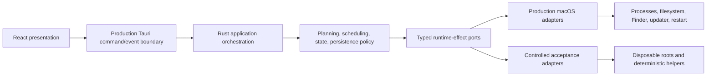
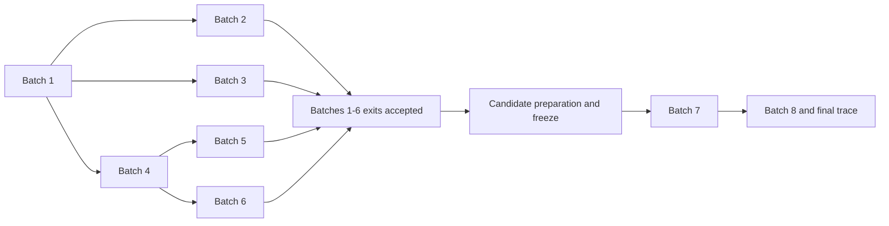
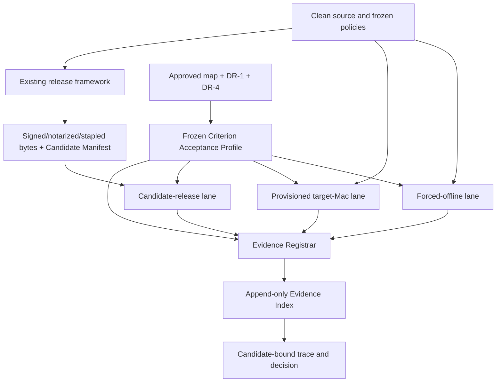

# Architecture Spine — Pack-Manager 100% P0 Product-and-Release Readiness

## Design Paradigm

Pack-Manager remains one layered Tauri application. Hexagonal boundaries are
introduced only where acceptance work must control or observe nondeterminism.
Production and acceptance compositions share the same application core,
registered commands, events, handlers, wire types, and frontend bridge.



Dependencies point inward. Product behavior must not depend on test
infrastructure, evidence storage, CI, or candidate state. Test infrastructure
may replace only adapters at the composition boundary. Candidate-specific
release evidence must exercise the unchanged packaged candidate through
production adapters.

## Verified Brownfield Baseline

- Production currently registers 20 Rust commands and six typed events, with
  matching frontend wrappers/subscriptions. `bridge.ts` is the sole frontend
  Tauri API import, and startup subscribes before hydration.
- Current Rust tests construct handlers below Tauri, while browser tests
  replace `__TAURI_INTERNALS__`; neither crosses the complete production
  JavaScript-to-Tauri-to-Rust transport.
- The process runner already provides structured argv, a cleared environment,
  null stdin, isolated process groups, bounded output, timeout, and
  SIGTERM-to-SIGKILL escalation. Application initialization and several
  commands still bind real paths, opener, updater, focus, restart, clocks, and
  other macOS effects directly.
- Settings use atomic replacement, and the append journal reconstructs an
  unfinished start as Interrupted without signaling its recorded PGID.
  Disposable native relaunch coverage and user-facing window-close host wiring
  do not yet exist.
- The current implementation has a one-use preview `planId`, immediate
  single-Package and direct Manager-update execution paths, Operation-only
  journal/history records, and no durable plan-attempt correlation. These are
  verified brownfield mechanics, not the approved target. Decisions D27-D30
  require the Product Behavior Prerequisite before affected evidence work.
- The release workflow checks out the release tag, verifies aligned versions,
  and builds universal artifacts. It can also finish without Apple Developer
  ID signing/notarization secrets (updater signing remains required), uploads
  assets with `--clobber`, and emits no Candidate Manifest or Evidence Index.
  Current CI does not enforce host-wide outbound denial, and no
  provisioned-target-Mac or installed-candidate lane exists.
- No minimum deployment target is declared. DR-1 therefore cannot be inferred
  from configuration.

These are verified starting conditions and gaps, not acceptance evidence or a
readiness claim.

## Invariants & Rules

### AD-1 — [ADOPTED] Product, infrastructure, and evidence remain separate

- **Binds:** all ASRs, TIR-1, TIR-8, RE-1..RE-11, Batches 1..8
- **Prevents:** a test harness becoming product behavior, or a green reusable
  test lane being reported as proof of a release candidate
- **Rule:** Every work item and result declares exactly one primary concern:
  Product Behavior, Reusable Test Infrastructure, or Candidate-Specific
  Release Evidence. A missing or incorrect behavior returns to Product
  Behavior through TIR-1. Infrastructure produces capabilities and results,
  never readiness status. Candidate evidence consumes an immutable candidate;
  it does not alter product behavior or the infrastructure oracle.

### AD-2 — [ADOPTED] One composition root, two adapter sets

- **Binds:** ASR-01, ASR-02, ASR-03, Batches 4..7
- **Prevents:** a test-only application path that bypasses the production
  handlers, state graph, serialization, or safety defaults
- **Rule:** The Tauri composition root constructs the application from typed
  runtime ports. Production composition supplies fail-closed macOS adapters;
  native acceptance composition supplies controlled adapters and disposable
  roots. Both compositions use the same Rust application services and command
  handlers. No test-only command, event, or alternate business workflow may
  count as native acceptance.
- **Rule:** Controlled adapters are construction-time dependencies of a
  non-distributable native harness target. Release builds contain no feature,
  environment variable, CLI option, hidden command, or runtime selector that
  can activate them. Packaged acceptance uses production adapters and obtains
  isolation only from the external test environment.

### AD-3 — [ADOPTED] The shared production command/event boundary is the acceptance boundary

- **Binds:** ASR-01, TIR-3, F1-AC1..F1-AC4, F2-AC1, F6, F7, D26
- **Prevents:** React and Rust suites agreeing internally while production
  registration, invocation shape, serialization, event delivery, or startup
  ordering is broken
- **Rule:** Native acceptance crosses the production frontend `invoke`/`listen`
  bridge, Tauri registration and serialization, Rust handler, application
  service, and production event dispatcher. It inventories every registered
  command and event and exercises representative success and failure paths for
  each command family plus every event channel. Startup subscription precedes
  hydration; detection, Re-detect, and all-six-Manager refresh cross this
  boundary with isolated dependencies.
- **Rule:** One production builder and registration source supplies both the
  shipped application and native acceptance composition. The inventory must
  prove set equality between registered Rust commands/events and the
  TypeScript wrappers/subscriptions. Direct handler calls, fake browser IPC,
  duplicated test registries, and test-only commands/events do not cross this
  boundary.
- **Rule:** `contracts/tauri-boundary/v1.json` is the one versioned boundary
  catalog. It is one strict JCS object with only
  `schema: "pack-manager.tauri-boundary/v1"`, `commands[]`, and `events[]`.
  Commands sort by unique `name` and contain only `name`, `family`,
  `requestSchemaId`, `requestSchemaSha256`, `responseSchemaId`,
  `responseSchemaSha256`, and `nativeVectors[]`. Events sort by unique `name`
  and contain only `name`, `payloadSchemaId`, `payloadSchemaSha256`, and
  `nativeVectors[]`. Each native vector sorts by unique `vectorId` and contains
  only `vectorId`, `scenarioContractSha256`, and expected `outcome`.
  Production registration is generated from or compile-validated against this
  catalog; TypeScript wrappers/subscriptions and Rust/TypeScript wire-schema
  fixtures must have exact set equality with it. Native acceptance performs at
  least one real frontend-to-handler round trip per command and one real
  dispatcher-to-frontend delivery per event, plus every named vector. Vector
  `outcome` is exactly one of `success`, `application-error`,
  `transport-error`, or `event-delivered`; the scenario digest fixes all input
  and expected wire bytes.
- **Rule:** The currently verified 20 commands and six events are a baseline,
  not permanent counts. A deliberate surface change is one atomic contract
  change: the boundary catalog, production registration, Rust models,
  TypeScript wrappers/types and guards, shared fixtures, subscriptions,
  boundary inventory, and native acceptance coverage change together.

### AD-4 — [ADOPTED] All material process and macOS effects have typed control points

- **Binds:** ASR-02, TIR-2, TIR-4, TIR-5, TIR-7, Batches 4..7
- **Prevents:** unsafe real mutations in tests and untestable branches hidden
  behind direct operating-system calls
- **Rule:** The runtime-port set covers process spawn/output/exit/stdin/signals,
  monotonic and wall time, executable discovery and ToolEnv, application and
  log roots, filesystem and permissions, symlink metadata, opener/reveal,
  current bundle and writability, focus/restart, and updater check/download/
  install. Existing `CommandRunner`, `EventSink`, `UpdateSource`, and
  `PendingRelease` remain valid ports and are extended rather than bypassed.
  Direct calls for a covered effect are confined to production adapters.
- **Rule:** Controlled child helpers must deterministically emit stdout,
  stderr, silence, expected and unexpected exits, external-lock signatures,
  inherited-descriptor behavior, SIGTERM exit or refusal, descendant
  processes, timeout, and null-stdin observation. They run only against
  disposable data and never invoke a real Package mutation.
- **Rule:** Ports cannot weaken settled safety behavior: process requests remain
  structured argv with allowlisted absolute executables, sanitized environment,
  null stdin, no shell reconstruction, and no `sudo`, password, or admin
  route. Scheduling retains the complete lock-set rule, operation IDs correlate
  commands/events/journal/transcripts, updater installation remains explicit,
  and a non-writable installation remains manual-install-required.
- **Rule:** Controlled adapters prove orchestration; candidate acceptance uses
  production macOS adapters. Neither result substitutes for the other.

### AD-5 — [ADOPTED] Lifecycle acceptance owns a disposable environment

- **Binds:** ASR-03, TIR-5, FR-15, FR-17, FR-18, Batch 6
- **Prevents:** crash and relaunch scenarios corrupting the operator's real
  data or signaling a reused historical process identifier
- **Rule:** One injected root set owns Application Support, settings, journal,
  logs, transcripts, diagnostics destination, temporary files, and controlled
  executables for each native lifecycle scenario. No scenario may resolve a
  production user directory by fallback.
- **Rule:** The lifecycle controller launches, force-terminates, and relaunches
  the same native acceptance application composition; preserves the disposable
  roots between launches; retains pre-crash output; and verifies journal,
  transcript, settings, retention, and Interrupted reconstruction.
- **Rule:** User-facing quit acceptance must cross the real Tauri close/run
  event wiring, operation guard, cancellation, bounded shutdown, and relaunch
  focus path. A dialog component test or `RunEvent::Exit` shutdown alone
  cannot prove the packaged quit contract.
- **Rule:** Historical PGIDs are data only. A relaunch test must place a live,
  controlled sentinel at a recorded historical identifier and prove it is not
  signaled. The controller owns cleanup of only the process groups it created.
- **Rule:** Candidate packaged lifecycle checks use the exact candidate in an
  OS-isolated disposable user/home or equivalent external sandbox; they do not
  enable a hidden test path in release bits.

### AD-6 — [ADOPTED] Execution lanes are isolated and non-substitutable

- **Binds:** ASR-05, TIR-2, TIR-6, TIR-7, TIR-8, RE-2..RE-11
- **Prevents:** network, mutable host state, or unsigned builds leaking into a
  deterministic result, and live smoke being mislabeled candidate proof
- **Rule:** Every execution is assigned exactly one lane:
  `forced-offline`, `provisioned-target-mac`, or `candidate-release`.
  Workspaces, credentials, caches after lane entry, result namespaces, and
  provenance are isolated. Required evidence cannot be borrowed across lanes.
- **Rule:** `forced-offline` begins after pinned dependencies/toolchains are
  prepared, from a fresh clean checkout with outbound network denied. It uses
  controlled processes and state, no real Manager invocation, no wall-clock
  sleeps, and no undeclared host state. It produces source-bound or controlled
  environment-bound evidence only.
- **Rule:** `provisioned-target-mac` is serialized on a designated Mac. It
  records dated Manager/tool topology including installed `mas`, detects drift,
  executes explicitly selected live checks, and produces environment-bound
  evidence only.
- **Rule:** `candidate-release` begins only after candidate freeze. It uses the
  exact signed candidate and real approved endpoints/OS services and produces
  candidate-bound evidence on Apple silicon and physical Intel where required.
  A credentialless or `--no-sign` build is never admitted to this lane.

### AD-7 — [ADOPTED] Candidate identity is a reproducible content digest

- **Binds:** ASR-04, RE-1, RE-3..RE-9, Batches 7..8
- **Prevents:** two machines assigning different identities to the same bytes,
  or one identity naming different source, artifacts, signatures, or metadata
- **Rule:** Candidate Identity Manifest schema
  `pack-manager.candidate-identity/v1` is a strict JSON Schema Draft 2020-12
  schema with `additionalProperties: false`. It contains identity only:
  source repository, 40-character lowercase commit, tag, `clean: true`, and
  lockfile hashes; immutable release build producer/run/attempt identity and
  resolved toolchain identity; package/Cargo/Tauri versions; bundle identifier
  and universal target; Developer ID certificate SHA-256 fingerprint, Apple
  Team ID, and embedded updater-public-key SHA-256; and the final
  direct-download, updater, signature, and `latest.json` artifacts with logical
  ID, file name, media type, decimal byte length encoded as a string, and
  SHA-256. It contains no result, mutable status, generated timestamp,
  machine-local path, or self-digest.
- **Rule:** Manifest input is valid I-JSON: duplicate object names, non-Unicode
  strings, non-finite numbers, unknown fields, and schema violations are
  rejected. Identity numbers use decimal strings. Identifier fields use
  restricted ASCII; arrays are unique and sorted by their schema-defined ASCII
  identity key. Every Unicode string must already be NFC; a non-NFC value is
  rejected. JCS then preserves those validated code points and performs no
  Unicode normalization.
- **Rule:** The validated value is serialized with RFC 8785 JSON
  Canonicalization Scheme to UTF-8 with no BOM, insignificant whitespace, or
  trailing newline. `candidateManifestDigest` is lowercase
  `sha256:<64-hex>` over exactly those canonical bytes using SHA-256 as defined
  by FIPS 180-4. `candidate-identity.json` stores those exact bytes;
  `candidate-identity.sha256` stores the digest separately. Independent
  implementations must pass shared canonicalization vectors before use. Every
  machine validating the same frozen manifest bytes must compute the same
  digest; a separate build run intentionally produces a different manifest.

### AD-8 — [ADOPTED] Evidence is an append-only, hash-chained ledger

- **Binds:** ASR-04, TIR-8, RE-10, RE-11, all evidence producers
- **Prevents:** result overwrite, retry laundering, concurrent index forks, and
  evidence detached from its candidate or source
- **Rule:** Each `evidence-index.ndjson` line conforms to
  `pack-manager.evidence-record/v1` and is
  `JCS({"payload": P, "recordDigest": D}) + 0x0A`. First,
  `B = UTF8(JCS(P))` with no BOM or trailing newline; then
  `D = "sha256:" + lowercase_hex(SHA-256(B))`. `P` contains an eight-digit
  sequence string, `previousRecordDigest` (`null` only at sequence 00000001),
  candidate and acceptance-profile digests, exactly one slot/criterion,
  readiness concern, execution lane, provenance binding level, source and
  environment provenance, candidate subject artifacts, producer and Registrar
  identities, attempt/outcome/retry data, and immutable result artifacts. The
  record envelope and `P` are strict Draft 2020-12 schemas with unknown fields
  rejected. The final index digest is a prefixed lowercase SHA-256 over every
  file byte including each `0x0A`.
- **Rule:** A candidate-and-acceptance-profile-scoped Evidence Registrar
  controlled by the Release function, operating through one Release-owned
  automation identity, is the sole append authority. Producers write immutable
  attempt bundles to an inbox; they cannot edit the index. The Registrar
  validates schema/canonical form, sequence and previous digest, candidate and
  acceptance-profile binding, provenance depth, subject/result bytes and
  hashes, retry linkage, and acceptance rules before one append.
- **Rule:** Append authority is provider-verifiable. One protected GitHub
  Environment admits one allowlisted Registrar workflow identity, recorded as
  repository, workflow path, workflow commit, run ID, run attempt, and
  environment. A candidate/profile concurrency key and provider lock or
  compare-and-swap cover predecessor read, immutable object/record/snapshot
  publication, and atomic head update. The submission's `idempotencyKey` is
  lowercase prefixed SHA-256 over JCS of
  `{candidateManifestDigest, acceptanceProfileDigest, slotId, attemptId}`.
  Repeating the key with the same record digest returns the existing append;
  another digest, stale head, second head, or fork is rejected.
- **Rule:** Storage is logically content-addressed and write-once. Existing
  GitHub Actions and GitHub Release transport may carry immutable objects and
  monotonically versioned index snapshots, but upload, retry, or promotion
  must never clobber or delete an accepted object. Attempt payloads and
  artifacts are hashed over exact raw file bytes, not parsed or reformatted
  content. Provider retention settings must preserve the complete Evidence Set
  through the final decision and its required audit period.

### AD-9 — [ADOPTED] Candidate mutation creates a new evidence root

- **Binds:** ASR-04, RE-1, RE-6..RE-11, Batches 7..8
- **Prevents:** evidence for one binary or metadata set being reused for a
  rebuilt, re-signed, re-tagged, repackaged, or replaced release
- **Rule:** Candidate freeze occurs only after the complete universal app,
  DMG/ZIP, updater archive/signature, signing, notarization, stapling, and
  updater metadata bytes are final. Before every candidate-bound append, the
  Registrar revalidates the frozen manifest and tested artifact checksum.
- **Rule:** Any source commit, tag, version, signing identity, artifact byte,
  artifact name, or published metadata byte change produces a new manifest
  digest and a new evidence root. Every new build invocation also has a new
  immutable build run/attempt identity, so rebuilding creates a new candidate
  even if output bytes happen to match. Prior results remain immutable
  historical evidence for the prior candidate but are ineligible for the new
  candidate. Batches 7 and 8 restart their affected candidate-bound scenarios.

### AD-10 — [ADOPTED] Provenance depth controls what a result may prove

- **Binds:** TIR-1, TIR-8, RE-2, RE-10, RE-11, readiness aggregation
- **Prevents:** source inspection, collected or ignored tests, and shallow
  evidence from closing a deeper acceptance boundary
- **Rule:** Source-bound evidence names repository, commit, clean/dirty state,
  exact command/scenario, evidence-producer version, lockfile/schema versions,
  and result artifacts.
  Environment-bound evidence adds macOS version/build, architecture, stable
  non-secret lane host identifier, provision profile, relevant Manager/tool
  versions, network state, and controlled-versus-live dependencies.
  Candidate-bound evidence adds candidate manifest digest and every exact
  tested artifact checksum.
- **Rule:** The frozen Criterion Acceptance Profile declares each criterion's
  required slots, binding depth, and permitted execution lane before result
  aggregation without changing the coverage map. A shallower or different lane
  cannot satisfy it. Static source, plans, collectors, and build-upload
  attempts are evidence inputs only.
- **Rule:** The Registrar may associate a source- or environment-bound result
  with a candidate Evidence Set only when its source commit matches the
  candidate and the frozen Criterion Acceptance Profile permits that depth and
  lane. Association never upgrades `bindingLevel`; provisioned-target-Mac
  evidence cannot be relabeled candidate-bound.
- **Rule:** Required ignored, skipped, collected-but-unexecuted, missing, or
  cancelled checks cannot produce PASS. A failed first attempt is indexed and
  retained. A test declared ignored qualifies only when a qualified lane
  explicitly selects it, actually executes it, and records PASS. Candidate/P0
  collection has no automatic retry. A manually authorized retry is a new
  record with a non-null `retry` object and a change explanation; it never
  replaces or hides the failure.
- **Rule:** The schema-valid machine record is authoritative. Any
  human-readable report is generated from or reconciled to the same attempt
  data; an outcome, count, criterion, or digest disagreement rejects the
  attempt.

### AD-11 — [ADOPTED] Packaged acceptance ends at the installed candidate

- **Binds:** TIR-7, FR-19..FR-22, RP-1, RP-2, RE-3..RE-9, DR-1, DR-2, DR-3
- **Prevents:** source, browser, universal-header, or workflow evidence being
  mistaken for the experience users install and update
- **Rule:** Candidate acceptance inspects the exact app, DMG, ZIP, updater
  archive/signature, resources, icon set, entitlements, architectures,
  Developer ID signatures, notarization, stapling, Gatekeeper assessment,
  `latest.json`, HTTPS URLs, embedded updater key, and cross-asset versions.
- **Rule:** UI interaction and visual acceptance runs inside the packaged
  application's WKWebView. Dev-server browser, DOM-only, and source-style
  results can support diagnosis but cannot satisfy the packaged boundary.
- **Rule:** The downloaded DMG journey installs and launches the exact
  candidate from Finder and the Dock on Apple silicon and physical Intel. An
  actually installed prior public version must discover, verify, download,
  explicitly install, and relaunch into the same candidate on both
  architectures. Active Package Operation refusal and non-writable
  manual-install-required behavior are candidate-bound checks.
- **Rule:** DR-2 is approved: packaged keyboard/focus paths, automated 4.5:1
  text contrast, reduced motion, and a manual VoiceOver focus-order and
  completion-announcement pass are required. Broader WCAG or legal compliance
  is not implied.
- **Rule:** DR-3 is approved: physical Intel fresh-install, Finder/Dock launch,
  and prior-version update evidence is mandatory for a 100% readiness claim.
  Universal-binary inspection is necessary artifact evidence but cannot
  substitute.
- **Rule:** DR-1 remains OPEN. TIR-7 and RE-4/RE-7/RE-8 environment design and
  implementation handoff are blocked until Product and Release declare the
  minimum supported macOS version.

### AD-12 — [ADOPTED] The existing release framework gains a manifest-bound hold point

- **Binds:** ASR-04, ASR-05, RE-1..RE-11, DR-4, release preparation
- **Prevents:** a mutable or already-replaced GitHub Release asset set being
  treated as the immutable readiness candidate
- **Rule:** Release-please and GitHub Actions remain the release framework and
  transport. Candidate preparation must introduce a write-once staging/freeze
  point before candidate validation and a manifest-bound promotion or
  attestation point after acceptance. The exact frozen bytes, not a tag or
  workflow run alone, are the subject of the decision.
- **Rule:** Current optional Apple Developer ID signing/notarization fallback
  and `--clobber` upload behavior are permitted only for non-candidate smoke or
  recovery workflows; updater signing remains required by the current build.
  Candidate preparation fails closed when any Apple or updater credential or
  required artifact is absent; promotion cannot replace an artifact named by
  the accepted manifest. Any attempted post-freeze replacement invalidates the
  candidate even when transport would permit it.
- **Rule:** A GitHub Release's existence is distribution state, not a readiness
  verdict. Any 100% label or promotion remains blocked by AD-14 and DR-4.

### AD-13 — [ADOPTED] Closure follows evidence dependency waves

- **Binds:** Batches 1..8, ASR delivery, downstream epics and stories
- **Prevents:** lifecycle, updater, or release stories starting before their
  reusable boundary and immutable-candidate prerequisites exist
- **Rule:** Batch 1 runs first. Batches 2, 3, and 4 may proceed in parallel.
  Batches 5 and 6 require the accepted Batch 4 native foundation and may run in
  parallel. Release preparation begins after Batches 1..6 have reached their
  required exits, then freezes one fully packaged, signed, notarized, stapled
  candidate and metadata. Batch 7 uses that manifest. Batch 8 follows Batches
  1..7 and attests the same unchanged candidate. Release preparation is a
  prerequisite, not a ninth batch.



### AD-14 — [ADOPTED] Readiness aggregation is fail-closed governance

- **Binds:** readiness-coverage-map.md, RE-10, RE-11, GP-1, GP-2, DR-4
- **Prevents:** denominator changes, baseline carry-forward, or architecture
  approval being mistaken for candidate readiness
- **Rule:** The coverage map remains `final-pending-approval` and exactly 72 P0
  rows. Architecture does not approve or alter it. The current dirty-snapshot
  planning gate remains FAIL with 14/72 FULL; all 14 are planning history and
  require candidate-era revalidation at their mapped depth. RP-1 and RP-2
  remain mandatory outside the denominator. No criterion is auto-promoted by
  code presence, a green suite, or this spine, and provisional disposition
  counts do not become permanent allocations.
- **Rule:** The final aggregator accepts only one candidate manifest digest,
  one frozen acceptance-profile digest that binds the approved coverage map and
  policy, one valid Evidence Index chain, and results satisfying every required
  slot. Product behavior, infrastructure, candidate evidence, and separate
  RP-1/RP-2 prerequisites are reported independently before a decision.
- **Rule:** DR-4 remains PROPOSED and blocked on Product/QA governance.
  Infrastructure work may proceed where otherwise authorized, but candidate
  validation, gate configuration, and any 100% readiness decision may not
  begin until the P0-specific policy is approved. Architecture records this
  consequence without approving the policy.

### AD-15 — [ADOPTED] A frozen acceptance profile defines every evidence slot

- **Binds:** ASR-04, ASR-05, TIR-8, RE-10, RE-11, GP-1, GP-2, DR-1, DR-4
- **Prevents:** different epics selecting different lanes, provenance depth,
  operating-system matrices, candidate subjects, or retry interpretations for
  the same criterion
- **Rule:** The approved DR-4 gate policy has one machine-readable companion,
  `pack-manager.criterion-acceptance-profile/v1`. It leaves the coverage map
  unchanged and maps each of its 72 criterion IDs, plus RP-1 and RP-2 outside
  the denominator, to one or more required evidence slots. Every slot fixes one
  criterion, concern, lane, minimum binding level, scenario, candidate subject
  set, macOS/architecture/physical-host matrix, and retry rule.
- **Rule:** The profile cannot be frozen while the coverage map is
  `final-pending-approval`, DR-1 is OPEN, or DR-4 is PROPOSED. Product/QA
  approval supplies policy values; this architecture supplies only their
  required schema and deterministic effect. QA, as ASR-05 accountable, owns
  producing the conforming profile before evidence collection.
- **Rule:** A profile is validated, JCS-canonicalized, and SHA-256 hashed by the
  same rules as the Candidate Manifest. Its digest identifies an Evidence Set,
  not the candidate. A profile change creates a new Evidence Set namespace and
  requires revalidation, but does not rename unchanged candidate artifacts.
- **Rule:** There is exactly one first attempt (`attempt.ordinal = "1"`) for
  each slot. A manual retry increments the ordinal by one and links to the
  immediately preceding attempt; gaps, branches, duplicate ordinals, and
  automatic retries are rejected. The approved profile must choose an explicit
  retry disposition. Viable policies are fail-sticky, where any failure keeps
  the slot unsatisfied, or authorized-terminal, where the final explicitly
  authorized PASS may satisfy it while every prior failure remains visible.
  Architecture recommends authorized-terminal only with Product/QA approval
  and a recorded reason; DR-4 remains PROPOSED and no choice is approved here.
- **Rule:** The aggregator evaluates each required slot once. A slot is
  satisfied only by the policy-eligible terminal PASS in its complete attempt
  chain. A criterion is FULL only when every required slot for that criterion
  is satisfied. Missing, conflicting, ineligible, wrong-lane, wrong-depth, or
  unresolved attempts fail closed. All 72 criteria and both separate release
  prerequisites must satisfy their own slots before a 100% decision is even
  eligible for Product/QA governance.

### AD-16 — [ADOPTED] Upgrade Plan intent and confirmed Plan Attempts are distinct durable domains

- **Binds:** D27-D30, FR-6..FR-17, FR-19, F3-F8, F10-AC1, F11-AC2,
  Product Behavior Prerequisite UX-PB.1..UX-PB.5
- **Prevents:** executing from a row or Manager header, treating a short-lived
  preview capability as History identity, fabricating plan groups from legacy
  Operations, or reporting success before verification
- **Rule:** Frontend draft state stores canonical `PlanIntent`, never trusted
  executable strings. It contains individually removable Package and Manager
  update members plus explicit option values. Every draft mutation asks Rust to
  rebuild the preview. The existing `planId` remains a bounded one-use
  capability for one reviewed preview and expires on mutation, staleness,
  execution attempt, or eviction.
- **Rule:** `execute_plan` returns a newly generated durable
  `planAttemptId` plus the admitted Operation identities. A preview `planId`
  and a `planAttemptId` are different types, fields, schemas, namespaces, and
  test assertions. Neither may be silently converted into the other.
- **Rule:** Plan attempt persistence records reviewed canonical intent, exact
  command snapshot, warnings/exclusions, timestamps, nested Operations,
  verification refreshes, terminal Results, and optional
  `retryOfPlanAttemptId`. Operation status/output/stall events, transcript
  metadata, journal start/finish records, and diagnostic export carry
  `planAttemptId` when one exists.
- **Rule:** Exactly one confirmed attempt may be active. A second confirmation
  fails closed with a typed already-active result. The active attempt may run
  independent Managers concurrently through AD-4's existing lock-set and
  resource rules.
- **Rule:** Primary cancellation targets `planAttemptId`: unstarted work becomes
  `Skipped`, running process groups use the existing escalation, and all
  terminal states remain durable. `Cancel operation` is reserved for an
  explicitly Operation-scoped diagnostic action.
- **Rule:** A mutating attempt is not successful until required affected
  Manager refreshes complete. The attempt explicitly enters `Verifying`.
  Results distinguish mutation failure from verification failure and preserve
  the Last-good Snapshot rules.
- **Rule:** Retry always creates a new `planAttemptId`, links to the preceding
  failed attempt, and preserves the original failure. The backend rebuilds
  current intent rather than replaying historical executable text.
- **Rule:** Legacy journal/history records without a recorded
  `planAttemptId` remain individually labeled legacy Operations. Migration may
  preserve and index them but must not infer a plan grouping.
- **Rule:** Settings replace active `autoOpenDrawer` behavior with
  `skipUpgradePlanConfirmation`, default `false`. Older files may deserialize
  `autoOpenDrawer` as ignored legacy input. A confirmation opt-out skips only
  the final modal, never draft review, Rust rebuild, stale detection, or the
  explicit confirmation action.
- **Rule:** `Interaction required` is emitted only from a closed
  Manager-specific classifier or explicit typed native signal. Any unmatched
  null-stdin silence uses the ordinary stall contract.
- **Rule:** The command/event boundary change is atomic under AD-3: Rust and
  TypeScript wire models, registration, wrappers, fixtures, guards, catalog,
  journal schemas, diagnostics, and native acceptance change together.

#### AD-16 normative domain minimum

Names may be refined during story implementation, but the semantic separation
is fixed:

```text
PlanIntent
  packageUpdates: ordered unique PackageRef[]
  managerUpdates: ordered unique ManagerId[]
  includeGreedyCasks: boolean

UpgradePlanPreview
  planId: one-use PlanCapabilityId
  intent: PlanIntent
  groups: reviewed commands and display items
  exclusions/warnings

PlanAttempt
  planAttemptId: durable PlanAttemptId
  retryOfPlanAttemptId?: PlanAttemptId
  reviewedIntent + reviewedCommandSnapshot
  operationIds[]
  state: admitted | running | verifying | terminal
  verificationResults + resultSummary
```

The active-attempt lookup, cancel command, History query, Activity replay, and
diagnostic export address `planAttemptId`. Operation detail continues to
address `opId` within that attempt.

## ASR Accountability and Acceptance Boundaries

Exactly one role is accountable for each enabler. Supporting functions do not
share accountability.

| Enabler                                        | Accountable role | Capability/support                               | Delivery boundary                                                                                                       | Acceptance boundary                                                                                                                                                                                                                                                                                  |
| ---------------------------------------------- | ---------------- | ------------------------------------------------ | ----------------------------------------------------------------------------------------------------------------------- | ---------------------------------------------------------------------------------------------------------------------------------------------------------------------------------------------------------------------------------------------------------------------------------------------------- |
| ASR-01 — Real native command/event boundary    | Architecture     | Development and QA implement/use the boundary    | Accepted by Batch 4 exit; required before Batches 5–7                                                                   | The versioned catalog, production bridge/registration, wire schemas, wrappers/subscriptions, and inventory have set equality; every command round-trips and every event dispatches through one isolated real Tauri boundary, including startup order, detection, Re-detect, and six-Manager refresh. |
| ASR-02 — Deterministic process and OS controls | Development      | Platform capability area                         | Core process controls accepted before Batch 5; relevant filesystem/updater extensions before Batches 6–7                | Deterministic helpers/adapters produce every required output, exit, signal, timeout, lock, stdin, path, permission, opener, restart, and updater condition while production adapters retain fail-closed behavior.                                                                                    |
| ASR-03 — Disposable lifecycle environment      | QA               | Development/Platform supports delivery           | Accepted before Batch 6                                                                                                 | Crash, forced quit, relaunch, persistence, retention, hostile filesystem, and historical-PGID non-signal scenarios run from disposable roots with retained evidence and no contact with operator data/processes.                                                                                     |
| ASR-04 — Candidate identity and attestation    | Release          | Evidence Registrar and existing GitHub transport | Contract before release preparation; manifest frozen before Batch 7; complete ledger accepted in Batch 8                | Candidate manifest and evidence ledger pass schema, canonicalization, digest, chain, artifact, provenance, retry, and invalidation validation; exact bytes remain write-once.                                                                                                                        |
| ASR-05 — Split evidence lanes                  | QA               | CI is the execution mechanism                    | Lane contract and separation accepted before any Batch 1 evidence collection; candidate lane operational before Batch 7 | Forced-offline, provisioned-target-Mac, and candidate-release workspaces, credentials, provenance, and outputs are isolated; the aggregator rejects cross-lane substitution.                                                                                                                         |

If any accountable role cannot accept its enabler by the stated boundary, the
affected batch and every downstream dependent batch remain blocked.

## Normative Evidence Contract

### Contract authority and common encoding

The `/v1` authority is the exact byte set committed at these paths:

```text
contracts/readiness/v1/candidate-identity.schema.json
contracts/readiness/v1/evidence-record.schema.json
contracts/readiness/v1/criterion-acceptance-profile.schema.json
contracts/readiness/v1/canonicalization-vectors.json
contracts/readiness/v1/contract-lock.json
```

The three schema files declare
`"$schema": "https://json-schema.org/draft/2020-12/schema"` and, respectively,
these immutable `$id` values:

```text
urn:pack-manager:readiness:candidate-identity:v1
urn:pack-manager:readiness:evidence-record:v1
urn:pack-manager:readiness:criterion-acceptance-profile:v1
```

The property-path tables below are normative: every listed property is
required unless explicitly nullable, every object has
`additionalProperties: false`, and no implementation may rename or add a v1
property. `contract-lock.json` is JCS with no trailing newline and contains
only `schema: "pack-manager.readiness-contract-lock/v1"` and `files[]`.
`files[]` has exactly four objects sorted by repository-relative `path`, each
with only `path`, decimal `byteLength`, and raw-file `sha256`, covering all
three schemas and the canonicalization vectors. Release accepts that lock as
part of ASR-04 before release preparation; changing any locked byte requires
`/v2`.

All digest fields are lowercase `sha256:<64-hex>`. All quantities are canonical
decimal strings with no sign or leading zero except literal `"0"`. `sequence`
is the sole exception: exactly `"00000001"` through `"99999999"`, incrementing
by one without gaps. IDs are restricted ASCII. Other strings must already be
NFC. Arrays are unique and sort by the property stated below using ascending
Unicode code-point order over their restricted-ASCII keys. JSON numeric values
are forbidden; booleans and `null` retain their JSON types. Stored
identity/profile documents must equal their RFC 8785 JCS serialization
byte-for-byte.

### Candidate Identity Manifest v1

| Exact property path                                       | JSON type and required v1 rule                                                                                                                               |
| --------------------------------------------------------- | ------------------------------------------------------------------------------------------------------------------------------------------------------------ |
| `schema`                                                  | Literal `pack-manager.candidate-identity/v1`.                                                                                                                |
| `contract.contractLockSha256`                             | Digest of the exact `contract-lock.json` JCS bytes.                                                                                                          |
| `contract.candidateSchemaSha256`                          | Digest of the exact raw candidate schema file locked by `contract-lock.json`.                                                                                |
| `contract.canonicalizationVectorsSha256`                  | Digest of the exact raw vectors file locked by `contract-lock.json`.                                                                                         |
| `source.repository`                                       | Canonical lowercase ASCII `github:<owner>/<repository>`.                                                                                                     |
| `source.commit`                                           | Exactly 40 lowercase hexadecimal characters.                                                                                                                 |
| `source.tag`                                              | Exact release tag; non-empty restricted ASCII.                                                                                                               |
| `source.clean`                                            | Boolean literal `true`.                                                                                                                                      |
| `source.lockfiles[]`                                      | Exactly two objects, sorted by `logicalId`: `package-lock` at `package-lock.json` and `cargo-lock` at `src-tauri/Cargo.lock`.                                |
| `source.lockfiles[].logicalId` / `.path`                  | The literals above; paths are repository-relative `/`-separated ASCII.                                                                                       |
| `source.lockfiles[].byteLength` / `.sha256`               | Decimal raw-file byte length and digest over those exact raw bytes.                                                                                          |
| `build.producer`                                          | Literal `github-actions`; no local build can be a candidate.                                                                                                 |
| `build.workflowRepository` / `.workflowPath`              | Same canonical repository as `source.repository`; literal path `.github/workflows/release.yml`.                                                              |
| `build.workflowCommit` / `.workflowSha256`                | Workflow commit equals `source.commit`; digest covers the workflow's exact raw bytes at that commit.                                                         |
| `build.runId` / `.runAttempt`                             | Provider-issued positive decimal strings. A new invocation or attempt receives a new value.                                                                  |
| `build.toolchains[]`                                      | Exactly `cargo`, `node`, `npm`, `rustc`, `tauri-cli`, and `xcodebuild`, sorted by `logicalId`; each object has only `logicalId` and exact `version` strings. |
| `versions.packageJson` / `.cargoPackage` / `.tauriConfig` | Canonical semver strings; all three are equal.                                                                                                               |
| `application.bundleIdentifier`                            | Exact identifier from the frozen Tauri configuration.                                                                                                        |
| `application.target`                                      | Literal `universal-apple-darwin`.                                                                                                                            |
| `signing.appleTeamId`                                     | Exact uppercase Apple Team ID.                                                                                                                               |
| `signing.developerIdCertificateSha256`                    | Digest of the leaf Developer ID Application certificate's DER bytes.                                                                                         |
| `signing.updaterPublicKeySha256`                          | Digest of the UTF-8 bytes of the exact embedded updater-public-key string, with no BOM or added newline.                                                     |
| `artifacts[]`                                             | Exactly five objects sorted by `logicalId`: `direct-app-zip`, `dmg`, `updater-archive`, `updater-metadata`, and `updater-signature`.                         |
| `artifacts[].logicalId` / `.fileName`                     | Logical ID from the fixed set and exact published file name.                                                                                                 |
| `artifacts[].mediaType` / `.downloadUrl`                  | Fixed logical media type and final ASCII HTTPS URL used for distribution or update.                                                                          |
| `artifacts[].byteLength` / `.sha256`                      | Decimal byte length and digest over the exact final raw file bytes.                                                                                          |

The five logical media types are, respectively, `application/zip`,
`application/x-apple-diskimage`, `application/gzip`, `application/json`, and
`text/plain;charset=utf-8`. The manifest is canonicalized and hashed exactly as
AD-7 specifies. Component hashes use the byte boundaries in the table after
signing, notarization, stapling, packaging, signature, and metadata generation.
The manifest contains no evidence result.

### Criterion Acceptance Profile v1

| Exact property path                                                                               | JSON type and required v1 rule                                                                                                                                                                            |
| ------------------------------------------------------------------------------------------------- | --------------------------------------------------------------------------------------------------------------------------------------------------------------------------------------------------------- |
| `schema`                                                                                          | Literal `pack-manager.criterion-acceptance-profile/v1`.                                                                                                                                                   |
| `contract.contractLockSha256`                                                                     | Digest of the exact `contract-lock.json` JCS bytes.                                                                                                                                                       |
| `contract.profileSchemaSha256` / `.evidenceRecordSchemaSha256` / `.canonicalizationVectorsSha256` | Raw-file digests matching `contract-lock.json`.                                                                                                                                                           |
| `coverageMap.path` / `.revision` / `.sha256` / `.approvalRecordDigest`                            | Path is literal `_bmad-output/planning-artifacts/prds/prd-Pack-Manager-2026-07-22/readiness-coverage-map.md`; plus frozen revision, exact raw-file digest, and durable Product/QA approval-record digest. |
| `coverageMap.denominator`                                                                         | Literal decimal string `"72"`.                                                                                                                                                                            |
| `gatePolicy.id` / `.path` / `.revision` / `.sha256` / `.approvalRecordDigest`                     | Approved DR-4 policy identity, repository-relative source path, revision, exact raw-file digest, and Product/QA approval-record digest.                                                                   |
| `minimumMacOS`                                                                                    | Product/Release DR-1 value in canonical `MAJOR.MINOR` or `MAJOR.MINOR.PATCH` decimal form.                                                                                                                |
| `slots[]`                                                                                         | Non-empty objects sorted by unique `slotId`; collectively cover every one of the 72 criterion IDs and RP-1/RP-2.                                                                                          |
| `slots[].slotId` / `.criterionId`                                                                 | Stable restricted-ASCII slot ID and exactly one coverage-map criterion or `RP-1`/`RP-2`.                                                                                                                  |
| `slots[].readinessConcern`                                                                        | One of `product-behavior`, `test-infrastructure`, or `release-evidence`.                                                                                                                                  |
| `slots[].executionLane`                                                                           | One of `forced-offline`, `provisioned-target-mac`, or `candidate-release`.                                                                                                                                |
| `slots[].bindingLevel`                                                                            | One of `source`, `environment`, or `candidate`.                                                                                                                                                           |
| `slots[].scenarioId` / `.scenarioContractPath` / `.scenarioContractSha256`                        | Versioned scenario ID, repository-relative `/`-separated contract path, and digest over that exact source-controlled raw file.                                                                            |
| `slots[].subjects[]`                                                                              | Empty unless candidate-bound; otherwise unique objects sorted by `subjectId`, each with only restricted-ASCII `subjectId`, Candidate Manifest `logicalId`, and one required `role`.                       |
| `slots[].subjects[].role`                                                                         | One of `installed-from`, `executed`, `inspected`, `served-metadata`, or `verified-signature`.                                                                                                             |
| `slots[].environment.macOSConstraint`                                                             | Literal `not-applicable` or `>=` followed by the exact `minimumMacOS` value; no other range grammar is permitted in v1.                                                                                   |
| `slots[].environment.requiredMacOSVersions`                                                       | Unique sorted exact-version strings; empty only when not applicable and includes `minimumMacOS` for packaged compatibility slots.                                                                         |
| `slots[].environment.architectures`                                                               | Unique sorted subset of `arm64` and `x86_64`, or an empty array when not applicable.                                                                                                                      |
| `slots[].environment.physicalHardware` / `.packagedApp`                                           | Booleans fixing whether physical hardware and the installed packaged app are mandatory.                                                                                                                   |
| `slots[].retryDisposition`                                                                        | Exactly one policy-selected value: `fail-sticky` or `authorized-terminal`. DR-4 approval is required to populate it.                                                                                      |
| `slots[].retryAuthorizerRoles`                                                                    | Unique sorted subset of `product` and `qa`; empty for `fail-sticky`, non-empty exactly as approved by DR-4 for `authorized-terminal`.                                                                     |

The profile itself has no candidate digest or result. Validate it, require
canonical byte equality, then compute
`acceptanceProfileDigest = sha256:<hex(SHA-256(profile JCS bytes))>`.

### Evidence Record v1

Each logical record is the strict envelope
`{"payload": P, "recordDigest": D}`. Its exact payload is:

| Exact payload property path                                                                                       | JSON type and required v1 rule                                                                                                                                                                          |
| ----------------------------------------------------------------------------------------------------------------- | ------------------------------------------------------------------------------------------------------------------------------------------------------------------------------------------------------- |
| `schema`                                                                                                          | Literal `pack-manager.evidence-record/v1`.                                                                                                                                                              |
| `contract.contractLockSha256`                                                                                     | Digest of the exact `contract-lock.json` JCS bytes.                                                                                                                                                     |
| `contract.evidenceRecordSchemaSha256` / `.canonicalizationVectorsSha256`                                          | Raw-file digests matching the frozen profile and `contract-lock.json`.                                                                                                                                  |
| `sequence` / `previousRecordDigest`                                                                               | Eight-digit monotonic sequence and hash-chain predecessor.                                                                                                                                              |
| `candidateManifestDigest`                                                                                         | One frozen manifest for the entire index.                                                                                                                                                               |
| `acceptanceProfileDigest`                                                                                         | One frozen profile for the entire index.                                                                                                                                                                |
| `slotId` / `criterionId`                                                                                          | Exactly one slot and its criterion; both must match the profile.                                                                                                                                        |
| `readinessConcern`                                                                                                | One of `product-behavior`, `test-infrastructure`, `release-evidence`.                                                                                                                                   |
| `executionLane`                                                                                                   | One of `forced-offline`, `provisioned-target-mac`, `candidate-release`.                                                                                                                                 |
| `bindingLevel`                                                                                                    | One of `source`, `environment`, `candidate`; all three fields above must equal the profile slot.                                                                                                        |
| `idempotencyKey`                                                                                                  | Digest computed by AD-8; unique for the candidate/profile/slot/attempt tuple.                                                                                                                           |
| `source.repository` / `.commit` / `.clean`                                                                        | Canonical repository, exact commit, and boolean clean state; candidate records must match the manifest and require `true`.                                                                              |
| `source.lockfiles[]`                                                                                              | Same sorted `logicalId`, `path`, `byteLength`, and raw-file `sha256` object shape as the Candidate Manifest; candidate records must match it exactly.                                                   |
| `source.producerVersion` / `.exactCommandOrScenario`                                                              | Immutable evidence-producer version and exact invoked command or manual scenario ID.                                                                                                                    |
| `environment`                                                                                                     | `null` for source-bound; otherwise the strict object defined by the following rows.                                                                                                                     |
| `environment.macOSVersion` / `.macOSBuild` / `.architecture` / `.hostId`                                          | Exact OS version/build, `arm64` or `x86_64`, and stable non-secret lane host ID.                                                                                                                        |
| `environment.provisionProfileId` / `.provisionProfileSha256`                                                      | Versioned environment profile and exact raw-file digest.                                                                                                                                                |
| `environment.networkMode` / `.dependencyMode`                                                                     | One of `denied`, `controlled`, `live`; and one of `controlled`, `live`.                                                                                                                                 |
| `environment.tools[]`                                                                                             | Unique objects sorted by `logicalId`, each containing only `logicalId` and exact `version`.                                                                                                             |
| `subjectArtifacts[]`                                                                                              | Empty for source/environment records. Candidate records exactly match the profile's `subjectId`/`logicalId`/`role` set, sorted by `subjectId`.                                                          |
| `subjectArtifacts[].subjectId` / `.logicalId` / `.role`                                                           | Profile subject ID, Candidate Manifest logical ID, and the profile-fixed subject role.                                                                                                                  |
| `subjectArtifacts[].byteLength` / `.sha256`                                                                       | Values exactly equal to the named Candidate Manifest artifact.                                                                                                                                          |
| `producer.role` / `.system` / `.actorId`                                                                          | Lowercase role from `architecture`, `development`, `qa`, `release`; literal system `github-actions`; and stable non-secret human actor ID for a manual scenario or `null` for fully automated evidence. |
| `producer.repository` / `.workflowPath` / `.workflowCommit` / `.runId` / `.runAttempt`                            | Verifiable producer workflow identity; IDs/attempts are positive decimal strings.                                                                                                                       |
| `registrar.repository` / `.workflowPath` / `.workflowCommit` / `.runId` / `.runAttempt` / `.protectedEnvironment` | Verifiable sole-append workflow and protected-environment identity.                                                                                                                                     |
| `attempt.id` / `.ordinal`                                                                                         | Lowercase UUID and positive decimal attempt ordinal fixed by AD-15.                                                                                                                                     |
| `attempt.runnerRetryCount`                                                                                        | Literal decimal string `"0"`; test-runner and workflow automatic retries are disabled.                                                                                                                  |
| `attempt.startedAt` / `.endedAt`                                                                                  | UTC RFC 3339 strings with exactly millisecond precision and `Z`; end is not earlier than start.                                                                                                         |
| `attempt.scenarioId` / `.exactCommand`                                                                            | Profile scenario ID and exact command; `exactCommand` is `null` only for a manual scenario.                                                                                                             |
| `outcome.status`                                                                                                  | One of `pass`, `fail`, `error`, or `not-run`.                                                                                                                                                           |
| `outcome.collected` / `.executed` / `.passed` / `.failed` / `.errored` / `.skipped` / `.ignored` / `.cancelled`   | Counts cover exactly the checks required by the profile-fixed slot/scenario. PASS requires `collected = executed = passed > 0` and every non-passed count `"0"`.                                        |
| `retry`                                                                                                           | `null` for ordinal 1; otherwise a strict object with `ofAttemptId`, `authorizers[]`, `authorizedAt`, and non-empty `changeReason`.                                                                      |
| `retry.authorizers[]`                                                                                             | Unique objects sorted by `role`, each with only profile-required `role` and stable non-secret `actorId`; the role set exactly matches `retryAuthorizerRoles`.                                           |
| `retry.authorizedAt`                                                                                              | UTC RFC 3339 with exactly millisecond precision and `Z`; not later than `attempt.startedAt`.                                                                                                            |
| `resultArtifacts[]`                                                                                               | Non-empty objects sorted by `logicalId`; evidence outputs only, never candidate subjects.                                                                                                               |
| `resultArtifacts[].logicalId` / `.objectPath` / `.mediaType`                                                      | Unique logical ID, exact `objects/sha256/<64-hex>` relative path, and declared media type.                                                                                                              |
| `resultArtifacts[].byteLength` / `.sha256`                                                                        | Decimal byte length and digest over exact raw result bytes.                                                                                                                                             |

`subjectArtifacts` identify what was tested; `resultArtifacts` prove what
happened. They are never interchangeable. For each record, first compute
`B = UTF8(JCS(P))`, then `D = "sha256:" + lowercase_hex(SHA-256(B))`.
The stored/indexed line is
`UTF8(JCS({"payload": P, "recordDigest": D})) + 0x0A`. The standalone record
file contains that exact line including its LF. Timestamps and paths follow the
strict formats above; paths containing an absolute prefix, `..`, backslash, or
symlink are rejected.

### Validation and deterministic aggregation

The Registrar performs these fail-closed stages in order:

1. Parse UTF-8 while detecting and rejecting BOMs, duplicate object keys,
   invalid Unicode, non-NFC strings, JSON numbers, and unknown schema IDs.
2. Validate the exact locked schema; verify required keys, closed objects,
   scalar formats, array uniqueness/order, schema/vector hashes, and canonical
   byte equality.
3. Recompute every raw-file byte length/digest, candidate/profile digest,
   idempotency key, record digest, predecessor, and index head.
4. Verify source, environment, lane, depth, slot, scenario, subject, producer,
   Registrar, retry-chain, and policy eligibility against the frozen manifest
   and profile.
5. Reject missing objects, candidate mismatch, stale/forked heads, automatic or
   branching retries, and any PASS with ignored, skipped, unexecuted, failed,
   errored, cancelled, filtered, unreported, or conflicting human-readable
   results. Optional checks must be excluded by the versioned scenario contract
   or represented in a separate slot.
6. Append under the AD-8 lock/CAS; publish a new immutable index snapshot and
   atomically advance the single head.

The final aggregator replays the full index from sequence 1, reconstructs every
profile slot's complete attempt chain, applies only its frozen retry
disposition, and computes criterion status by AD-15. It cannot infer a slot,
lane, depth, subject, retry rule, or result not present in the profile/index.

### Logical write-once layout

```text
evidence/sha256/<candidate-manifest-64-lowercase-hex>/
  candidate-identity.json
  candidate-identity.sha256
  profiles/sha256/<acceptance-profile-64-lowercase-hex>/
    criterion-acceptance-profile.json
    criterion-acceptance-profile.sha256
    contract/
      contract-lock.json
      candidate-identity.schema.json
      evidence-record.schema.json
      criterion-acceptance-profile.schema.json
      canonicalization-vectors.json
    profile-inputs/sha256/<map-policy-scenario-or-approval-64-lowercase-hex>
    objects/sha256/<result-object-64-lowercase-hex>
    records/<sequence>-<record-digest-64-lowercase-hex>.json
    evidence-index.ndjson
    index-snapshots/<sequence>-<index-digest-64-lowercase-hex>.ndjson
    registrar-attestations/<sequence>.json
    final/
      traceability...
      gate-decision...
```

The layout is storage-provider neutral. A transport that cannot append in
place publishes monotonically named immutable index snapshots; a provider-level
single-head pointer advances only through AD-8 CAS. The final snapshot must
reproduce the complete `evidence-index.ndjson` byte-for-byte. Unreferenced
objects from an interrupted append are inert and never evidence. Exact
coverage-map, gate-policy, approval, and scenario-contract bytes referenced by
the profile are retained in `profile-inputs` by their digest.

## Consistency Conventions

| Concern                    | Convention                                                                                                                                                |
| -------------------------- | --------------------------------------------------------------------------------------------------------------------------------------------------------- |
| Boundary inventory         | The versioned catalog is authoritative and must have set equality with production registration/wrappers/subscriptions; 20/6 is only the current baseline. |
| Wire changes               | Catalog, Rust registration/models, TypeScript wrappers/types/guards, fixtures, subscriptions, and native vectors move atomically.                         |
| Runtime effects            | Application/core code depends on typed ports; controlled adapters exist only in a non-distributable harness composition.                                  |
| Evidence schemas           | Exact `/v1` bytes and vectors are frozen by `contract-lock.json`; a breaking or locked-byte change creates `/v2`.                                         |
| JSON identity              | JSON Schema 2020-12 validation, I-JSON input, RFC 8785 JCS bytes, SHA-256, lowercase prefixed digests.                                                    |
| Stable ordering            | Schema-defined arrays sort by restricted ASCII identity keys; JCS sorts object properties.                                                                |
| Evidence paths             | Relative `/`-separated content-addressed paths under one candidate/profile root; no absolute paths, traversal, backslashes, or symlinks.                  |
| Candidate subjects/results | `subjectArtifacts` must match manifest/profile; `resultArtifacts` are raw evidence objects and never substitute for subjects.                             |
| Attempts and retries       | One slot attempt, one ledger record; retries form a gapless policy-authorized chain and never overwrite.                                                  |
| Lane naming                | `readinessConcern` describes what is being proven; `executionLane` describes where it ran; `bindingLevel` describes provenance depth.                     |
| Candidate changes          | Rebuild/resign/retag/repackage/replacement/metadata change means a new manifest digest and evidence root.                                                 |
| Gate status                | Only the profile-driven final aggregator may issue a decision; infrastructure and workflows never infer FULL from success alone.                          |

## Stack

This is a verified brownfield seed, not a permanent version policy.

| Name                         | Version                                   |
| ---------------------------- | ----------------------------------------- |
| Rust edition                 | 2021                                      |
| Tauri Rust crate             | 2.11.5                                    |
| Tauri JavaScript API         | 2.11.1                                    |
| Tauri CLI                    | 2.11.4                                    |
| Tauri updater plugin         | 2.10.1                                    |
| Tokio                        | 1.53.1                                    |
| React / React DOM            | 19.2.8                                    |
| TypeScript                   | 5.8.3                                     |
| Vite                         | 7.3.6                                     |
| Playwright                   | 1.61.1                                    |
| Node in CI                   | 24                                        |
| JSON Schema                  | Draft 2020-12                             |
| JSON Canonicalization Scheme | RFC 8785 (2020)                           |
| Secure Hash Standard         | SHA-256, FIPS 180-4                       |
| Release automation           | release-please action v5 + GitHub Actions |

## Structural Seed



The Evidence Registrar owns mutation of the index only. It does not execute
tests, change the candidate, classify product behavior, approve the coverage
map, or decide DR-4.

## Capability → Architecture Map

| Capability / area                                                                                      | Lives in                                                                                 | Governed by             |
| ------------------------------------------------------------------------------------------------------ | ---------------------------------------------------------------------------------------- | ----------------------- |
| ASR-01 / TIR-3                                                                                         | Versioned boundary catalog, production Tauri boundary, and native acceptance composition | AD-2, AD-3              |
| ASR-02 / TIR-4                                                                                         | Runtime-effect ports, production adapters, controlled helpers                            | AD-2, AD-4              |
| ASR-03 / TIR-5                                                                                         | Disposable roots and lifecycle controller                                                | AD-5                    |
| ASR-04 / RE-1, RE-10, RE-11                                                                            | Locked evidence schemas, Candidate Manifest, Evidence Registrar, write-once store        | AD-7, AD-8, AD-9, AD-10 |
| ASR-05 / TIR-2, TIR-6, TIR-7                                                                           | Three isolated execution lanes and frozen Criterion Acceptance Profile                   | AD-6, AD-10, AD-15      |
| Packaged accessibility                                                                                 | Exact packaged candidate                                                                 | AD-11; approved DR-2    |
| Signing/notarization/updater                                                                           | Candidate preparation and candidate-release lane                                         | AD-9, AD-11, AD-12      |
| Apple silicon and physical Intel                                                                       | Candidate-release environments                                                           | AD-11; approved DR-3    |
| Persistent Upgrade Plan, Plan Attempts, Activity, Results, History, Retry, and confirmation preference | Frontend draft state plus Rust plan-attempt application/persistence services             | AD-3, AD-4, AD-5, AD-16 |
| Eight closure batches                                                                                  | Dependency waves and ASR delivery boundaries                                             | AD-13; ASR table        |
| Final 72-row trace and release prerequisites                                                           | Slot-driven candidate-bound aggregator                                                   | AD-10, AD-14, AD-15     |

## Decision Status, Deferred Items, and Blockers

| Item                                                   | Status                                | Accountable/decision role                        | Deadline or acceptance boundary                                   | Consequence / revisit condition                                                                                                                                                                                                      |
| ------------------------------------------------------ | ------------------------------------- | ------------------------------------------------ | ----------------------------------------------------------------- | ------------------------------------------------------------------------------------------------------------------------------------------------------------------------------------------------------------------------------------ |
| DR-1 — minimum supported macOS                         | **OPEN**                              | Product and Release                              | Before TIR-7 or RE-4/RE-7/RE-8 environment implementation handoff | Product and Release must declare the version; those handoffs and Criterion Acceptance Profile freeze remain blocked.                                                                                                                 |
| DR-2 — packaged accessibility method                   | **APPROVED**                          | QA for acceptance execution                      | Candidate lane before Batch 7; evidence complete for Batch 8      | The hybrid packaged method in AD-11 is binding. Approval establishes the method, not evidence that it has passed.                                                                                                                    |
| DR-3 — physical Intel requirement                      | **APPROVED**                          | QA for acceptance execution                      | Physical host ready before Batch 7; evidence complete for Batch 8 | Physical Intel execution is mandatory for 100%; universal inspection cannot compensate.                                                                                                                                              |
| DR-4 — P0-specific gate policy                         | **PROPOSED**                          | Product and QA governance                        | Before candidate validation or gate configuration                 | Product and QA must approve, modify, or defer GP-1, including the profile's slot and retry-policy values. Profile freeze and validation remain blocked; Architecture records consequences and does not approve the policy.           |
| Normative coverage map approval                        | **final-pending-approval**            | Product and QA                                   | Before implementation treats it as the frozen oracle              | Approval and mechanical 72-row verification remain an implementation-entry blocker; no row or baseline status changes here.                                                                                                          |
| Product Behavior Prerequisite UX-PB.1..UX-PB.5         | **APPROVED TARGET — NOT IMPLEMENTED** | Product, UX, Architecture, and Development       | Before affected Batch 3–7 evidence stories                        | Implement Decisions D27-D30 and AD-16, then perform behavior-present reclassification. Existing immediate-row, direct-self-update, drawer, Operation-History, and `autoOpenDrawer` evidence cannot close the revised behavior.       |
| Named individuals and calendar dates                   | **UNASSIGNED — HANDOFF BLOCKER**      | Unassigned                                       | Before each affected downstream work item enters implementation   | Role accountability and batch-relative deadlines are binding, but downstream planning must assign people and dates.                                                                                                                  |
| Native harness/test runner                             | **Deferred**                          | Architecture accountable; Development implements | Accepted by Batch 4 exit                                          | Any choice must satisfy AD-2/AD-3, the versioned boundary catalog, and the non-distributable harness rule; a fake bridge or alternate handler surface is non-conforming.                                                             |
| Controlled-helper implementation language              | **Deferred**                          | Development                                      | Available before Batch 5                                          | Any choice must satisfy AD-4 and cannot add a production shell-command surface.                                                                                                                                                      |
| Evidence transport primitive and retention duration    | **Deferred — HANDOFF BLOCKER**        | Release                                          | Declared before release preparation                               | Must use the existing GitHub framework and demonstrate the protected identity, candidate/profile lock-CAS, single head, idempotency, write-once/no-clobber objects, complete-set retention, and audit availability required by AD-8. |
| Provisioned target-Mac access/profile                  | **Execution dependency**              | QA                                               | Before first qualified environment-bound collection               | QA must secure and serialize the environment. Absence blocks that evidence; target-Mac results cannot move to another lane.                                                                                                          |
| Physical Intel and Apple-silicon hosts                 | **Execution dependency**              | QA                                               | Before candidate lane becomes operational ahead of Batch 7        | Missing physical Intel evidence blocks a 100% readiness claim.                                                                                                                                                                       |
| Candidate signing/notarization credentials             | **Execution dependency**              | Release                                          | Before candidate freeze                                           | Missing credentials fail candidate preparation closed.                                                                                                                                                                               |
| Signing-secret storage mechanics                       | **Deferred**                          | Release                                          | Before candidate freeze                                           | Existing fnox/GitHub Secrets boundaries remain; secrets never enter manifests or evidence artifacts.                                                                                                                                 |
| Epic/story file layout and branch plan                 | **Deferred downstream**               | Unassigned downstream planning role              | Before epic/story decomposition                                   | Must preserve AD IDs, batch dependencies, ASR ownership, and lane boundaries.                                                                                                                                                        |
| P1/P2 features, new updater/provider/channel/framework | **Excluded**                          | Not applicable                                   | Outside this initiative                                           | Require a separate product/architecture change; they cannot compensate for P0 closure.                                                                                                                                               |
