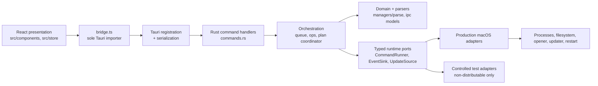
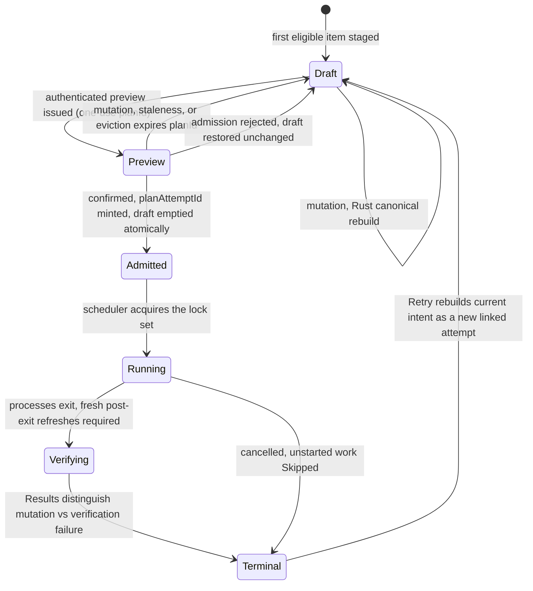

# Architecture Spine — Pack-Manager

> **Revision 7, 2026-07-25.** The `epics.md` retired register is **reconciled**, so
> the last Open row from revision 6 is closed — `epics.md` now carries the retired
> gate only as retirement records and cites this spine as the sole AD authority.
> Also corrects four claims this spine made that the tree or the bound stories
> contradicted: the application version (release-please owns it and it was already
> 1.0.1), and three Deferred rows whose "no live consumer" premise was false —
> opener/reveal is now an Open item owned by Story 6.5. A reviewer gate of four
> lenses ran against revision 6; its unresolved architecture findings are listed as
> Open items below. Change record: `DRIFT-NOTE.md`.
>
> **Revision 6, 2026-07-25.** AD-17's draft durability is settled: fail-to-empty,
> session-scoped, never persisted. Revision 5 assumed the durable branch; the
> owner chose the other one. Everything below is otherwise revision 5.
>
> **Revision 5, 2026-07-25.** Removes the last of the readiness-gate apparatus
> `docs/DECISIONS.md` D33 retired — chiefly AD-3's versioned boundary catalog,
> which bound builders to a `contracts/` directory that has never existed. Adds
> AD-17 through AD-20 for the places the live build queue could diverge, and
> states D27's headline invariant — no entry point executes — which earlier
> revisions claimed in a `Prevents` but never wrote as a `Rule`. AD-6..AD-10 and
> AD-13..AD-15 remain retired and their ids are never reused. Change record:
> `DRIFT-NOTE.md` in this folder.

## Design Paradigm

Pack-Manager is one layered Tauri application. Hexagonal boundaries exist only
where the application must control or observe nondeterminism — processes, the
clock, the filesystem, the updater. Rust owns trusted orchestration and every
canonical domain value; React owns presentation. They meet at exactly one typed
local command/event boundary.

Dependencies point inward. The arrow direction below is a rule, not a sketch.


```mermaid
flowchart LR
    UI["React presentation<br/>src/components, src/store"] --> BRIDGE["bridge.ts<br/>sole Tauri importer"]
    BRIDGE --> IPC["Tauri registration<br/>+ serialization"]
    IPC --> HANDLERS["Rust command handlers<br/>commands.rs"]
    HANDLERS --> APP["Orchestration<br/>queue, ops, plan coordinator"]
    APP --> DOMAIN["Domain + parsers<br/>managers/parse, ipc models"]
    APP --> PORTS["Typed runtime ports<br/>CommandRunner, EventSink, UpdateSource"]
    PORTS --> PROD["Production macOS adapters"]
    PORTS --> CTRL["Controlled test adapters<br/>non-distributable only"]
    PROD --> OS["Processes, filesystem, opener, updater, restart"]
```

Nothing in `src/` or `src-tauri/src/` may point outward from this graph — not at
test infrastructure, not at CI, not at release tooling.

## Verified Brownfield Baseline

Verified against the tree on 2026-07-25. Starting conditions, not a claim of
completeness.

- Production registers 20 Tauri commands (`src-tauri/src/lib.rs`,
  `invoke_handler`) and six typed events (`src-tauri/src/events.rs`), with
  matching frontend wrappers and subscriptions. `src/lib/ipc/bridge.ts` is the
  sole frontend Tauri importer; startup subscribes before hydration.
- `dev/fixtures/ipc/` holds 15 committed contract fixtures. `src-tauri/src/ipc.rs`
  byte-compares each serialized model against its fixture and round-trips the
  committed bytes back through `Deserialize`.
- The process runner already provides structured argv, cleared environment, null
  stdin, isolated process groups, bounded output, timeout, and
  SIGTERM-to-SIGKILL escalation. Opener, reveal, restart, current-executable,
  bundle-parent writability, and some path/time behavior are still direct OS
  calls.
- Rust tests construct handlers below Tauri; browser tests replace the Tauri
  bridge with an in-browser double. Neither crosses the complete production
  JavaScript-to-Tauri-to-Rust transport. No native harness exists.
- The Upgrade Plan is currently transient dialog state (`ui.dialog`
  `{ kind: "upgradePlan" }`, discarded by `closeDialog`), a single-package row
  action executes immediately, the durable token is a monotonic `revision` in
  `PlanCoordinator`, and no `planAttemptId`, `Verifying`, or
  `InteractionRequired` symbol exists in `src/` or `src-tauri/src/`.
  `autoOpenDrawer` is still an active setting.
- Persistence lives in Application Support: `settings.json` (atomic replace) and
  `operations.jsonl` (append-only, compacted to the newest 1,000 records via
  temp file + fsync + rename). Diagnostics export ships `report.json`, the
  newest three app logs, the newest 25 transcripts, and `operations.jsonl`.
- `release.yml` builds universal signed artifacts and blocks publication on two
  checks: `minisign` verification of the detached updater signature against the
  embedded pubkey, and a reachability/coherence assertion on the published
  `latest.json`.
- Minimum supported macOS is 15.0 at `bundle.macOS.minimumSystemVersion`. The
  application version is release-please-owned across five files and is read from
  `.release-please-manifest.json`, never restated here — it was 1.0.1 as of
  2026-07-25 and will move without this document changing.

## Invariants & Rules

### AD-1 — [ADOPTED] Dependencies point inward; test and release tooling are never product dependencies

- **Binds:** all
- **Prevents:** a test harness, CI lane, or release tool becoming load-bearing
  product behavior — and work being scheduled for a "test gap" the shipping code
  already covers
- **Rule:** Product code never imports, branches on, or requires test
  infrastructure, CI, or release tooling. Test infrastructure may replace
  adapters at the composition boundary; it may not add product behavior.
- **Rule:** Missing or incorrect behavior is product work, not test work. Before
  scheduling anything described as a test gap, verify whether the behavior is
  already present in the shipping code (`docs/DECISIONS.md` D33).

### AD-2 — [ADOPTED] One composition root; controlled adapters never reach release bits

- **Binds:** all
- **Prevents:** a test-only application path that bypasses production handlers,
  the state graph, serialization, or safety defaults
- **Rule:** The Tauri composition root constructs the application from typed
  runtime ports. Production composition supplies fail-closed macOS adapters. Any
  controlled adapter is a construction-time dependency of a non-distributable
  target.
- **Rule:** Release builds contain no feature flag, environment variable, CLI
  option, hidden command, or runtime selector that can activate a controlled
  adapter, and production registration contains no test-only command or event.

### AD-3 — [ADOPTED] The IPC surface changes atomically, proven by the committed contract fixtures

- **Binds:** all IPC work; Epic UX-PB; Story 6.5
- **Prevents:** React and Rust drifting apart on the shape of what crosses the
  boundary — payload fields, wire casing, registration set, and which module may
  touch Tauri at all
- **Rule:** `src/lib/ipc/bridge.ts` is the only frontend module that imports
  Tauri APIs, re-exporting exactly `invoke`, `listen`, and `UnlistenFn`.
  Components use typed wrappers from `client.ts`; `events.ts` owns native event
  subscriptions. Argument-taking commands wrap payloads as `{ args: ... }`;
  no-argument commands omit the payload entirely.
- **Rule:** One deliberate surface change moves as one change: Rust models and
  registration, TypeScript types, guards and wrappers, `dev/fixtures/ipc/*.json`,
  and event subscriptions. The enforcing mechanism is the shipping contract test
  — `src-tauri/src/ipc.rs` byte-compares each serialized model against its
  committed fixture, and the TypeScript half asserts its fixture set exactly
  equals its guard map. Regenerate only with
  `PM_UPDATE_CONTRACT=1 cargo test ipc_contract`; never set that variable in a
  verification run.
- **Rule:** Every IPC enum declares its wire casing explicitly with
  `#[serde(rename_all = ...)]`, and each existing spelling is preserved. Stable
  `ErrorCode` values and `IpcError` context fields do not change meaning.
- **Rule:** The verified 20 commands and six events are a baseline, not a fixed
  count. There is no separate versioned boundary-catalog file and none is to be
  created.
- **Rule:** Startup subscribes to native events before `get_state` hydration, and
  a real detection report is never clobbered by the pre-detection placeholder.
- **Rule:** The fixtures prove payload shape on both sides. They do not dispatch
  anything through Tauri, so real event *delivery* is unproven by construction —
  no current suite crosses the complete JavaScript-to-Tauri-to-Rust transport.
  Any story adding a field to an event payload (AD-18's `planAttemptId` on
  `op:status`, `op:output`, and the attention path) owns fixture coverage of the
  shape; proving delivery itself waits on the native harness Deferred below, whose
  only live consumer is Story 6.5. No story may claim delivery coverage from a
  fixture or from the browser double.

### AD-4 — [ADOPTED] Material process and macOS effects go through typed ports

- **Binds:** all Rust orchestration; Epic UX-PB; Stories 2.2, 3.4, 6.5
- **Prevents:** unsafe real mutations under test, and untestable branches hidden
  behind direct operating-system calls
- **Rule:** Five ports exist today and are extended rather than bypassed:
  `CommandRunner`, `EventSink`, `UpdateSource`, `PendingRelease`, and
  `ManagerAdapter`. Effects already behind one of them stay behind it, and a
  direct call for a covered effect is a defect.
- **Rule:** Effects the live build queue newly introduces go through a port from
  the start — specifically the filesystem access AD-18's attempt journal requires,
  and the clock any verification or staleness deadline reads. AD-17's draft needs
  neither, because it never leaves memory. Opener, reveal, restart,
  current-executable, bundle-parent writability,
  and the remaining path/time call sites are direct calls today; that is recorded
  brownfield state, not a violation. Opener and reveal are the exception: Story 6.5
  requires their success and failure to be controlled, so that seam is an Open item
  owned by Story 6.5, not a consumer-less deferral.
- **Rule:** Ports may not weaken the settled safety floor. Process requests stay
  structured argv against resolved absolute executables, with `env_clear`, an
  explicit environment, null stdin, and `process_group(0)`. No shell command
  string is ever run, no display text is ever split back into arguments, and no
  `sudo`, password, or administrator route exists.
- **Rule:** Observe the coordinator-first lock order. Any code reading
  plan-relevant state — `detection`, `registry`, `queue.records()`, `settings`,
  `tool_env` — must already hold `state.plan_coordinator`. Taking those locks
  without it yields a mixed-time collection instead of one canonical epoch.
- **Rule:** The manager's own `outdated` verdict is the only authority on whether
  a package is outdated. Pack-Manager never computes a version comparison to
  decide it; frontend version-delta logic is display-only.
- **Rule:** Ownership and self-update routing are derived from paths at detection
  time, never hardcoded. Classification inspects the RAW resolved path against
  mise's shims and installs directories BEFORE canonicalizing it — mise shims are
  symlinks to the mise binary, so canonicalize-first misroutes npm and uv to
  brew. Route precedence is fixed: in-band override, then delegated-if-detected,
  then native, then unavailable.
- **Rule:** The output side has a fidelity floor. Transcripts are byte-faithful
  to what the child printed, with exactly one exception: the runner's
  unterminated-notice list, a closed set of verbatim strings — never patterns —
  which is the only place Pack-Manager inserts a line break the child never
  printed. Extending `CommandRunner` may not add a second output-rewriting rule.
- **Rule:** Scheduling keeps the complete lock-set rule: the single scheduler
  atomically checks and acquires each operation's full lock set before start.
  The set is the executor lock union the subject lock, plus the Mise lock when a
  mise-managed npm or uv is the executor. The global concurrency cap of 4, the
  120s aging guard, and duplicate-refresh coalescing are preserved.

### AD-5 — [ADOPTED] Anything exercising application data owns a disposable root

- **Binds:** persistence and lifecycle work; Stories 3.4, 6.5; UX-PB.1b, UX-PB.2c
- **Prevents:** a test corrupting the operator's real data, or a relaunch
  signaling a reused historical process identifier
- **Rule:** One injected root set owns Application Support, settings, journals,
  logs, transcripts, diagnostics destination, and temporary files for each
  scenario. No scenario resolves a production user directory by fallback.
- **Rule:** Historical PGIDs recorded in the journal are data only and are never
  signaled after a restart, because PID reuse makes it unsafe. An unfinished
  start is reconstructed as Interrupted instead.
- **Rule:** Diagnostics must reject symlinks both when selecting and when
  streaming files.

### AD-11 — [ADOPTED] Release acceptance is the checklist plus two automated checks

- **Binds:** release
- **Prevents:** a release shipping without the checks whose failure is silent and
  simultaneous across every installed client
- **Rule:** Release readiness is `docs/RELEASE-CHECKLIST.md` — a manual
  checklist, not a computed verdict, coverage percentage, or gate decision. A
  GitHub Release's existence is distribution state, not proof.
- **Rule:** Two checks in `release.yml` block publication: the detached updater
  signature is base64-decoded and verified with `minisign` against the public key
  the shipping app embeds, and the published `latest.json` is asserted reachable
  and coherent after upload.
- **Rule:** The build stays universal and `latest.json` publishes both
  `darwin-aarch64` and `darwin-x86_64`, both pointing at the single universal
  archive. The x86_64 key is never dropped — `tauri-plugin-updater` resolves its
  target from `cfg!(target_arch)`, so removing it strands every installed Intel
  user with no signal. Verification is Apple silicon only; Intel is best-effort
  and unverified (`docs/DECISIONS.md` D32).
- **Rule:** Minimum supported macOS is 15.0 at
  `bundle.macOS.minimumSystemVersion` (`docs/DECISIONS.md` D31). CI stays on
  `macos-14`: a deployment target above the build SDK is a floor annotation, not
  an SDK requirement. Whether `notarytool` accepts `minos 15.0` against that SDK
  is still open and is settled by a manual Release run, never by assertion.
- **Rule:** Accessibility is product quality carried by the existing lanes, not a
  separate evidence lane. Automated 4.5:1 text-contrast and reduced-motion checks
  belong in the Playwright/Vitest lane — neither exists yet, so this is an
  obligation on whichever story adds them, not a description of current coverage.
  One manual VoiceOver pass sits on the release checklist. Broader WCAG or legal
  compliance is not implied (`docs/DECISIONS.md` D33, restating the former DR-2).

### AD-12 — [ADOPTED] release-please owns versions; `main` is the release trigger

- **Binds:** release, all commits
- **Prevents:** a hand-edited version drifting between the five files that must
  agree, and unfinished work shipping because `main` has no later gate
- **Rule:** release-please and GitHub Actions are the release framework and
  transport. A conventional commit reaching `main` enters release automation with
  no later human gate, so work stays off `main` until it is ready to ship.
- **Rule:** Seven files are release-please-owned and never hand-edited:
  `package.json`, `package-lock.json`, `src-tauri/tauri.conf.json`,
  `src-tauri/Cargo.toml`, `src-tauri/Cargo.lock`, `CHANGELOG.md`, and
  `.release-please-manifest.json`.
- **Rule:** Apple Developer ID signing and notarization are required for a
  published release; updater signing is required by the build. The manual
  workflow-dispatch path publishes nothing only when `attach_to_tag` is empty —
  that is the safe way to test pipeline changes.

### AD-16 — [ADOPTED] Upgrade Plan intent and confirmed Plan Attempts are distinct durable domains

- **Binds:** D27–D30; Epic UX-PB (all 28 stories); Stories 3.1, 3.2, 3.5, 6.5
- **Prevents:** executing from a row or Manager header, treating a short-lived
  preview capability as History identity, fabricating plan groups from legacy
  Operations, or reporting success before verification
- **Rule:** No entry point executes. A Package row action, a Manager-header
  action, a Manager-wide action, and `Update Everything` all mutate the draft and
  return. `execute_plan` is reachable only from the confirmed-attempt path below.
  The shipping `ManagerPane.upgradeRow` → `executePlan` call site is retired by
  this rule, not preserved by it (`docs/DECISIONS.md` D27).
- **Rule:** The draft holds canonical `PlanIntent`, never trusted executable
  strings, with individually removable Package and Manager members plus explicit
  option values. Every draft mutation asks Rust to rebuild the preview. The
  existing `planId` stays a bounded one-use capability for one reviewed preview
  and expires on mutation, staleness, execution attempt, or eviction — an evicted
  `planId` fails closed exactly like an unknown or replayed one.
- **Rule:** A canonical rebuild may remove or invalidate membership; it may never
  add a member the user has not seen. An `AllEligible` intent freezes its
  expansion at the mutation that created it — newly eligible work discovered
  later surfaces as an explicit offer to re-seed, never as silent membership. If
  a rebuild would enlarge membership, the preview `planId` expires and re-review
  is required. This holds identically on the confirmation-off path, which
  otherwise has no moment at which the user could see the addition.
- **Rule:** `execute_plan` returns a newly generated durable `planAttemptId` plus
  the admitted Operation identities. A preview `planId` and a `planAttemptId` are
  different types, fields, schemas, namespaces, and test assertions. Neither is
  ever silently converted into the other.
- **Rule:** Admission is atomic and all-or-none. The complete derived operation
  set enters the scheduler together or nothing does, so a confirmed attempt's
  membership can never silently differ from the reviewed intent. Execution must
  match the issued preview and a fresh coherent rebuild, and is rejected on
  in-progress state change, revision drift, an active refresh, or a lock-set
  overlap with any pending or running mutating operation.
- **Rule:** Exactly one confirmed attempt may be active. A second confirmation
  fails closed with a typed already-active result. The active attempt may run
  independent Managers concurrently under AD-4's lock-set rules.
- **Rule:** Primary cancellation targets `planAttemptId`: unstarted work becomes
  `Skipped`, running process groups use the existing escalation, and every
  terminal state stays durable. `Cancel operation` is reserved for an explicitly
  Operation-scoped diagnostic action.
- **Rule:** A mutating attempt is not successful until the required affected
  Manager refreshes complete. The attempt explicitly enters `Verifying`, and
  Results distinguish mutation failure from verification failure while preserving
  the Last-good Snapshot rules. "Affected" is the executor and the subject of each
  mutating operation in the attempt — the same set the scheduler locked.
- **Rule:** A verification refresh must be a fresh acquisition whose data
  collection begins strictly after the mutating process exited. Verification
  refreshes are exempt from AD-4's duplicate-refresh coalescing against any
  refresh already in flight at that instant; a coalesced refresh satisfies
  verification only if it started after it. A snapshot taken before the mutation
  can neither confirm nor refute it.
- **Rule:** `Verifying` and `Skipped` are durable wire-level operation states, not
  presentation states derived in React. They are journaled, exported in
  diagnostics, and replayed from History, so a derived state could not survive a
  crash or a replay. Adding them is one atomic contract change under AD-3.
  `Skipped` marks only work that never started; crash-reconstructed unfinished
  work stays `Interrupted`.
- **Rule:** Retry always creates a new `planAttemptId`, links to the preceding
  failed attempt, and preserves the original failure. The backend rebuilds
  current intent rather than replaying historical executable text.
- **Rule:** Settings replace active `autoOpenDrawer` behavior with
  `skipUpgradePlanConfirmation`, default `false`. A confirmation opt-out skips
  only the final modal — never draft review, the Rust rebuild, stale detection,
  or the explicit confirmation action.
- **Rule:** `Interaction required` is emitted only from a closed Manager-specific
  classifier or an explicit typed native signal. Any unmatched null-stdin silence
  uses the ordinary stall contract.
- **Rule:** The application's own update is not a Package plan. It never enters a
  `PlanIntent`, draft, confirmed attempt, Results, or plan-attempt History, and it
  holds no manager lock. Its surfaces are its own StatusBar badge, the Settings
  Updates card, and the macOS app menu's `Check for Updates…` item. The menu
  handler and the IPC command share one code path behind the
  `UpdateSource`/`PendingRelease` seam — a second entry point never grows its own
  state transitions (`docs/DECISIONS.md` D25, D25a).

#### Normative domain minimum (under AD-16)

Names may be refined during story implementation; the semantic separation is
fixed.

```text
PlanIntent
  kind: Explicit | AllEligible      # durable; a removal converts AllEligible -> Explicit
  packageUpdates: ordered unique PackageRef[]
  managerUpdates: ordered unique ManagerId[]   # independent removable members
  includeGreedyCasks: boolean
  # no global includeSelfUpdates control exists

UpgradePlanPreview
  planId: one-use PlanCapabilityId
  intent: PlanIntent
  groups: reviewed commands and display items
  exclusions / warnings

PlanAttempt
  planAttemptId: durable PlanAttemptId
  retryOfPlanAttemptId?: PlanAttemptId
  reviewedIntent + reviewedCommandSnapshot
  operationIds[]
  state: admitted | running | verifying | terminal
  verificationResults + resultSummary
```

The active-attempt lookup, cancel command, History query, Activity replay, and
diagnostic export address `planAttemptId`. Operation detail continues to address
`opId` within that attempt.


```mermaid
stateDiagram-v2
    [*] --> Draft: first eligible item staged
    Draft --> Draft: mutation, Rust canonical rebuild
    Draft --> Preview: authenticated preview issued (one-use planId)
    Preview --> Draft: mutation, staleness, or eviction expires planId
    Preview --> Admitted: confirmed, planAttemptId minted, draft emptied atomically
    Preview --> Draft: admission rejected, draft restored unchanged
    Admitted --> Running: scheduler acquires the lock set
    Running --> Verifying: processes exit, fresh post-exit refreshes required
    Verifying --> Terminal: Results distinguish mutation vs verification failure
    Running --> Terminal: cancelled, unstarted work Skipped
    Terminal --> Draft: Retry rebuilds current intent as a new linked attempt
```

#### Domain rules required by the UX-PB acceptance criteria (under AD-16)

- **Intent kind.** `PlanIntent` distinguishes explicitly chosen membership from
  bulk `AllEligible` membership, durably: a bulk-added item the user removes
  stays removed across a rebuild, and an explicit item is never silently absorbed
  into a later bulk action. `AllEligible` carries the scope of the action that
  created it — one Manager, the current filtered view, or everything — because
  the bulk entry points differ in scope and a kind without a scope cannot be
  re-derived or explained. It never silently widens to a larger scope.
- **Draft-mutation convergence.** Every draft mutation resolves against a Rust
  canonical rebuild. If the rebuild errors or rejects, the prior coherent draft
  and its last authenticated preview are preserved unchanged and nothing is
  admitted. Frontend display text is never authority. Concurrent mutations
  converge to one deduplicated membership set with a single authenticated
  rebuild.
- **Ineligible-item inertness.** An item that is pinned, already current, a
  non-opted-in greedy cask, or removed between staging and rebuild is inert: its
  control is non-interactive to pointer and keyboard, it carries a stated reason
  for assistive technology, and it can never enter a `PlanIntent`.
- **Item ineligibility is not plan-composition exclusion.** The two resolve at
  different times and must not be collapsed. Item-level ineligibility is a
  property of the item alone and bars it from `PlanIntent` entirely. A
  plan-composition exclusion depends on what else is in the plan — `rustDedup`
  when rustup toolchains join a plan also containing mise's `tool:rust`, and
  `alreadyRunning` — so the item stays in `PlanIntent` and is surfaced with its
  reason in the preview's exclusions. A cross-item exclusion is never
  retroactively converted into item ineligibility, and removing the other side of
  the conflict restores the item without the user re-staging it.
- **Legacy honesty.** Journal and History records without a recorded
  `planAttemptId` stay individually labeled legacy Operations. Migration may
  preserve and index them but must never infer a plan grouping.

### AD-17 — [ADOPTED] Rust owns the canonical draft; the sidecar is a layout region

- **Binds:** UX-PB.1a–1e, UX-PB.3a, UX-PB.4d; Stories 3.1, 3.2, 3.5
- **Prevents:** UX-PB.1a and UX-PB.1b disagreeing on whether the draft survives a
  relaunch — one persisting it, the other assuming it is gone — and separate
  stories disagreeing on whether the sidecar is a dialog, a drawer, or a layout
  region
- **Rule:** Rust owns the canonical `PlanIntent`. The Zustand draft store is a
  projection of the last authenticated rebuild — never the authority, never the
  author of executable text. Every mutation round-trips through Rust before the
  projection updates.
- **Rule:** The draft is session-scoped and is never written to disk. Every
  relaunch — after a clean quit, a crash, or a force-quit — starts with an empty
  draft and a hidden sidecar. This takes the second branch of UX-PB.1b's recovery
  criterion unconditionally: membership is never reconstructed, never partially
  restored, and never fabricated, and nothing executes on relaunch. A draft is
  never surfaced as Activity or History.
- **Rule:** The door stays closed. No draft file exists in Application Support, no
  draft schema is versioned, and AD-19 has nothing to migrate for it. A story that
  wants staging to survive a crash is proposing a new decision, not implementing
  this one — the cost of that choice is a lost draft after a crash, and it was
  accepted deliberately.
- **Rule:** Admission transfers custody. The draft is emptied atomically with the
  mint of `planAttemptId`; a failed or rejected admission restores it unchanged.
  While an attempt is non-terminal the region is owned by attempt status, and new
  membership staged during that attempt accumulates in the canonical draft
  without displacing it — surfacing in the region only once the attempt's Results
  are dismissed.
- **Rule:** The sidecar is a single layout region — not a `ui.dialog` kind and not
  a `DialogHost` child. Exactly one instance exists and it persists across
  `ActiveView` changes without losing membership or scroll identity. Its
  visibility is a three-way union: a non-empty draft, a non-terminal attempt, or
  undismissed Results. A confirmed attempt replaces its content in place rather
  than opening a second surface, and Results remain until dismissed even though
  the draft behind them is empty. When all three are false the region is hidden
  and the workspace reclaims its width with no reserved empty column.
- **Rule:** Below 720 usable CSS pixels the region stops being a fixed sidecar and
  the same single instance is presented as a full-workspace or stacked surface.
  Viewport is a placement driver, never a second mount point.
- **Rule:** Activity is a first-class destination in the existing discriminated
  `ActiveView` state — for the active attempt and for replaying a completed
  History entry — not a drawer and not a sidecar mode. The existing
  `ActivityDrawer` surface retires with the `autoOpenDrawer` setting; no story
  keeps it alive as a second home for attempt status. A queued draft stays in the
  sidecar and never appears in Activity (`docs/DECISIONS.md` D30).
- **Rule:** `DialogHost` remains the single mount point for modal surfaces and
  shows one dialog at a time. The final confirmation dialog is one of those
  modals; the sidecar is not.
- **Rule:** There is exactly one polite status-announcement channel for plan and
  attempt progress, owned alongside the sidecar region. Stories announce through
  it; none adds a second live region for the same information. Two live regions
  narrating one attempt is a defect, not additive coverage.

### AD-18 — [ADOPTED] Confirmed plan attempts have their own durable store

- **Binds:** UX-PB.2c, UX-PB.2d, UX-PB.2f, UX-PB.3d, UX-PB.4a, UX-PB.4b, UX-PB.4e; Story 6.5
- **Prevents:** the writer, the History reader, and the diagnostics exporter each
  choosing a different home for attempt records — an extended `operations.jsonl`,
  a private sidecar file, or memory only
- **Rule:** Confirmed attempts persist to their own append-only NDJSON journal in
  the same Application Support directory as `operations.jsonl`, under the same
  discipline: an append failure is nonfatal to package operations, and compaction
  is temp file + fsync + rename, never truncate-in-place.
- **Rule:** `operations.jsonl` keeps its record shape and carries `planAttemptId`
  only where one exists. A record without one stays an individually labeled
  legacy Operation.
- **Rule:** Diagnostics export carries both journals as distinct entries
  alongside `report.json`, the newest three app logs, and the newest 25
  transcripts. Existing retention bounds are unchanged.
- **Rule:** Widening the export does not widen disclosure. Plan-attempt records
  enter the archive under the same allowlist the export already applies —
  inherited environment values are excluded, and a record carries the reviewed
  intent and the exact argv Pack-Manager constructed, never ambient environment
  or user paths beyond what the existing entries already disclose. A story that
  adds a field to the attempt record owns its disclosure review.
- **Rule:** The two journals share a retention policy. Compacting the Operation
  journal may not orphan an attempt whose Operations it drops, and compacting the
  attempt journal may not leave Operations pointing at an attempt that no longer
  resolves. A record that loses its counterpart reads as legacy, never as
  corrupt.
- **Rule:** Operation status, output and stall events, transcript metadata, and
  journal start/finish records carry `planAttemptId` when one exists, so
  correlation never depends on reconstructing it from timing or membership.

### AD-19 — [ADOPTED] Persisted schemas tolerate their own history

- **Binds:** UX-PB.5b; Story 3.4; all persistence
- **Prevents:** one story dropping unknown persisted keys while another fails
  closed on them, and a retired setting silently coming back to life
- **Rule:** Reading a persisted file tolerates unknown and retired fields and
  never fails the application.
- **Rule:** Degrade-to-defaults is scoped to configuration, not to records. A
  corrupt `settings.json` falls back to defaults with a visible notice — the
  shipping behavior. A journal must never be defaulted away: an unparseable line
  is skipped and counted, the surrounding records stay readable, and a
  plan-attempt or Operation record is never silently replaced by a synthesized
  one. Losing history quietly is worse than surfacing that some of it is
  unreadable.
- **Rule:** A retired field is never re-serialized as active and is never
  observed by product code. An old persisted `autoOpenDrawer` value is tolerated
  on read and inert once `skipUpgradePlanConfirmation` exists.
- **Rule:** A settings patch is persisted before it becomes active in memory or
  advances the canonical revision; a failed save changes neither. Every control
  saves immediately and atomically with visible `Saving` / `Saved` / failure
  state.

### AD-20 — [ADOPTED] The webview trust boundary widens only on purpose

- **Binds:** all frontend work; any new plugin, permission, window, or remote asset
- **Prevents:** a feature story quietly widening the webview's authority, and
  remote content reaching a webview that has no content-security policy
- **Rule:** The application loads only its own bundled assets. `csp` is `null`
  today, which means Tauri injects none — tolerable only while nothing remote is
  loaded. Any change that introduces remote content, a remote font, script,
  style, or navigation target must set a real CSP in the same change, not later.
- **Rule:** One capability file grants the `main` window exactly `core:default`,
  `opener:default`, and `core:window:allow-start-dragging`. Adding a permission,
  a plugin, a window, or a second capability is a security-sensitive change
  reviewed on its own terms and never folded into a feature story as a
  side effect.

## Consistency Conventions

| Concern | Convention |
| --- | --- |
| IPC surface | Production registration is authoritative; 20 commands / six events is the current baseline, not an invariant. Rust models, TypeScript types/guards/wrappers, `dev/fixtures/ipc/*.json`, and subscriptions move in one change (AD-3). |
| Wire casing | Every IPC enum declares `#[serde(rename_all = ...)]` explicitly. Structs and multiword-variant enums are `camelCase`; single-word-variant enums are `lowercase`; `ErrorCode` is `snake_case`. |
| Identity | Package ids are `kind:name`, split on the first colon only. `mas` is the exception: its id segment is the numeric App Store id. Manager-supplied version strings are preserved verbatim; unknown versions are `null`. |
| Plan identity | `planId` is a one-use preview capability; `planAttemptId` is durable. Different types, fields, schemas, and namespaces — never interconverted (AD-16). |
| Runtime effects | Application and domain code depends on typed ports. Direct OS calls live only in production adapters; controlled adapters exist only in a non-distributable composition (AD-2, AD-4). |
| Persistence | Application Support holds `settings.json` (atomic replace) plus append-only NDJSON journals compacted by temp file + fsync + rename. Unknown and retired fields are tolerated on read (AD-18, AD-19). |
| Frontend state | Narrow Zustand selectors in components; the store's static accessor outside React. Objects and Sets are replaced immutably; cross-store derived state lives in `src/store/index.ts`. Per-manager phase is derived, never stored. |
| Styling | Design tokens live in `src/styles/theme.css`; the product is dark-only and adds no hardcoded hex elsewhere. Color states always carry a text or icon equivalent. |
| Determinism | Default suites are offline and deterministic: `CommandRunner`/`FakeRunner`, `EventSink`/`VecSink`, `bridge.ts`/`fakeIpc`, paused Tokio or fake timers. No real processes, network, sleeps, or host state. |

## Stack

Verified against `package-lock.json` and `src-tauri/Cargo.lock` on 2026-07-25.
A brownfield seed, not a version policy — the lockfiles own this.

| Name | Version |
| --- | --- |
| Application version | release-please-owned; see `.release-please-manifest.json` (1.0.1 on 2026-07-25) |
| Rust edition | 2021 |
| Tauri Rust crate | 2.11.5 |
| Tauri JavaScript API | 2.11.1 |
| Tauri CLI | 2.11.4 |
| Tauri updater plugin | 2.10.1 |
| Tauri opener plugin | 2.5.4 |
| Tokio | 1.53.1 |
| React / React DOM | 19.2.8 |
| TypeScript | 7.0.2 |
| Vite | 8.1.5 |
| Tailwind CSS | 4.3.3 |
| Zustand | 5.0.14 |
| TanStack React Virtual | 3.14.8 |
| Vitest | 4.1.10 |
| Playwright | 1.61.1 |
| Node in CI | 24 |
| CI runner images | macos-14 (ci.yml build/test, release.yml); ubuntu-latest (all other jobs) |
| Minimum supported macOS | 15.0 |
| Release automation | release-please action v5 + GitHub Actions |

## Structural Seed

Where durable state lives. The code owns the detail; this fixes the shape the
UX-PB stories must agree on.

```text
~/Library/Application Support/<bundle-id>/
  settings.json          # atomic replace; unknown/retired fields tolerated (AD-19)
  operations.jsonl       # existing Operation journal; carries planAttemptId when one exists (AD-18)
  <plan-attempts>.jsonl  # confirmed attempts; own append-only journal (AD-18)
  transcripts/           # newest 25 exported
  # no draft file — the draft is session-scoped and never persisted (AD-17)
~/Library/Logs/<bundle-id>/
                         # newest 3 exported
```

## Capability → Architecture Map

| Capability / area | Lives in | Governed by |
| --- | --- | --- |
| Draft Upgrade Plan and sidecar — persists across navigation, not across relaunch (UX-PB.1a–1e) | Rust plan services + Zustand projection + layout region | AD-16, AD-17 |
| Plan attempts, admission, cancellation (UX-PB.2a–2f) | Rust queue/ops + plan-attempt store | AD-3, AD-4, AD-16, AD-18 |
| Activity, live progress, Results, interaction classification (UX-PB.3a–3g) | Rust event dispatch + React attempt views | AD-4, AD-16 |
| History, replay, Retry, legacy labeling (UX-PB.4a–4e) | Plan-attempt journal + History views | AD-16, AD-18 |
| Confirmation gate and its setting (UX-PB.5a–5e) | `DialogHost` modal + settings persistence | AD-16, AD-17, AD-19 |
| Detection, refresh phases, timeouts (Story 2.2) | Manager adapters behind runtime ports | AD-4 |
| Package state, eligibility, keyboard selection (Stories 3.1, 3.2, 3.5) | React package views + Rust plan builder | AD-4, AD-16, AD-17 |
| Settings and Environment Report (Story 3.4) | Settings persistence + detection state | AD-19 |
| Diagnostics export (Story 6.5) | `diagnostics.rs` through the production native command | AD-5, AD-18 |
| Packaged release, signing, updater | `release.yml` + `docs/RELEASE-CHECKLIST.md` | AD-11, AD-12 |

## Decision Status and Deferred Items

| Item | Status | Note |
| --- | --- | --- |
| Minimum supported macOS | **RESOLVED (one residual)** | 15.0 declared at `bundle.macOS.minimumSystemVersion` (`docs/DECISIONS.md` D31). Whether `notarytool` accepts `minos 15.0` against the CI SDK is OPEN and is settled by a manual Release run — D31 declines to assert it, and neither does this spine. |
| Supported architectures | **RESOLVED** | Universal build retained; verification is Apple silicon only. `docs/DECISIONS.md` D32. |
| Readiness gate policy | **RETIRED** | The 72-criterion gate, coverage percentages, scenario contracts, evidence manifests, and candidate-freeze machinery are dissolved. `docs/DECISIONS.md` D33. AD-6..AD-10 and AD-13..AD-15 are retired ids and are never reused. |
| Boundary catalog file | **RETIRED** | `contracts/tauri-boundary/v1.json` is not created. The atomic-change obligation moved to AD-3's committed contract fixtures. |
| ASR-01 / ASR-02 / ASR-03 enabler framing | **RETIRED** | The enabler register belonged to the retired gate. The surviving obligations are AD-2, AD-3, AD-4, and AD-5. |
| Upgrade Plan redesign (D27–D30) | **IN BUILD** | Epic UX-PB is the primary build queue; AD-16 through AD-19 are its contract. |
| Epics 1–6 | **RESCOPED** | Six stories survive — 2.2, 3.1, 3.2, 3.4, 3.5, 6.5 — carrying no inter-epic dependencies. Epics 1, 4, and 5 were removed; 31 stories archived. `docs/DECISIONS.md` D33. |
| Native Tauri E2E harness and runner | **Deferred** | Story 6.5 is the only live consumer ("Real native Tauri E2E plus artifact inspection"). Any choice must satisfy AD-2 and AD-3. |
| Controlled child-helper language | **Deferred** | Any choice must satisfy AD-4 and cannot add a production shell-command surface. |
| Crash/relaunch lifecycle controller | **Deferred (live consumers)** | UX-PB.1b, UX-PB.2f, UX-PB.4e, and Story 6.5 each assert crash, force-quit, or relaunch behavior, so the earlier "no live story requires one" premise was false. AD-5 binds whoever builds it; until it exists those stories own their own disposable-root setup and may not resolve a production directory by fallback. |
| Plan-attempt file name and serde shape | **Deferred** | AD-18 fixes ownership, location, durability, and failure mode; the exact filename and field list belong to UX-PB.2c. |
| Porting opener, reveal, restart, current-executable, writability, and remaining path/time call sites | **OPEN — owner Story 6.5** | Direct calls today. The earlier "no live story needs them controllable" premise was false: `epics.md` Story 6.5 requires "native command/opener success and failure are controlled", and both reveal paths are un-ported direct calls (`src-tauri/src/commands.rs` `reveal_item_in_dir`, `open_path`). Story 6.5 must introduce an opener/reveal seam as a sixth port under AD-4 rather than weaken its own criterion; it may not claim the coverage from the browser double. The remaining call sites stay Deferred. |
| Draft durability | **RESOLVED** | Fail-to-empty. The draft is session-scoped and never persisted; every relaunch starts empty. `epics.md` UX-PB.1b's recovery criterion permits this branch explicitly. Decided 2026-07-25; closes the assumption revision 5 carried. |
| Signing-secret storage mechanics | **Deferred** | fnox locally, GitHub Secrets in CI; secrets never enter build artifacts. |
| Settings write vs. revision drift | **OPEN — blocks UX-PB.5b** | AD-19 makes a settings patch advance the canonical revision; AD-16 rejects admission on revision drift. UX-PB.5b's confirmation opt-out writes `skipUpgradePlanConfirmation` inside the admission it is meant to streamline, so the safety opt-out deterministically fails its own run. Needs a rule scoping which revision advances invalidate a preview. `reviews/review-divergence-v6.md` C-1. |
| `PlanIntent` member provenance | **OPEN — blocks UX-PB.1a, UX-PB.1c** | AD-16's normative block gives `PlanIntent` a single `kind` scalar, but its own durability rule requires a bulk-added item the user removed to stay removed across a rebuild — which is per-member provenance, not a whole-intent scalar. The two stories cannot produce the same wire shape from the block as written. `reviews/review-divergence-v6.md` C-2. |
| Retry vs. the accumulating draft | **OPEN — blocks UX-PB.4d, UX-PB.1c** | AD-17 lets new membership accumulate in the canonical draft while an attempt is non-terminal; AD-16 says Retry rebuilds current intent as a new linked attempt. Both write the draft's next state and neither yields to the other. `reviews/review-divergence-v6.md` C-3. |
| Per-Manager failure isolation and Last-good Snapshot retention | **OPEN — silent dimension** | AD-16 references the Last-good Snapshot rules as though this spine defined them; it does not. Stories 2.2, 3.1, and the verification path all depend on them. `reviews/review-rubric-v6.md` H2. |
| App-update safety guard enforcement point | **OPEN** | The rule that an update is refused while Package work is queued or running has no stated enforcement point, and the shipping guard is frontend convention only — `install_app_update` has no Rust guard. `reviews/review-rubric-v6.md` H4. |
| Reviewer-gate tail (revision 6) | **Open** | The four `*-v6` lenses returned 44 findings: 5 CRITICAL, 14 HIGH, 18 MEDIUM, 7 LOW. Revision 7 resolved 12 (2 CRITICAL, 5 HIGH, 3 MEDIUM, 2 LOW) and promoted 5 to their own rows above. The tail is **7 HIGH, 15 MEDIUM, 5 LOW** across `reviews/review-divergence-v6.md`, `review-rubric-v6.md`, `review-reconcile-epics-v6.md`, and `review-currency-v6.md`. Two HIGHs to note: the native Tauri E2E harness stays Deferred while Story 6.5 is its named live consumer and AD-3 forbids the substitutes, so that story is not buildable from this spine as written (rubric H1); and UX-PB.1b's recovery criterion still offers the draft-reconstruction branch AD-17 forbids, which needs owner authorization because it edits an acceptance criterion (reconcile HIGH-3). Each finding names its own affected stories. |
| `epics.md` retired register | **RESOLVED** | Reconciled 2026-07-25 under `sprint-change-proposal-2026-07-25.md`. TIR-1..TIR-8, RE-1..RE-11, ASR-01..ASR-05, the register's own AD-1..AD-15, the 72-criterion controls, the Candidate Identity Manifest, the Evidence Registrar, `contracts/readiness/v1/contract-lock.json`, and the `contracts/tauri-boundary/v1.json` set-equality requirement appear only as retirement records. No `AD-n` id in `epics.md` asserts a rule differing from this spine's under that id, and all twelve live AD ids are now cited there. The `R-001`..`R-008` register was retired with them — its ids were defined only in archived gate artifacts and its `Required mitigation` column *was* the retired machinery, so asserting it survived re-imported ASR-01 set-equality and D32's dropped physical-Intel obligation by reference. Residual: UX-PB.1b `epics.md` UX-PB.1b's recovery criterion still offers the draft-reconstruction branch AD-17 forbids. |
