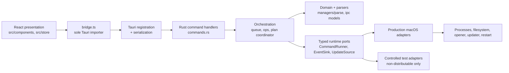
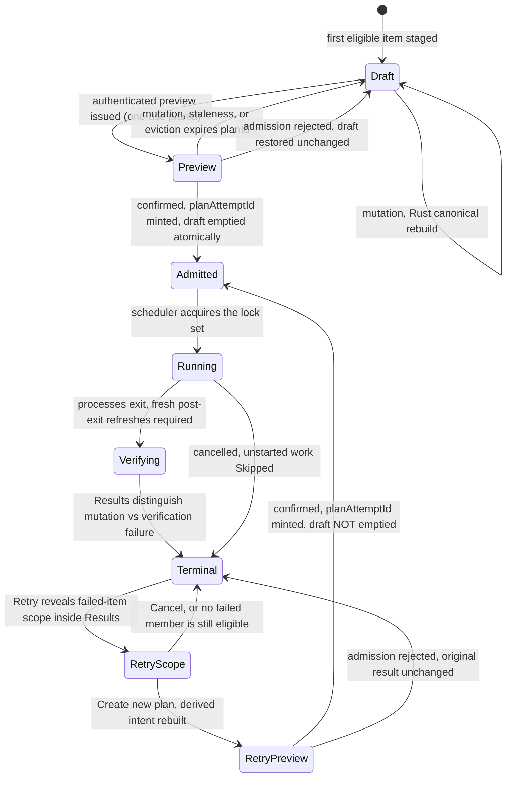

# Architecture Spine — Pack-Manager

> **Revision 12, 2026-08-11.** One register row, and the same defect revision 11
> fixed one row up: **maintainer edits** still read `OPEN` after every edit it
> lists had landed, in commit `d7a7696`. Its own worklist,
> `MAINTAINER-EDITS-2026-07-25.md`, already carried the header "Status: all six
> applied 2026-07-25 (maintainer)" — the row had not read it. All seven claims
> re-verified against the committed files and **all seven discharged**, so the row
> is **RESOLVED** with no maintainer edit outstanding. Two of them are discharged
> in a shape a later run could misread as unfinished and must not "fix":
> `docs/SPEC.md` §4.11 keeps its stale keyboard line under a **superseded marker
> rather than a rewrite**, because restating requirements in a demoted file is
> what created the two-authority problem `prd.md` §0.1 ended; and
> `docs/RELEASE-CHECKLIST.md` step 9a deliberately verifies `⌘L` as the
> **shipping** drawer toggle, naming AD-17's target state and saying not to report
> the difference as a failure. No `AD` created, retired, renumbered, or given a
> new rule. Change record: `DRIFT-NOTE.md`.
>
> **Revision 11, 2026-08-06.** Two recorded defects and nothing else — no new
> invariants, and no `AD` created, retired, or renumbered. The `epics.md`
> residuals row is **RESOLVED**: commit `0960aab` applied all seventeen items, and
> re-verifying them against the committed file caught **two errors in the row's own
> text** — it had joined `Clear` to `Esc` as if AD-28 deleted both, when AD-28's
> rule text names `Clear` inside the closed removal taxonomy, and its `Cancelling`
> count missed a lowercase occurrence. **AD-28**'s `Esc` rule no longer
> contradicts itself: it carried `prd.md` FR-6's pre-AD-17 wording ("three rungs
> to two") one clause ahead of its own correction, so a builder could read either.
> The cascade is **close-dialog alone**, which is what AD-17 and FR-6 both state.
> Change record: `DRIFT-NOTE.md`.
>
> **Revision 10, 2026-07-25.** Requirements have a separable owner again:
> `prds/prd-Pack-Manager-2026-07-25/prd.md` is the requirements authority this
> spine is reconciled *against*, and it restores FR-1…FR-22, RP-1/RP-2 and
> NFR-1…NFR-8 as Phase 2 content that had been living inside `epics.md`. Two
> Open rows that revision 9 routed to the owner as *new architecture* come back
> with decisions and close here, each as a new invariant: **AD-28** — a Package
> checkbox **is** Upgrade Plan membership, the transient selection layer is
> eliminated, and a range or filter-wide interaction is **one batched membership
> operation** rather than one per row; and **AD-29** — the plan-attempt journal
> has one writer and exactly two records per attempt, admission and terminal,
> with a stated fold rule. D37 also lands: keyboard navigation and screen-reader
> support are no longer release criteria, which touches AD-11, AD-16, AD-17 and
> AD-27 — and *exposes* two invariants that had been hiding behind the removed
> criteria, because deleting a rule deleted the only thing that made a safety
> state reach the user. D36's bright-fill ink rule now has consumers, a CI
> contrast guard, and a home in the Styling convention. Change record:
> `DRIFT-NOTE.md`.
>
> **Revision 9, 2026-07-25.** A reconciliation pass, not new architecture: five
> Open rows close because the work they were waiting on landed, and each closure
> was verified against the committed tree rather than against the report of it.
> The `epics.md` divergence batch is **applied** (commit `8d36cdf`, all seven
> items), the `macos-14` retirement is **done** (`macos-15`, D34 — which also
> closes D31's `notarytool` residual), the canonical design-token set is
> **decided** (D35), and the app-update safety guard now has a **Rust enforcement
> point** (`7cc7b5f`), closing a rubric finding open since revision 6. One new
> invariant, folded into AD-11 rather than given its own id: **a focus indicator
> must be drawn by a mechanism the shipping engine actually paints, and proven in
> WebKit rather than Chromium alone** — WKWebView does not paint `box-shadow` on
> native-appearance form controls, so the style contract stayed green on both
> engines while the native checkboxes had no visible focus at all. AD-11 also now
> states what a release may claim from the lanes. The reviewer gate then found the
> new rules were filed in the wrong place — AD-11 `Binds: release`, so the two
> stories that will actually draw a focus indicator never read it — and that the
> rule as first written was *weaker* than the D35 it should ratify. Both are fixed:
> the focus rules are now **AD-27**, bound to every story that renders a control,
> mandating one mechanism (`outline` + `outline-offset`, never `ring-*`, never
> `outline-none`) and refusing the `appearance: none` escape D35 rejects by name.
> AD-27 also records that CI's `webkit` project is Playwright's *Linux* WebKit, not
> WKWebView, so it is a proxy and not proof about the packaged app. Change record:
> `DRIFT-NOTE.md`.
>
> **Revision 8, 2026-07-25.** Closes the three CRITICAL Open rows revision 7
> recorded but declined to fix, each a pair of stories that obey every existing
> `AD` and still build incompatibly. Six new invariants: **AD-21** (only
> plan-determining inputs advance the revision admission checks), **AD-22** (a
> confirming action is one critical section and a safety-reducing rider never
> outlives a failed action), **AD-23** (`PlanIntent` carries per-member
> provenance; the `kind` scalar is gone), **AD-24** (the draft has one author;
> Retry derives its own intent), **AD-25** (a Manager failure never destroys a
> Last-good Snapshot — the referent AD-16 had been citing without defining), and
> **AD-26** (a native automation surface never reaches release bits). AD-11's
> accessibility rule is corrected: reduced motion **is** automated and runs in
> CI, so the standing obligation is contrast alone. Change record:
> `DRIFT-NOTE.md`.
>
> **Revision 7, 2026-07-25.** The `epics.md` retired register is **reconciled**, so
> the last Open row from revision 6 is closed — `epics.md` now carries the retired
> gate only as retirement records and cites this spine as the sole AD authority.
> Also corrects four claims this spine made that the tree or the bound stories
> contradicted: the application version (release-please owns it and it was already
> 1.0.1), and three Deferred rows whose "no live consumer" premise was false —
> opener/reveal is now an Open item owned by Story 6.5. A reviewer gate of four
> lenses ran against revision 6; its unresolved architecture findings are listed as
> Open items below. Change record: `DRIFT-NOTE.md`.
>
> **Revision 6, 2026-07-25.** AD-17's draft durability is settled: fail-to-empty,
> session-scoped, never persisted. Revision 5 assumed the durable branch; the
> owner chose the other one. Everything below is otherwise revision 5.
>
> **Revision 5, 2026-07-25.** Removes the last of the readiness-gate apparatus
> `docs/DECISIONS.md` D33 retired — chiefly AD-3's versioned boundary catalog,
> which bound builders to a `contracts/` directory that has never existed. Adds
> AD-17 through AD-20 for the places the live build queue could diverge, and
> states D27's headline invariant — no entry point executes — which earlier
> revisions claimed in a `Prevents` but never wrote as a `Rule`. AD-6..AD-10 and
> AD-13..AD-15 remain retired and their ids are never reused. Change record:
> `DRIFT-NOTE.md` in this folder.

## Design Paradigm

Pack-Manager is one layered Tauri application. Hexagonal boundaries exist only
where the application must control or observe nondeterminism — processes, the
clock, the filesystem, the updater. Rust owns trusted orchestration and every
canonical domain value; React owns presentation. They meet at exactly one typed
local command/event boundary.

Dependencies point inward. The arrow direction below is a rule, not a sketch.


```mermaid
flowchart LR
    UI["React presentation<br/>src/components, src/store"] --> BRIDGE["bridge.ts<br/>sole Tauri importer"]
    BRIDGE --> IPC["Tauri registration<br/>+ serialization"]
    IPC --> HANDLERS["Rust command handlers<br/>commands.rs"]
    HANDLERS --> APP["Orchestration<br/>queue, ops, plan coordinator"]
    APP --> DOMAIN["Domain + parsers<br/>managers/parse, ipc models"]
    APP --> PORTS["Typed runtime ports<br/>CommandRunner, EventSink, UpdateSource"]
    PORTS --> PROD["Production macOS adapters"]
    PORTS --> CTRL["Controlled test adapters<br/>non-distributable only"]
    PROD --> OS["Processes, filesystem, opener, updater, restart"]
```

Nothing in `src/` or `src-tauri/src/` may point outward from this graph — not at
test infrastructure, not at CI, not at release tooling.

## Verified Brownfield Baseline

Verified against the tree on 2026-07-25. Starting conditions, not a claim of
completeness.

- Production registers 20 Tauri commands (`src-tauri/src/lib.rs`,
  `invoke_handler`) and six typed events (`src-tauri/src/events.rs`), with
  matching frontend wrappers and subscriptions. `src/lib/ipc/bridge.ts` is the
  sole frontend Tauri importer; startup subscribes before hydration.
- `dev/fixtures/ipc/` holds 15 committed contract fixtures. `src-tauri/src/ipc.rs`
  byte-compares each serialized model against its fixture and round-trips the
  committed bytes back through `Deserialize`.
- The process runner already provides structured argv, cleared environment, null
  stdin, isolated process groups, bounded output, timeout, and
  SIGTERM-to-SIGKILL escalation. Opener, reveal, restart, current-executable,
  bundle-parent writability, and some path/time behavior are still direct OS
  calls.
- Rust tests construct handlers below Tauri; browser tests replace the Tauri
  bridge with an in-browser double. Neither crosses the complete production
  JavaScript-to-Tauri-to-Rust transport. No native harness exists.
- The Upgrade Plan is currently transient dialog state (`ui.dialog`
  `{ kind: "upgradePlan" }`, discarded by `closeDialog`), a single-package row
  action executes immediately, the durable token is a monotonic `revision` in
  `PlanCoordinator`, and no `planAttemptId`, `Verifying`, or
  `InteractionRequired` symbol exists in `src/` or `src-tauri/src/`.
  `autoOpenDrawer` is still an active setting.
- A transient selection layer ships alongside it: `src/store/packages.ts` holds
  `selection` (a `Set` of package ids per Manager) with toggle, range, set and
  clear primitives, plus an `anchor` per Manager for shift-ranges. AD-28 retires
  the `selection` set and keeps the anchor. The eligibility-and-visibility
  predicate that feeds it exists **twice** — inline in
  `src/components/manager/ManagerPane.tsx` and again as `visibleSelectableIds`
  in `src/hooks/useKeyboard.ts`, whose own comment says it "mirrors ManagerPane
  filters".
- The pinned row's checkbox is natively `disabled` with reduced opacity
  (`src/components/manager/PackageRow.tsx`), which is the state AD-16's
  inertness rule now forbids.
- Persistence lives in Application Support: `settings.json` (atomic replace) and
  `operations.jsonl` (append-only, compacted to the newest 1,000 records via
  temp file + fsync + rename). Diagnostics export ships `report.json`, the
  newest three app logs, the newest 25 transcripts, and `operations.jsonl`.
- `release.yml` builds universal signed artifacts and guards them with two checks,
  and the two sit on **opposite sides of publication**. `minisign` verification of
  the detached updater signature against the embedded pubkey runs *before* upload
  and genuinely blocks it. The reachability/coherence assertion on the published
  `latest.json` runs *after* `gh release upload`, by construction — the file names
  an asset that does not exist until it is uploaded — so it fails the run rather
  than preventing the release. A release whose endpoint is broken therefore still
  exists as a published release, with a red workflow beside it.
- Minimum supported macOS is 15.0 at `bundle.macOS.minimumSystemVersion`. The
  application version is release-please-owned across five files and is read from
  `.release-please-manifest.json`, never restated here — it was 1.0.1 as of
  2026-07-25 and will move without this document changing.

## Invariants & Rules

### AD-1 — [ADOPTED] Dependencies point inward; test and release tooling are never product dependencies

- **Binds:** all
- **Prevents:** a test harness, CI lane, or release tool becoming load-bearing
  product behavior — and work being scheduled for a "test gap" the shipping code
  already covers
- **Rule:** Product code never imports, branches on, or requires test
  infrastructure, CI, or release tooling. Test infrastructure may replace
  adapters at the composition boundary; it may not add product behavior.
- **Rule:** Missing or incorrect behavior is product work, not test work. Before
  scheduling anything described as a test gap, verify whether the behavior is
  already present in the shipping code (`docs/DECISIONS.md` D33).

### AD-2 — [ADOPTED] One composition root; controlled adapters never reach release bits

- **Binds:** all
- **Prevents:** a test-only application path that bypasses production handlers,
  the state graph, serialization, or safety defaults
- **Rule:** The Tauri composition root constructs the application from typed
  runtime ports. Production composition supplies fail-closed macOS adapters. Any
  controlled adapter is a construction-time dependency of a non-distributable
  target.
- **Rule:** Release builds contain no feature flag, environment variable, CLI
  option, hidden command, or runtime selector that can activate a controlled
  adapter, and production registration contains no test-only command or event.

### AD-3 — [ADOPTED] The IPC surface changes atomically, proven by the committed contract fixtures

- **Binds:** all IPC work; Epic UX-PB; Story 6.5
- **Prevents:** React and Rust drifting apart on the shape of what crosses the
  boundary — payload fields, wire casing, registration set, and which module may
  touch Tauri at all
- **Rule:** `src/lib/ipc/bridge.ts` is the only frontend module that imports
  Tauri APIs, re-exporting exactly `invoke`, `listen`, and `UnlistenFn`.
  Components use typed wrappers from `client.ts`; `events.ts` owns native event
  subscriptions. Argument-taking commands wrap payloads as `{ args: ... }`;
  no-argument commands omit the payload entirely.
- **Rule:** One deliberate surface change moves as one change: Rust models and
  registration, TypeScript types, guards and wrappers, `dev/fixtures/ipc/*.json`,
  and event subscriptions. The enforcing mechanism is the shipping contract test
  — `src-tauri/src/ipc.rs` byte-compares each serialized model against its
  committed fixture, and the TypeScript half asserts its fixture set exactly
  equals its guard map. Regenerate only with
  `PM_UPDATE_CONTRACT=1 cargo test ipc_contract`; never set that variable in a
  verification run.
- **Rule:** Every IPC enum declares its wire casing explicitly with
  `#[serde(rename_all = ...)]`, and each existing spelling is preserved. Stable
  `ErrorCode` values and `IpcError` context fields do not change meaning.
- **Rule:** The verified 20 commands and six events are a baseline, not a fixed
  count. There is no separate versioned boundary-catalog file and none is to be
  created.
- **Rule:** Startup subscribes to native events before `get_state` hydration, and
  a real detection report is never clobbered by the pre-detection placeholder.
- **Rule:** The fixtures prove payload shape on both sides. They do not dispatch
  anything through Tauri, so real event *delivery* is unproven by construction —
  no current suite crosses the complete JavaScript-to-Tauri-to-Rust transport.
  Any story adding a field to an event payload (AD-18's `planAttemptId` on
  `op:status`, `op:output`, and the attention path) owns fixture coverage of the
  shape; proving delivery itself waits on the native harness, whose only live
  consumer is Story 6.5 and whose admissibility AD-26 governs. No story may claim
  delivery coverage from a fixture or from the browser double.

### AD-4 — [ADOPTED] Material process and macOS effects go through typed ports

- **Binds:** all Rust orchestration; Epic UX-PB; Stories 2.2, 3.4, 6.5
- **Prevents:** unsafe real mutations under test, and untestable branches hidden
  behind direct operating-system calls
- **Rule:** Five ports exist today and are extended rather than bypassed:
  `CommandRunner`, `EventSink`, `UpdateSource`, `PendingRelease`, and
  `ManagerAdapter`. Effects already behind one of them stay behind it, and a
  direct call for a covered effect is a defect.
- **Rule:** Effects the live build queue newly introduces go through a port from
  the start — specifically the filesystem access AD-18's attempt journal requires,
  and the clock any verification or staleness deadline reads. AD-17's draft needs
  neither, because it never leaves memory. Opener, reveal, restart,
  current-executable, bundle-parent writability,
  and the remaining path/time call sites are direct calls today; that is recorded
  brownfield state, not a violation. Opener and reveal are the exception: Story 6.5
  requires their success and failure to be controlled, so that seam is an Open item
  owned by Story 6.5, not a consumer-less deferral.
- **Rule:** Ports may not weaken the settled safety floor. Process requests stay
  structured argv against resolved absolute executables, with `env_clear`, an
  explicit environment, null stdin, and `process_group(0)`. No shell command
  string is ever run, no display text is ever split back into arguments, and no
  `sudo`, password, or administrator route exists.
- **Rule:** Observe the coordinator-first lock order. Any code reading
  plan-relevant state — `detection`, `registry`, `queue.records()`, `settings`,
  `tool_env` — must already hold `state.plan_coordinator`. Taking those locks
  without it yields a mixed-time collection instead of one canonical epoch.
- **Rule:** The manager's own `outdated` verdict is the only authority on whether
  a package is outdated. Pack-Manager never computes a version comparison to
  decide it; frontend version-delta logic is display-only.
- **Rule:** Ownership and self-update routing are derived from paths at detection
  time, never hardcoded. Classification inspects the RAW resolved path against
  mise's shims and installs directories BEFORE canonicalizing it — mise shims are
  symlinks to the mise binary, so canonicalize-first misroutes npm and uv to
  brew. Route precedence is fixed: in-band override, then delegated-if-detected,
  then native, then unavailable.
- **Rule:** The output side has a fidelity floor. Transcripts are byte-faithful
  to what the child printed, with exactly one exception: the runner's
  unterminated-notice list, a closed set of verbatim strings — never patterns —
  which is the only place Pack-Manager inserts a line break the child never
  printed. Extending `CommandRunner` may not add a second output-rewriting rule.
- **Rule:** Scheduling keeps the complete lock-set rule: the single scheduler
  atomically checks and acquires each operation's full lock set before start.
  The set is the executor lock union the subject lock, plus the Mise lock when a
  mise-managed npm or uv is the executor. The global concurrency cap of 4, the
  120s aging guard, and duplicate-refresh coalescing are preserved.

### AD-5 — [ADOPTED] Anything exercising application data owns a disposable root

- **Binds:** persistence and lifecycle work; Stories 3.4, 6.5; UX-PB.1b, UX-PB.2c,
  UX-PB.4a
- **Prevents:** a test corrupting the operator's real data, or a relaunch
  signaling a reused historical process identifier
- **Rule:** One injected root set owns Application Support, settings, journals,
  logs, transcripts, diagnostics destination, and temporary files for each
  scenario. No scenario resolves a production user directory by fallback.
- **Rule:** Historical PGIDs recorded in the journal are data only and are never
  signaled after a restart, because PID reuse makes it unsafe. An unfinished
  start is reconstructed as Interrupted instead.
- **Rule:** Diagnostics must reject symlinks both when selecting and when
  streaming files.

### AD-11 — [ADOPTED] Release acceptance is the checklist plus two automated checks

- **Binds:** release
- **Prevents:** a release shipping without the checks whose failure is silent and
  simultaneous across every installed client
- **Rule:** Release readiness is `docs/RELEASE-CHECKLIST.md` — a manual
  checklist, not a computed verdict, coverage percentage, or gate decision. A
  GitHub Release's existence is distribution state, not proof.
- **Rule:** Two checks in `release.yml` guard the updater path, and **only the
  first blocks publication.** The detached updater signature is base64-decoded and
  verified with `minisign` against the public key the shipping app embeds, before
  upload — that one gates. The published `latest.json` is asserted reachable and
  coherent *after* upload, which cannot gate, because the file references an asset
  that does not exist until it is uploaded. So the second is a detector, not a
  gate: it turns a silently broken update path into a red workflow next to a
  published release. Neither check may be reordered into the other's role, and a
  release may not be described as gated on both.
- **Rule:** The build stays universal and `latest.json` publishes both
  `darwin-aarch64` and `darwin-x86_64`, both pointing at the single universal
  archive. The x86_64 key is never dropped — `tauri-plugin-updater` resolves its
  target from `cfg!(target_arch)`, so removing it strands every installed Intel
  user with no signal. Verification is Apple silicon only; Intel is best-effort
  and unverified (`docs/DECISIONS.md` D32).
- **Rule:** Minimum supported macOS is 15.0 at
  `bundle.macOS.minimumSystemVersion` (`docs/DECISIONS.md` D31). CI and release
  build on a **named stable runner image, never `macos-latest`** — a floating
  label would move the signing and notarization environment without a commit
  (`docs/DECISIONS.md` D20, D34). That image is `macos-15`, and all three pins
  moved together: `ci.yml` `rust`, `ci.yml` `build-smoke`, and `release.yml`
  `build`. A deployment target above the build SDK is a floor annotation rather
  than an SDK requirement — that is what made the older pin tolerable — but it is
  not a licence to let the image drift behind the declared floor. D31's one open
  question, whether `notarytool` accepts `minos 15.0` against an older SDK, is
  closed by the move rather than by assertion: on `macos-15` the build SDK is no
  longer behind the floor, so the mismatch the question was about no longer
  exists (`docs/DECISIONS.md` D34), and a manual Release run built, signed, and
  notarized on the new image (commit `419dc32`).
- **Rule:** Interface quality is carried by the existing Playwright/Vitest lane,
  never by a separate evidence lane. **`tests/e2e/browser-style-contract.spec.ts`
  is the inventory of what is automated** — read it for the current set rather
  than trusting a list here, and it runs in CI on every push and pull request to
  `main` via `.github/workflows/test.yml`. A release may claim exactly what that
  spec asserts on the samples it names, and nothing wider: the spec disclaims the
  rest itself, and AD-27 states the sampling and engine limits. Whatever is not
  asserted there is product work owned by a story (AD-1), not a gap for the
  release to absorb.
- **Rule:** On one point this AD **supersedes the requirements authority, and says
  so rather than diverging quietly.** `prd.md` states in three places — §7.1, NFR-6,
  and addendum §4 — that the contrast guard and its on-fill ink tokens are
  uncommitted working-tree changes absent from `HEAD`, and that neither FR-19 nor
  NFR-6 may be read as CI-guaranteed on that axis. That was true when the PRD was
  written and is **false now**: commit `a201fb0` landed the guard and the three
  consumers afterwards, and `docs/DECISIONS.md` D36 records it. Under the PRD's own
  precedence rule a later decision supersedes it, so the spine follows D36. The
  PRD's §7.1 caveat, NFR-6's "does not hold at `HEAD`" clause, and addendum §4's
  fourth defect are the stale side and are recorded as such.
- **Rule:** This rule states a *claim boundary*, not a coverage inventory, and
  that phrasing is deliberate. Four consecutive revisions restated the inventory
  and four were wrong — revision 5 asserted both automated checks existed,
  revision 8 asserted neither did, revision 9 corrected the reduced-motion half,
  and revision 10 found the contrast half false again because the check landed
  (`docs/DECISIONS.md` D36, commit `a201fb0`). A rule that names what ships goes
  stale on the next commit; a rule that names where to look does not.
- **Rule:** Keyboard navigation and screen-reader support are **not release
  criteria** (`docs/DECISIONS.md` D37, superseding D33's VoiceOver clause). No
  manual VoiceOver pass, keyboard-navigation pass, or by-eye contrast sweep sits
  on `docs/RELEASE-CHECKLIST.md`, and their absence is deliberate — a
  regeneration or review pass that reports it as a gap is repeating a mistake
  D37 names. Broader WCAG or legal compliance is not implied. What the checklist
  *does* still carry is exactly `⌘X`/`⌘C`/`⌘V`/`⌘A`, in the package search field
  and every `CopyableCommand`, as a functional copy-paste concern under D25a rather
  than an accessibility check. **It does not carry the application accelerator
  map** — `⌘R`, `⌘⇧R`, `⌘⇧U`, `⌘L`, `⌘F` and `⌘1–9` appear nowhere on it, while
  `prd.md` RP-2 enumerates them and §4.6 says RP-1 and RP-2 "are validated through
  `docs/RELEASE-CHECKLIST.md`". RP-2's stated validation route is therefore
  incomplete for its own accelerator half — a checklist gap for the maintainer, and
  a release may not claim those accelerators were verified.
- **Rule:** The *mechanism* by which focus is drawn, and the limits of what the
  style-contract lane proves about it, are **AD-27** — they bind every story
  that renders a control, not the release. D37 preserves the focus indicator by
  name; this AD keeps only the release-side claim.

### AD-12 — [ADOPTED] release-please owns versions; `main` is the release trigger

- **Binds:** release, all commits
- **Prevents:** a hand-edited version drifting between the five files that must
  agree, and unfinished work shipping because `main` has no later gate
- **Rule:** release-please and GitHub Actions are the release framework and
  transport. A conventional commit reaching `main` enters release automation with
  no later human gate, so work stays off `main` until it is ready to ship.
- **Rule:** release-please's ownership is **field-scoped, not file-scoped.** What it
  owns and what is never hand-edited is the version in each of these places:
  `package.json` and `package-lock.json` (the `node` release type's own version),
  `$.version` in `src-tauri/tauri.conf.json`, `$.package.version` in
  `src-tauri/Cargo.toml`, and the `pack-manager` entry's version in
  `src-tauri/Cargo.lock` — the three `extra-files` paths in
  `release-please-config.json`, each pinned by `jsonpath` — plus `CHANGELOG.md` and
  `.release-please-manifest.json`, which release-please owns whole.
- **Rule:** **Everything else in those files stays maintainer-owned.** The
  file-scoped reading forbade edits two sibling `AD`s require and left the product
  unable to rotate its own signing key: `bundle.macOS.minimumSystemVersion` (AD-11),
  a `[profile.release]` section (AD-26's compile-time gate depends on its absence),
  and the updater `pubkey` all live inside `src-tauri/tauri.conf.json` or
  `src-tauri/Cargo.toml`, and release-please reads none of them — the `pubkey`
  appears in no `extra-files` path, so it is never read or written by the release
  automation. A hand edit to a non-version field in those files is ordinary work.
- **Rule:** Apple Developer ID signing and notarization are required for a
  published release; updater signing is required by the build. The manual
  workflow-dispatch path publishes nothing only when `attach_to_tag` is empty —
  that is the safe way to test pipeline changes.

### AD-16 — [ADOPTED] Upgrade Plan intent and confirmed Plan Attempts are distinct durable domains

- **Binds:** D27–D30; Epic UX-PB (all 28 stories); Stories 3.1, 3.2, 3.5, 6.5
- **Prevents:** executing from a row or Manager header, treating a short-lived
  preview capability as History identity, fabricating plan groups from legacy
  Operations, or reporting success before verification
- **Rule:** No entry point executes. A Package row action, a Manager-header
  action, a Manager-wide action, and `Update Everything` all mutate the draft and
  return. `execute_plan` is reachable only from the confirmed-attempt path below.
  **Three shipping call sites are retired by this rule, not one:** the Package row
  action (`ManagerPane.upgradeRow` → `executePlan`) **and both direct Manager
  self-update paths** — the Dashboard Manager card and the Manager-workspace
  self-update card each invoke the self-update command directly today, bypassing the
  plan entirely (`prd.md` FR-6). Scoping the work to the row action alone would leave
  two unstaged mutation paths alive, which is a breach of SM-2 — "no Package or
  Manager update ever runs that the user did not see staged first" — not a tidiness
  miss (`docs/DECISIONS.md` D27).
- **Rule:** The draft holds canonical `PlanIntent`, never trusted executable
  strings, with individually removable Package and Manager members plus explicit
  option values. Every draft mutation asks Rust to rebuild the preview. The
  existing `planId` stays a bounded one-use capability for one reviewed preview
  and expires on mutation, staleness, execution attempt, or eviction — an evicted
  `planId` fails closed exactly like an unknown or replayed one.
- **Rule:** A canonical rebuild may remove or invalidate membership; it may never
  add a member the user has not seen. A bulk mutation freezes its expansion into
  concrete members at the moment it is made — the scope predicate never runs a
  second time, and newly eligible work discovered later surfaces as an explicit
  offer to re-seed, never as silent membership. If
  a rebuild would enlarge membership, the preview `planId` expires and re-review
  is required. This holds identically on the confirmation-off path, which
  otherwise has no moment at which the user could see the addition.
- **Rule:** `execute_plan` returns a newly generated durable `planAttemptId` plus
  the admitted Operation identities. A preview `planId` and a `planAttemptId` are
  different types, fields, schemas, namespaces, and test assertions. Neither is
  ever silently converted into the other.
- **Rule:** Admission is atomic and all-or-none. The complete derived operation
  set enters the scheduler together or nothing does, so a confirmed attempt's
  membership can never silently differ from the reviewed intent. Execution must
  match the issued preview and a fresh coherent rebuild, and is rejected on
  in-progress state change, revision drift, an active refresh, or a lock-set
  overlap with any pending or running mutating operation. AD-21 fixes what can
  advance that revision, and AD-22 fixes the sequencing when the confirming
  action itself carries a side effect.
- **Rule:** Exactly one confirmed attempt may be active. A second confirmation
  fails closed with a typed already-active result. The active attempt may run
  independent Managers concurrently under AD-4's lock-set rules.
- **Rule:** Primary cancellation targets `planAttemptId`: unstarted work becomes
  `Skipped`, running process groups use the existing escalation, and every
  terminal state stays durable. `Cancel operation` is reserved for an explicitly
  Operation-scoped diagnostic action.
- **Rule:** A mutating attempt is not successful until the required affected
  Manager refreshes complete. The attempt explicitly enters `Verifying`, and
  Results distinguish mutation failure from verification failure while preserving
  the Last-good Snapshot rules (AD-25). "Affected" is the executor and the subject of each
  mutating operation in the attempt — the same set the scheduler locked.
- **Rule:** A verification refresh must be a fresh acquisition whose data
  collection begins strictly after the mutating process exited. Verification
  refreshes are exempt from AD-4's duplicate-refresh coalescing against any
  refresh already in flight at that instant; a coalesced refresh satisfies
  verification only if it started after it. A snapshot taken before the mutation
  can neither confirm nor refute it.
- **Rule:** `Verifying` and `Skipped` are durable wire-level operation states, not
  presentation states derived in React. They are journaled, exported in
  diagnostics, and replayed from History, so a derived state could not survive a
  crash or a replay. Adding them is one atomic contract change under AD-3.
  `Skipped` marks only work that never started; crash-reconstructed unfinished
  work stays `Interrupted`.
- **Rule:** The same answer governs every new operation state the UX-PB stories
  introduce, not only those two. `Interaction required` is a durable wire-level
  state on `OpStatus` as well — replay must reconstruct what the user saw, and a
  transient flag following the `op:stalled` event precedent cannot survive a crash
  or a replay. `OpStatus` ships seven variants today, so every addition moves as
  one atomic AD-3 change across the Rust enum, `src/lib/ipc/types.ts`, the guards,
  and `dev/fixtures/ipc/*.json`. Emitting an event alongside a state is fine;
  emitting one *instead of* a state is the defect.
- **Rule:** **There is no `Cancelling` state, durable or otherwise.** Cancellation
  moves an Operation straight to its terminal state, and the 5-second SIGTERM grace
  window is never surfaced as its own status (`prd.md` FR-13). Revision 8 had added
  `Cancelling` to the rule above, reasoning by symmetry with `Verifying` and
  `Skipped`; the PRD settles it the better way, by removing the state so the
  durability question never arises — which also makes this AD agree with its own
  cancellation rule two bullets up. `epics.md` (**UX-PB.2e** "running work moves to `Cancelling` and escalates through
  the existing process-group mechanics" and **UX-PB.3g** "changes still-running
  Operations bound to that `planAttemptId` to `Cancelling`") and `EXPERIENCE.md`
  still carry the state; both are superseded and are recorded as divergences, because the
  requirements authority wins on whether a user-visible state exists at all
  (`prd.md` §0). A builder must not add the variant.
- **Rule:** Retry always creates a new `planAttemptId`, links to the preceding
  failed attempt, and preserves the original failure. The backend rebuilds
  current intent rather than replaying historical executable text. That rebuild
  produces a derived intent of its own and never writes the persistent draft
  (AD-24).
- **Rule:** Settings replace active `autoOpenDrawer` behavior with
  `skipUpgradePlanConfirmation`, default `false`. A confirmation opt-out skips
  only the final modal — never draft review, the Rust rebuild, stale detection,
  or the explicit confirmation action.
- **Rule:** The opt-out **costs three compensations, and all three are required** —
  this list is not exhaustible by the rule above, which says only what the opt-out
  may *skip*. When `skipUpgradePlanConfirmation` is active the plan
  **auto-expands the exact commands** before the action is enabled, a **persistent
  "Confirmation is off" notice** is shown and links to Settings, and the primary
  action **relabels from `Confirm` to `Run N updates`** (`prd.md` FR-7). Removing the
  gate without them leaves a button still reading `Confirm` that executes
  immediately with the commands collapsed behind a reveal — which `EXPERIENCE.md`
  names as an anti-pattern and which breaches SM-2. The compensations are the price
  of the opt-out, not a nicety attached to it, so a story may not ship the
  preference without them.
- **Rule:** `Interaction required` is entered only from a closed Manager-specific
  classifier or an explicit typed native signal — "entered", because the rule above
  makes it a durable state; any event announcing it accompanies that state rather
  than standing in for it. Any unmatched null-stdin silence
  uses the ordinary stall contract.
- **Rule:** The application's own update is not a Package plan. It never enters a
  `PlanIntent`, draft, confirmed attempt, Results, or plan-attempt History, and it
  holds no manager lock. Its surfaces are its own StatusBar badge, the Settings
  Updates card, and the macOS app menu's `Check for Updates…` item. The menu
  handler and the IPC command share one code path behind the
  `UpdateSource`/`PendingRelease` seam — a second entry point never grows its own
  state transitions (`docs/DECISIONS.md` D25, D25a).

#### Normative domain minimum (under AD-16)

Names may be refined during story implementation; the semantic separation is
fixed.

```text
# no transient selection type exists anywhere in this model, and that absence is
# a decision rather than an omission — the checkbox is membership (AD-28)
PlanIntent
  # no intent-level `kind` field — provenance is per member (AD-23)
  packageUpdates: ordered unique PlanMember<PackageRef>[]
  managerUpdates: ordered unique PlanMember<ManagerId>[]   # independent removable members
  removed: unique Ref[]             # tombstones; no bulk expansion re-adds one
  includeGreedyCasks: boolean
  # no global includeSelfUpdates control exists

PlanMember<Ref>
  ref: Ref
  origin: Explicit | Bulk { scope: Manager(ManagerId) | FilteredView | Everything }
  # scope is descriptive, recorded at the creating mutation, never re-evaluated

RetryIntent                         # derived; never the persistent draft (AD-24)
  sourcePlanAttemptId: PlanAttemptId
  intent: PlanIntent                # the source's reviewed intent restricted to its failed members

UpgradePlanPreview
  planId: one-use PlanCapabilityId
  intent: PlanIntent
  groups: reviewed commands and display items
  exclusions / warnings

PlanAttempt
  planAttemptId: durable PlanAttemptId
  retryOfPlanAttemptId?: PlanAttemptId
  reviewedIntent + reviewedCommandSnapshot
  operationIds[]
  # state: DERIVED, never persisted — admitted/terminal from which records exist,
  #        running/verifying live only in memory (AD-29)
  verificationResults + resultSummary
```

The active-attempt lookup, cancel command, History query, Activity replay, and
diagnostic export address `planAttemptId`. Operation detail continues to address
`opId` within that attempt.


```mermaid
stateDiagram-v2
    [*] --> Draft: first eligible item staged
    Draft --> Draft: mutation, Rust canonical rebuild
    Draft --> Preview: authenticated preview issued (one-use planId)
    Preview --> Draft: mutation, staleness, or eviction expires planId
    Preview --> Admitted: confirmed, planAttemptId minted, draft emptied atomically
    Preview --> Draft: admission rejected, draft restored unchanged
    Admitted --> Running: scheduler acquires the lock set
    Running --> Verifying: processes exit, fresh post-exit refreshes required
    Verifying --> Terminal: Results distinguish mutation vs verification failure
    Running --> Terminal: cancelled, unstarted work Skipped
    Terminal --> RetryScope: Retry reveals failed-item scope inside Results
    RetryScope --> Terminal: Cancel, or no failed member is still eligible
    RetryScope --> RetryPreview: Create new plan, derived intent rebuilt
    RetryPreview --> Admitted: confirmed, planAttemptId minted, draft NOT emptied
    RetryPreview --> Terminal: admission rejected, original result unchanged
```

#### Domain rules required by the UX-PB acceptance criteria (under AD-16)

- **Member provenance.** `PlanIntent` distinguishes explicitly chosen membership
  from bulk membership durably, and it does so per member rather than per intent
  — a bulk-added item the user removes stays removed, and an explicit item is
  never silently absorbed into a later bulk action. Each bulk member carries the
  scope of the action that created it, because the bulk entry points differ in
  scope and a provenance without a scope cannot be re-derived or explained. No
  member's scope ever silently widens. AD-23 fixes the shape this requires.
- **Draft-mutation convergence.** Every draft mutation resolves against a Rust
  canonical rebuild. If the rebuild errors or rejects, the prior coherent draft
  and its last authenticated preview are preserved unchanged and nothing is
  admitted. Frontend display text is never authority. Concurrent mutations
  converge to one deduplicated membership set with a single authenticated
  rebuild.
- **Confirmation is unavailable while a rebuild is in flight, and after one fails.**
  Preserving the prior preview keeps the draft coherent; it does **not** keep the
  preview confirmable. During a pending rebuild the displayed commands still belong
  to the previous options, so a confirmation in that window would execute something
  other than what is on screen **while passing every other check in this AD** — the
  revision check, the one-use `planId`, and the lock-set test all succeed against
  the stale-but-valid preview. The user can never confirm a preview the backend has
  not just re-derived (`prd.md` FR-8).
- **Ineligible-item inertness.** An item that is pinned, already current, a
  non-opted-in greedy cask, or removed between staging and rebuild can never
  enter a `PlanIntent`. Its control is **inert, not inactive**: activation never
  changes membership, and the control stays a pointer-interaction target that
  states the reason. It therefore **may not use the native `disabled` state** — a
  natively disabled control cannot receive the pointer interaction the reason
  requires, so `disabled` and the explanation are mutually exclusive and the
  explanation wins (`prd.md` FR-5, and the `EXPERIENCE.md` Checkbox contract — its
  native-`disabled` clause only; the announcement limbs in the same sentence are
  D37-removed and await a `bmad-ux` Update). Reduced
  opacity alone is not the treatment either: ineligibility never rests on gray
  styling without a text or icon equivalent. The shipping row is the defect this
  names, not the reference — it is natively `disabled` with reduced opacity
  today. Exposing the reason to assistive technology is not a release criterion
  (`docs/DECISIONS.md` D37), and D37 equally forbids stripping the ARIA that
  already ships to satisfy that scope decision.
- **Item ineligibility, continued — this rule contradicts a live decision, and says
  so.** `docs/DECISIONS.md` **D15** specifies pinned formulae as a "Disabled
  checkbox + tooltip with the `brew unpin` command", and the shipping row is that
  decision implemented literally rather than drift. D15 is **not superseded by
  anything** — it is named once in the decision record, its own heading. So: D15's
  *substance* stands untouched and is not in question — a pinned formula is never
  upgradable in-app and is excluded from every plan. Its *mechanism* clause is
  overridden here, because the later requirements authority requires a treatment
  that "must not be the native disabled state" (`prd.md` FR-5). A spine cannot
  supersede a decision — only a decision can — so **recording that supersession is
  a maintainer edit to `docs/DECISIONS.md`**, and until it happens a reviewer
  checking UX-PB.1d against D15 will read the removal of `disabled` as a
  regression. Flagged rather than assumed: this is the one place revision 10
  overrides a live decision.
- **Item ineligibility is not plan-composition exclusion.** The two resolve at
  different times and must not be collapsed. Item-level ineligibility is a
  property of the item alone and bars it from `PlanIntent` entirely. A
  plan-composition exclusion depends on what else is in the plan — `rustDedup`
  when rustup toolchains join a plan also containing mise's `tool:rust`, and
  `alreadyRunning` — so the item stays in `PlanIntent` and is surfaced with its
  reason in the preview's exclusions. **The mise `tool:rust` entry is the excluded
  side**, never the rustup toolchains (`prd.md` FR-5, `docs/DECISIONS.md` D10, and
  the shipping builder agrees). A cross-item exclusion is never retroactively
  converted into item ineligibility, and removing the *other* side of the conflict —
  the rustup toolchains — restores the mise entry without the user re-staging it.
- **Legacy honesty.** Journal and History records without a recorded
  `planAttemptId` stay individually labeled legacy Operations. Migration may
  preserve and index them but must never infer a plan grouping.

### AD-17 — [ADOPTED] Rust owns the canonical draft; the sidecar is a layout region

- **Binds:** UX-PB.1a–1e, UX-PB.3a, UX-PB.4d; Stories 3.1, 3.2, 3.5
- **Prevents:** UX-PB.1a and UX-PB.1b disagreeing on whether the draft survives a
  relaunch — one persisting it, the other assuming it is gone — and separate
  stories disagreeing on whether the sidecar is a dialog, a drawer, or a layout
  region
- **Rule:** Rust owns the canonical `PlanIntent`. The Zustand draft store is a
  projection of the last authenticated rebuild — never the authority, never the
  author of executable text. Every mutation round-trips through Rust before the
  projection updates.
- **Rule:** The draft is session-scoped and is never written to disk. Every
  relaunch — after a clean quit, a crash, or a force-quit — starts with an empty
  draft and a hidden sidecar. This takes the second branch of UX-PB.1b's recovery
  criterion unconditionally: membership is never reconstructed, never partially
  restored, and never fabricated, and nothing executes on relaunch. A draft is
  never surfaced as Activity or History.
- **Rule:** The door stays closed. No draft file exists in Application Support, no
  draft schema is versioned, and AD-19 has nothing to migrate for it. A story that
  wants staging to survive a crash is proposing a new decision, not implementing
  this one — the cost of that choice is a lost draft after a crash, and it was
  accepted deliberately.
- **Rule:** Admission transfers custody **of what it admitted**. Admitting the
  draft's own preview empties the draft atomically with the mint of
  `planAttemptId`; a failed or rejected admission restores it unchanged. Admitting
  a derived intent — a retry scope (AD-24) — consumes that intent and leaves the
  draft and its tombstones untouched, because the draft was never its source.
  Minting a `planAttemptId` is not by itself the trigger; being the admitted
  intent's source is.
  While an attempt is non-terminal the region is owned by attempt status, and new
  membership staged during that attempt accumulates in the canonical draft
  without displacing it — surfacing in the region only once the attempt's Results
  are dismissed.
- **Rule:** The sidecar is a single layout region — not a `ui.dialog` kind and not
  a `DialogHost` child. Exactly one instance exists and it persists across
  `ActiveView` changes without losing membership or scroll identity. Its
  visibility is a four-way union: a non-terminal attempt, a **derived intent under
  review** (AD-24), undismissed Results, or a non-empty draft — in that content
  precedence, highest first. A confirmed attempt replaces its content in place
  rather than opening a second surface. Results remain until dismissed by `Done`,
  with one exception: choosing `Create new plan` on a retry deliberately replaces
  Results with the derived intent under review, and the immutable result stays
  reachable by `View previous result`. Higher precedence hides lower content, never
  destroys it. When all four are false the region is hidden and the workspace
  reclaims its width with no reserved empty column.
- **Rule:** The retry **scope** and the derived intent **under review** are
  different things and only the second is in that union. The scope is a content
  state *inside* the surface Retry was invoked from — Results, or a read-only
  History replay — so the failure detail the user is deciding against stays on
  screen and `Cancel` has a Retry action to return focus to. The scope never
  supersedes Results, never hides a live attempt, and never becomes a second
  region. Only `Create new plan` promotes the derived intent into the region.
  Because the scope lives inside Results, `Done` may not discard it out from under
  the user: while a retry scope is open, dismissal is withheld until the user
  resolves it with `Cancel` or `Create new plan`. Staging a new item while a retry scope is open still writes the draft
  (AD-24), and the draft surfacing behind Results is unchanged by the retry scope
  being open.
- **Rule:** Below 720 usable CSS pixels the region stops being a fixed sidecar and
  the same single instance is presented as a full-workspace or stacked surface.
  Viewport is a placement driver, never a second mount point.
- **Rule:** At that width **one surface is visible at a time** — no overlapping panes
  and no two-dimensional scrolling for the primary task — so a live attempt and a
  History replay cannot both hold the workspace. Two stories pull opposite ways here:
  one requires the live surface stay visibly live while a replay is open, the other
  forbids overlap at a width NFR-3 declares supported. Layout resolves in favour of no
  overlap.
- **Rule:** Which makes the safety rule's mechanism load-bearing, so it is named: a
  safety-critical attempt state is reachable **without navigation**. When the surface
  that owns it is not on screen — stacked behind a replay, or any other reason — the
  state surfaces in a **persistent, non-occludable indicator that routes to it**, and
  that indicator is what satisfies "the live attempt stays visibly live" at this width
  rather than a second pane. Without this the stall handoff and `Interaction required`
  render into an off-screen surface and the attempt sits to the 30-minute hard cap
  invisibly, with nothing narrating it — because the announcement channel that used to
  carry it is now optional. That is the failure the safety rule was written to close,
  and at this width the rule needs a mechanism to be true rather than aspirational.
- **Rule:** Activity is a first-class destination in the existing discriminated
  `ActiveView` state — for the active attempt and for replaying a completed
  History entry — not a drawer and not a sidecar mode. The existing
  `ActivityDrawer` surface retires with the `autoOpenDrawer` setting; no story
  keeps it alive as a second home for attempt status. A queued draft stays in the
  sidecar and never appears in Activity (`docs/DECISIONS.md` D30).
- **Rule:** `⌘L` **moves focus to the sidecar region. It does not toggle, and it does
  not navigate.** The region is a layout region, so it has no toggled state to own,
  and `EXPERIENCE.md` already gives the region a keyboard identity — F6 cycles
  primary navigation, the main grid, and the sidecar region, so `⌘L` is the direct
  jump to the third of those. When the region is hidden (all union members false)
  `⌘L` is a **no-op**, because there is nothing to focus and it must not conjure the
  region into existence. The shipping handler toggles the retiring `ActivityDrawer`;
  that sink dies with the surface. Owner decision, 2026-07-25.
- **Rule:** `Esc` collapses to **close-dialog and nothing else.** `prd.md` FR-6
  removes the clear-selection rung and AD-28 confirms membership is never its
  business; this rule removes the drawer rung along with the drawer. **`Esc` is not
  handed the sidecar as a replacement sink** — admission is what empties the draft
  (AD-24), so an `Esc` that dismissed the region would orphan a draft the user still
  holds, and `Done` already owns dismissing Results. A one-rung cascade is the
  intended end state, not an impoverished one.
- **Rule:** `DialogHost` remains the single mount point for modal surfaces and
  shows one dialog at a time. The final confirmation dialog is one of those
  modals; the sidecar is not.
- **Rule:** A safety-critical attempt state reaches the user through a **visible**
  surface and never depends on an announcement channel. The stall handoff and
  `Interaction required` are the two that qualify, and both are visible in the
  region that owns the attempt. This has to be said now because it used to be
  carried implicitly: the rule this replaces routed them through an assertive live
  region, so speech was the mechanism that reached a user looking elsewhere. D37
  removes screen-reader support as a criterion (`prd.md` FR-19 drops live-region
  announcement of plan progress, verification, cancellation, failure and
  completion by name), which removes the mechanism and leaves the requirement — so
  the requirement is now stated on its own terms.
- **Rule:** No story is obliged to build a status-announcement channel. If one
  exists there is exactly **one**, owned alongside the sidecar region: two live
  regions narrating one attempt is a defect, not additive coverage. The
  convergence rule survives D37 because it is about not building two of
  something, which stays true whether building one is required or optional.

### AD-18 — [ADOPTED] Confirmed plan attempts have their own durable store

- **Binds:** UX-PB.2c, UX-PB.2d, UX-PB.2f, UX-PB.3d, UX-PB.4a, UX-PB.4b, UX-PB.4e; Story 6.5
- **Prevents:** the writer, the History reader, and the diagnostics exporter each
  choosing a different home for attempt records — an extended `operations.jsonl`,
  a private sidecar file, or memory only
- **Rule:** Confirmed attempts persist to their own append-only NDJSON journal in
  the same Application Support directory as `operations.jsonl`, under the same
  discipline: an append failure is nonfatal to package operations, and compaction
  is temp file + fsync + rename, never truncate-in-place.
- **Rule:** `operations.jsonl` keeps its record shape and carries `planAttemptId`
  only where one exists. A record without one stays an individually labeled
  legacy Operation.
- **Rule:** Diagnostics export carries both journals as distinct entries
  alongside `report.json`, the newest three app logs, and the newest 25
  transcripts. Existing retention bounds are unchanged.
- **Rule:** Widening the export does not widen disclosure. Plan-attempt records
  enter the archive under the same allowlist the export already applies —
  inherited environment values are excluded, and a record carries the reviewed
  intent and the exact argv Pack-Manager constructed, never ambient environment
  or user paths beyond what the existing entries already disclose. A story that
  adds a field to the attempt record owns its disclosure review.
- **Rule:** The two journals share a retention policy. Compacting the Operation
  journal may not orphan an attempt whose Operations it drops, and compacting the
  attempt journal may not leave Operations pointing at an attempt that no longer
  resolves. A record that loses its counterpart reads as legacy, never as
  corrupt.
- **Rule:** Operation status, output and stall events, transcript metadata, and
  journal start/finish records carry `planAttemptId` when one exists, so
  correlation never depends on reconstructing it from timing or membership. Note
  this is *field presence*, and conditional — it is not a cardinality rule, and the
  one place this AD names a per-record shape names it for `operations.jsonl`.
- **Rule:** This AD fixes the journal's **home**, format, and durability discipline
  and deliberately nothing else. **Who appends, how many records one attempt
  produces, and how a reader folds them are AD-29**, which binds a wider story set
  than this AD does. Do not read "the same discipline" as transferring a *writer*
  discipline: it transfers a file discipline, and the shipping `Journal` type
  permits a second writer.

### AD-19 — [ADOPTED] Persisted schemas tolerate their own history

- **Binds:** UX-PB.5b; Story 3.4; all persistence
- **Prevents:** one story dropping unknown persisted keys while another fails
  closed on them, and a retired setting silently coming back to life
- **Rule:** Reading a persisted file tolerates unknown and retired fields and
  never fails the application.
- **Rule:** Degrade-to-defaults is scoped to configuration, not to records. A
  corrupt `settings.json` falls back to defaults with a visible notice — the
  shipping behavior. A journal must never be defaulted away: an unparseable line
  is skipped and counted, the surrounding records stay readable, and a
  plan-attempt or Operation record is never silently replaced by a synthesized
  one. Losing history quietly is worse than surfacing that some of it is
  unreadable.
- **Rule:** A retired field is never re-serialized as active and is never
  observed by product code. An old persisted `autoOpenDrawer` value is tolerated
  on read and inert once `skipUpgradePlanConfirmation` exists.
- **Rule:** A settings patch is persisted before it becomes active in memory or
  advances the canonical revision; a failed save changes neither — the shipping
  order at `src-tauri/src/commands.rs` `set_settings_core`. Every control saves
  immediately and atomically with visible `Saving` / `Saved` / failure state.
  Whether a given patch advances the revision at all is AD-21's question, not
  this rule's: the same call site currently bumps it for every key.

### AD-20 — [ADOPTED] The webview trust boundary widens only on purpose

- **Binds:** all frontend work; any new plugin, permission, window, or remote asset
- **Prevents:** a feature story quietly widening the webview's authority, and
  remote content reaching a webview that has no content-security policy
- **Rule:** The application loads only its own bundled assets. `csp` is `null`
  today, which means Tauri injects none — tolerable only while nothing remote is
  loaded. Any change that introduces remote content, a remote font, script,
  style, or navigation target must set a real CSP in the same change, not later.
- **Rule:** One capability file grants the `main` window exactly `core:default`,
  `opener:default`, and `core:window:allow-start-dragging`. Adding a permission,
  a plugin, a window, or a second capability is a security-sensitive change
  reviewed on its own terms and never folded into a feature story as a
  side effect.

### AD-21 — Only plan-determining inputs can invalidate a reviewed plan

- **Binds:** UX-PB.2b, UX-PB.5b, UX-PB.5c; Story 3.4; all settings work
- **Prevents:** a settings write anywhere in the application silently
  invalidating a reviewed plan — and specifically the confirmation opt-out
  deterministically failing the admission it rides on
- **Rule:** The canonical revision AD-16 tests for drift advances only on a
  change to a **plan-determining input**: the closed set of state whose change
  can alter a preview's membership, its exclusions, the argv of the operations
  this plan would run — its verification refreshes included, so a key that shapes
  refresh argv is plan-determining — or any execution parameter the reviewed
  snapshot records, timeouts and stall thresholds among them, because the user
  reviewed a plan that runs under them. That set is `detection`, `registry`, `queue.records()`, `tool_env`, and
  the plan-determining subset of `settings`. A change outside it is not drift and
  does not expire a preview.
- **Rule:** Classification is fail-closed and declared at the definition site. A
  persisted key is plan-determining unless it is explicitly marked plan-inert
  with a stated reason. Adding a key and forgetting to classify it costs one
  unnecessary re-review; the opposite default would execute a plan the user never
  reviewed. `skipUpgradePlanConfirmation` is plan-inert — it selects whether a
  modal renders and cannot reach membership, exclusions, or argv.
- **Rule:** Splitting the revision does not split the lock. `settings` stays
  plan-relevant state read under `state.plan_coordinator` (AD-4); one coordinator
  epoch still orders every read. Only the *bump* is conditional, never the
  acquisition.
- **Rule:** The shipping call site bumps unconditionally for every key
  (`src-tauri/src/commands.rs` `set_settings_core`). Narrowing it is product work
  owned by whichever of UX-PB.5b or Story 3.4 lands first, not a test concern
  (AD-1).

### AD-22 — A confirming action is one critical section; a safety-reducing rider never outlives a failed action

- **Binds:** UX-PB.5b, UX-PB.2b, UX-PB.5c
- **Prevents:** the two halves of one confirming click landing independently —
  the safety gate disarmed while the run it authorized was refused, or an attempt
  admitted under a preference that never reached disk
- **Rule:** The confirming action is atomic against the **canonical revision**,
  not against one mutex hold. Validation reads under `state.plan_coordinator`; the
  guard is released before admission; the scheduler re-checks the same
  `expected_revision` under its own acquisition and enqueues all-or-none or
  nothing. That revision-checked round trip *is* the critical section, and it
  already ships — `execute_issued_plan` states the constraint outright ("No
  synchronous guard crosses an await"), and `handle_plan_batch` performs the
  re-check.
- **Rule:** No confirming action holds the coordinator across admission. It cannot:
  `plan_coordinator` is a `std::sync::Mutex`, so it is not reentrant and its guard
  is not `Send` across the admission `await`, and the scheduler takes the same lock
  to admit. A rule demanding one unbroken hold would not compile, and would
  deadlock if it did. **No confirming action** may persist under a held coordinator
  guard either — the settings path acquires that lock itself and `save_to` fsyncs.
  This scopes the ban to the confirming action and leaves AD-19's reference to
  `set_settings_core`, which legitimately holds the guard across its own save,
  intact.
- **Rule:** Ordering is fixed — validate, admit through the scheduler's
  revision-checked transaction, then persist the rider once the admission has
  returned. A rider never precedes the admission it rides on. **This deliberately
  overrides UX-PB.5b's stated clause order** (persist, activate, then admit); see
  the rider rule below for why, and the `epics.md` batch row for the criterion that
  must be restated.
- **Rule:** A rider that **reduces** a safety default commits only if the action
  it rode on succeeded. On rejected admission nothing is persisted and nothing
  becomes active, and the dialog retains the user's selection so the choice is
  not silently lost. On successful admission with a failed rider save the attempt
  stands, the prior preference is retained as both active and persisted state,
  and the failure is surfaced inline **in the surface that owns the attempt** — by
  then the region has transformed into the active-attempt summary, because this AD's
  own ordering puts the rider after the admission, so the confirmation dialog the user
  made the choice in is already gone and naming it would specify a surface this AD
  guarantees no longer exists. The asymmetry is the point: an unsaved
  opt-out costs one extra confirmation, while a saved opt-out on a refused run
  removes the gate from a run the user never got.

### AD-23 — `PlanIntent` membership carries per-member provenance

- **Binds:** UX-PB.1a, UX-PB.1c, UX-PB.1d, UX-PB.2a; Story 3.2
- **Prevents:** one story emitting a whole-intent `kind` scalar while another
  needs per-member and per-scope provenance — two stories that cannot produce the
  same wire shape for a single fixture-backed model
- **Rule:** Provenance is a property of the member, never of the intent. Every
  member of `packageUpdates` and `managerUpdates` carries its own `origin`:
  `Explicit` when the user staged that exact item, or `Bulk { scope }` when it
  arrived in a bulk expansion.
- **Rule:** `Explicit` dominates. A bulk expansion covering an already-`Explicit`
  member leaves it `Explicit` — that is the only enforceable reading of "never
  silently absorbed into a later bulk action". Explicitly staging a `Bulk` member
  promotes it to `Explicit`; the reverse never happens.
- **Rule:** `scope` is descriptive. It records which action created the member —
  one Manager, the current filtered view, or everything — and is never
  re-evaluated, because AD-16 already freezes expansion into concrete members at
  the creating mutation.
- **Rule:** Removal writes a tombstone on the intent. A later bulk expansion of
  any scope does not re-add a tombstoned ref — a member list can record presence
  but not a deliberate absence, so the "stays removed" guarantee needs this home.
  Explicitly re-staging a tombstoned ref clears its tombstone: a user reversing
  themselves deliberately is not a silent re-add.
- **Rule:** Tombstones share the draft's lifetime exactly — they live on the
  `PlanIntent`, so they are session-scoped and never persisted (AD-17), and
  an admission that empties the draft carries them off with it, while a retry
  admission leaves both untouched (AD-24). A new draft starts with none. Growth is therefore bounded by one session's draft activity, and no
  tombstone outlives the intent that recorded it.
- **Rule:** No durable intent-level `kind` field exists. Where a kind is displayed
  or explained it is derived — an intent is explicit when no member carries `Bulk`
  origin, otherwise mixed. Nothing converts one kind into another, because there
  is no whole-intent value left to convert.
- **Rule:** This shape is one atomic surface change under AD-3 — Rust models,
  TypeScript types and guards, `dev/fixtures/ipc/*.json`, and wrappers move
  together. UX-PB.1a and UX-PB.1c may not land it independently; whichever runs
  first lands the complete shape and the other builds against it.

### AD-24 — The draft has exactly one author; a derived intent never routes through it

- **Binds:** UX-PB.4d, UX-PB.1a, UX-PB.1c, UX-PB.4b
- **Prevents:** Retry and the accumulating draft both writing the draft's next
  state — one discarding membership staged during the attempt, the other
  inflating the reviewed retry scope and falsifying its lineage
- **Rule:** The one persistent draft has exactly one author: a user staging or
  removal action resolved through the Rust canonical rebuild. Admission of the
  draft's own preview empties it as custody transfer (AD-17) and a canonical
  rebuild may narrow it (AD-16); no other path adds, replaces, or clears
  membership. **A confirmed retry does not empty the draft** — it admits a derived
  intent, not the draft, so staged membership and its tombstones survive it.
- **Rule:** Retry does not write the draft. A retry scope is a **derived intent**
  — composed in Rust from the failed attempt's reviewed intent restricted to its
  failed members, canonically rebuilt against current eligibility and argv, and
  taken directly to preview and confirmation. It is a separate reviewable object
  and never merges with the persistent draft in either direction.
- **Rule:** The retry scope is revealed inline in the surface Retry was invoked
  from — Results, or a read-only History replay — not in a surface of its own and
  not by displacing the sidecar's content (AD-17). Confirming it admits the
  derived intent through the ordinary preview and confirmation path.
- **Rule:** Membership staged while the attempt was running is untouched by
  Retry. It stays in the persistent draft and surfaces once higher-precedence
  content is dismissed, exactly as AD-17 promises. Staging while a retry scope is
  open behaves identically — the item joins the persistent draft, never the
  derived intent, so a retry's reviewed scope cannot grow under the user after
  they have seen it.
- **Rule:** A confirmed retry mints a new `planAttemptId` linked by
  `retryOfPlanAttemptId`, and its reviewed membership is exactly what the retry
  review showed. Because no draft membership can reach it, the lineage claim
  stays true by construction rather than by each story remembering to filter.
- **Rule:** If the derived intent cannot be rebuilt — every failed member now
  pinned, current, removed, or unavailable — the retry scope explains the
  failure, nothing is admitted, the original result stays immutable, and the
  persistent draft is unchanged.

### AD-25 — [ADOPTED] A Manager failure is contained and never destroys a Last-good Snapshot

- **Binds:** Story 2.2; UX-PB.1e, UX-PB.2b, UX-PB.3d; the verification path
- **Prevents:** one Manager's failure blanking its peers, and two stories
  re-deriving merge-versus-replace differently on the recovery path
- **Rule:** A failure in one Manager's detection, refresh, parse, network,
  update, cancellation, timeout, or persistence path is contained to that
  Manager. Peers keep running and keep rendering
  (`docs/SPEC.md` load-bearing invariant 5).
- **Rule:** A Manager that has ever produced a successful snapshot retains it on
  failure, labeled with its own timestamp and the exact failure, with a Retry
  affordance. A failure never replaces a good snapshot with an empty one, and
  never with a partial overlay: recovered-parse output **merges** into the
  inventory already parsed from the successful outputs. Replacing a snapshot with
  an outdated-only overlay makes every up-to-date package vanish, and merging
  never un-pins a row. The seam already exists — `ManagerAdapter::parse_recovery`
  takes `refresh_outputs` alongside the failed command's output precisely so the
  merge is possible; discarding that argument is the defect this rule names.
- **Rule:** A verification refresh (AD-16) is bound by this rule too. A
  verification refresh that fails or times out marks the attempt's verification
  failed and leaves the Manager's Last-good Snapshot in place — a failed
  verification must not destroy the inventory that would show what actually
  happened.
- **Rule:** Health and staleness presentation derive from the snapshot's real
  timestamp. A Manager relying on a Last-good Snapshot reads as degraded with
  that timestamp and the specific failure; no invented or interpolated value is
  ever substituted.

### AD-26 — A native automation surface never reaches release bits

- **Binds:** Story 6.5; any native E2E harness adoption
- **Prevents:** the only story that requires native-transport coverage being
  satisfied by shipping an automation plugin or an embedded driver inside the
  distributed application
- **Rule:** Which route is chosen decides this, so name them — **there are two
  macOS-capable ones, and only one embeds a surface.** Driving `tauri-driver`
  directly is not available here: "Driven directly, only Windows and Linux are
  supported on desktop, as macOS has no WKWebView driver tool available (use the
  service’s embedded WebDriver server for macOS)". The service that does cover
  macOS is `@wdio/tauri-service`, which "works on **Windows, Linux, and macOS**",
  and under it: (a) the **`embedded` provider, the default** — "By default the
  service runs an **embedded WebDriver server** inside your app", that server being
  `tauri-plugin-wdio-webdriver`; and (b) the **`crabnebula` provider** — a
  cross-platform `tauri-driver` fork working "on all platforms (a paid API key is
  required for macOS)", of which the same source says "You can skip it if you want
  to use the `external` or `crabnebula` provider instead". So the *default* macOS
  route puts an automation surface inside the application, which makes adopting
  **that** route a trust-boundary decision under AD-20 and a release-bits decision
  under AD-2 rather than a test-tooling detail; the paid alternative trades money
  for not widening the boundary. All quotations verified against raw
  `tauri.app/llms-full.txt` on 2026-07-25, not against a retrieval tool's summary.
- **Rule:** The automation surface is excluded at **compile time**, never by a
  runtime selector. The reference shape is the plugin registered under
  `#[cfg(debug_assertions)]`, so release builds do not contain it at all. A
  feature flag, environment variable, capability toggle, or any other runtime
  route that could activate it is forbidden by AD-2 and is not an acceptable
  substitute.
- **Rule:** Compile-time exclusion is only as strong as the profile behind it.
  `src-tauri/Cargo.toml` declares no `[profile.release]`, so `debug-assertions`
  is off in release builds today and the gate holds. Enabling `debug-assertions`
  in a release profile, or moving the gate to a default-on feature, silently
  re-admits the automation surface — either is a security-sensitive change under
  AD-20, never a build-tuning detail.
- **Rule:** A native harness proves delivery only if it drives the **production
  composition**: the same registered commands and events, the same handlers, the
  same serialization (AD-2, AD-3). The one permitted difference from release bits
  is the debug-gated automation plugin and the debug profile, declared as such. A
  harness that introduces a test-only command, a second composition root, or a
  different registration set proves nothing about the shipping application, and
  no story may claim delivery coverage from it.
- **Rule:** Widening the shipping trust boundary to satisfy a test level is never
  the remedy. If no compliant composition can be made to work, the remedy is a
  renegotiated test level for the story, decided at this altitude.

### AD-27 — [ADOPTED] Keyboard focus uses one mechanism, and it is the one WKWebView paints

- **Binds:** every story that renders an interactive control — all of Epic UX-PB
  and, of the surviving Epic 1–6 stories, **3.1, 3.2, 3.4, 3.5 and 6.5** — plus any
  change to `src/styles/theme.css` or the style contract. Story 3.4 renders Settings
  controls and Story 6.5 renders the diagnostics action, so the Rule below covers
  both; an earlier enumeration omitted them, and because a prose preamble followed
  by a closed list resolves as the list, `epics.md` faithfully mirrored the omission.
- **Prevents:** two stories each drawing focus their own way, and a control
  shipping a focus state that matches `:focus-visible` but is invisible to the
  user in the app they actually run
- **Rule:** **This AD survives D37, which preserves the focus indicator by name**
  (`docs/DECISIONS.md` D37: "Deleting the rule would remove no work and would only
  un-guard working code against the next `ring-*`"). The word *keyboard* in this
  heading is about the CSS `:focus-visible` mechanism, not about keyboard
  navigation — a pass scoping D37 by searching for that word will hit this AD, and
  deleting it is the error. Scope D37 by named heading, never by mention count.
- **Rule:** Focus is drawn as a real 2px `outline` in `--color-focus-ring` with
  `outline-offset`, on every interactive element. **`ring-*` is forbidden, and
  `outline-none` is never added to a focusable element** — under Tailwind 4
  `outline-none` genuinely sets `outline-style: none`, so it actively suppresses the
  indicator. What v3 called `outline-none` was **not** a no-op — it set a transparent
  2px outline, which kept the control visible under forced colours while custom
  styling took over — and v4 renamed that utility `outline-hidden`. Verified against
  the installed Tailwind 4.3.3: `outline-hidden` emits `outline-style: none` plus a
  `(forced-colors: active)` fallback of `outline: 2px solid transparent`. One mechanism
  everywhere (`docs/DECISIONS.md` D35, `docs/SPEC.md` §4.1).
- **Rule:** The uniformity is the invariant, not a style preference. Tailwind's
  `ring-*` compiles to `box-shadow`, and WebKit does not paint `box-shadow` on a
  control still rendering with its **native appearance** — the discriminator is
  `appearance`, not the element and not the property, which is why the same
  utility paints correctly on a `<button>` and not at all on an
  `<input type="checkbox">` or `<select>`. Pack-Manager ships in WKWebView, so a
  ring on those controls is invisible to the user. A rule scoped to only the
  affected controls is what makes this a trap: the next person adding a checkbox
  copies the `ring-` from its neighbour. `appearance: none` would also make a
  ring paint and is **rejected** — it destroys the native checkmark (D35).
- **Rule:** Absence of a focus indicator is not detectable by searching the
  source, because the defect is a *missing* class. It was found twice here by
  walking the real tab order and reading computed style, and the first count was
  wrong by a factor of three — three reported, **nine** actual. A story adding an
  interactive control verifies that control's focus state at runtime; no grep,
  and no green suite, substitutes for that.
- **Rule:** The style contract proves the mechanism on **named samples, not a
  sweep**: the `Refresh All` `<button>` and the package-row checkbox — membership
  under AD-28, still the `selection` toggle until UX-PB.1a lands — named by
  accessible name because they are chosen for sitting on opposite sides of the
  `appearance` discriminator, not for where they live in the layout. It does not enumerate
  every interactive element. No story may
  read a green run as proof that the element *it* added has a visible focus state
  — the same sample-versus-population limit AD-3 puts on the contract fixtures.
- **Rule:** Text on a bright fill takes the palette's **dark ink**, never white.
  `--color-on-accent` is the ink for `--color-accent`, `--color-accent-hover`
  and `--color-danger` alike; white on those measures 2.46:1, 2.15:1 and 2.30:1
  against a 4.5:1 floor, and the same ink measures 7.74:1, 8.87:1 and 8.30:1
  (`docs/DECISIONS.md` D36, commit `a201fb0`). The guard in the same style-contract
  lane measures the **rendered** foreground and background of a named sample and
  fails below 4.5:1 — it does not trust the token names, which is what makes it
  catch a regression that reintroduces a literal colour. Darkening
  `--color-accent` so white passes is rejected: the accent carries selection,
  running state and navigation, so moving it to rescue one text pair moves every
  other surface (D36).
- **Rule:** CI's `webkit` project is Playwright's **Linux** WebKit on
  `ubuntu-latest`, not WKWebView. It is the closest available proxy and it did
  catch this defect, but it is not evidence about the packaged macOS app, and no
  story may describe it as such — the same substitution AD-3 and AD-26 refuse for
  the browser double and the fixtures.
- **Rule:** Real-WKWebView verification is the **story's** runtime check, not a
  release gate. D37 removed the manual keyboard-and-VoiceOver pass this rule
  previously named as the fallback, so no release-time step exercises focus
  painting in the engine that ships. What replaces it is the rule above: a story
  adding an interactive control verifies that control at runtime in a macOS Tauri
  build, because that is the only engine where the `appearance` discriminator
  behaves as it ships. The mouse-driven packaged-app steps that remain on the
  checklist are not a substitute — `:focus-visible` is precisely the state a
  pointer click does not reliably produce on a checkbox, so reading them as
  coverage would look like a gate and provide none.
- **Rule:** D37 therefore **promoted the proxy**. The Linux-WebKit assertion was
  a supplement to a manual pass; with that pass gone it is the only automated
  thing standing between a `ring-*` on a native control and a release. That
  raises the cost of weakening the named-sample rule rather than lowering it, and
  a story that drops or loosens a sample is removing the last guard, not tidying
  a test.

### AD-28 — A Package checkbox *is* membership, and a range is one batched operation

- **Binds:** Stories 3.1, 3.2, 3.5; UX-PB.1a–1e; the application accelerator map
  (`prd.md` RP-2). UX-PB.1e and UX-PB.1b are in deliberately: 1e renders the Manager
  `Remove` affordance, so it must read AD-23 and this AD's removal taxonomy; 1b
  renders the `Updates` / `Managers` / `Commands` counts, and the count a batch
  reports is defined here.
- **Prevents:** Story 3.5 building a transient selection set while UX-PB.1a builds
  direct membership — two stories that obey every other `AD` and ship opposite
  models of the same checkbox — and a shift-range across 100 rows becoming 100
  Rust round trips
- **Rule:** There is **no transient selection**. Checking an eligible Package adds
  it to the Upgrade Plan draft; unchecking removes it. There is no separate set to
  build and no `Add Selected` submit step (`EXPERIENCE.md`: "On eligible Package
  rows, selection immediately adds/removes Upgrade Plan membership";
  `docs/DECISIONS.md` D27). The live `selection` set in `src/store/packages.ts`
  retires with this rule. `docs/SPEC.md` F5 is the stale side of this conflict and
  remains so — it is hand-written, workflow-unowned, and `prd.md` §0.1 records
  that F5 was never added to SPEC §0.1's supersession list, which is the whole
  mechanical reason the conflict survived long enough to reach this spine.
- **Rule:** The **anchor survives; the selection set does not.** The frontend may
  hold *where the user is* — the shift-range anchor, the search term, the filter —
  and never *what is staged*. A second client-side set of staged package ids is
  exactly the unauthorized authority AD-17 forbids; an anchor carries no
  membership meaning, and losing it degrades a range into a single toggle, which
  is already the shipping fallback when no usable anchor exists.
- **Rule:** **A range or filter-wide interaction is one membership operation.** It
  submits every affected identity in a single batch — one round trip, one
  canonical rebuild — never one operation per row. This is a requirement rather
  than an optimization: the canonical draft lives in Rust and every mutation
  round-trips before the projection updates, so per-row mapping breaks NFR-3's
  "The interface stays interactive beyond 100 Packages, with correct actions
  reachable at 101 rows" (`prd.md` FR-6, NFR-3). Adding the batch verb is one
  atomic surface change under AD-3.
- **Rule:** A batch carries **concrete canonical identities computed from the
  snapshot the user is looking at**, never a predicate for Rust to re-expand. A
  re-expanded predicate resolves against whatever snapshot Rust holds at that
  instant, so a refresh landing between render and click would stage a Package the
  user never saw — the enlargement AD-16's frozen-expansion and never-enlarging
  rules exist to forbid. The count reported to the user is the size of that same
  set. Row **ordering is presentation** and may change freely — including the
  outdated-first ordering `prd.md` FR-5 leaves unbuilt — but it must never change
  how a batch is derived: a range is an anchor and a target over the **ordered
  filtered set the projection holds**, which includes off-screen virtualized rows,
  and **not** the rendered DOM window. The product virtualizes, so at 500 rows
  roughly twenty are rendered and a 400-row range would otherwise mean two different
  things to the story that owns the range and the story that owns the table. Same set
  as the tri-state denominator, by construction.
- **Rule:** A batch is **all-or-none in application and narrowing in resolution**,
  and the two are not in tension. One batch resolves through one canonical rebuild;
  the rebuild applies every member it still finds eligible and drops the rest **as
  one transaction**, reporting the dropped refs and their reasons. A batch never
  half-applies *silently* and never applies *partially without saying so*. It is
  rejected outright only when the rebuild **errors**, in which case the prior
  coherent draft and its last authenticated preview are preserved unchanged
  (AD-16). This is the batch form of AD-16's "a canonical rebuild may remove or
  invalidate membership; it may never add a member the user has not seen" — the
  narrowing direction is already lawful and batching does not make it unlawful.
  Reading a total reject into this rule wedges the tri-state control: the
  denominator would stay at the full eligible set while the projection held fewer,
  leaving the header permanently `mixed` with no user-reachable exit.
- **Rule:** Provenance follows the shape of the act, under AD-23. A **range is
  `Explicit`** for every member: it names concrete visible rows rather than a
  predicate, AD-23's `scope` enum has no token for a contiguous span, and filing a
  deliberate span as `Bulk` would let a later bulk of the same scope absorb it.
  The **header checkbox and `⌘A` are `Bulk { scope: FilteredView }`** — they are
  defined by the active filter, which is what a scope token can describe.
- **Rule:** Removal is a **closed three-way taxonomy**, and every membership
  removal is exactly one of them. **(1) A single-ref removal** — one checkbox, one
  `Remove` control — writes a tombstone (AD-23). **(2) A scope-wide removal** — the
  header checkbox, `⌘A` on an all-staged view, a Manager-wide remove, `Clear`, or
  undoing an `Update Everything` seed — carries one of AD-23's **three** scope
  tokens, clears membership for the refs in that scope, and clears the tombstones
  **only of the refs whose membership it actually cleared**, never of refs that held
  none. **(3) A range removal** is a batch of single-ref removals for tombstone
  purposes and writes one tombstone per member, on the same ground a range is filed
  `Explicit`: it names concrete rows rather than a predicate. **Batching is a
  transport requirement and never changes a removal's taxonomy class.** A shape not
  on this list is a new decision, not an implementation choice.
- **Rule:** Why (2) clears rather than writes: a tombstone exists so a **narrower**
  deliberate act survives a **wider** automatic one, and when the user's own act is
  the wider one there is nothing to protect. Without it one header-uncheck writes N
  session-permanent vetoes and the next `Update Everything` stages nothing, which a
  user would rightly call broken. But the clearing is scoped to what the act
  actually removed, because the wide reading inverts the rule: a user who removed
  `foo` deliberately, then unchecked a header covering `foo`, would have `foo`
  re-staged by the next `Update Everything` without ever re-staging it — and both
  acts were removals, so the newer intent was to have *less*, not more. AD-23's
  addition-side guarantee is untouched: a bulk *addition* still never re-adds a
  surviving tombstone, and re-staging remains the only act that clears one in the
  user's favour.
- **Rule:** `Esc` never touches membership. Its clear-selection rung is **deleted,
  not re-pointed**, and what survives is **close-dialog alone** — the third rung
  loses its sink when the `ActivityDrawer` retires under AD-17, so removing the
  middle rung leaves one. Deleting that rung rather than re-pointing it is what
  keeps a single `Esc` from mass-writing tombstones and poisoning a draft against
  `Update Everything`, the failure this rule's absence made reachable. **`Esc` is
  narrowed, not deleted:** the surviving close-dialog rung must not be removed
  alongside the two that are. AD-17 owns the cascade's end state and `⌘L`'s sink;
  `prd.md` FR-6 states the same one-rung result. The RP-2 divergence earlier
  revisions recorded here is **closed** — `grep -c "toggle the activity surface"`
  on `prd.md` returns **0**, and RP-2 now reads "`⌘L` is a focus move, not a
  toggle."
- **Rule:** `⌘U` (upgrade selected) is **dropped**, not re-pointed. Once
  membership is ambient it collapses into `⌘⇧U`, and two accelerators opening one
  surface is not a feature. `⌘⇧U` is unaffected, and RP-2's enumerated
  accelerators — `⌘R`, `⌘⇧R`, `⌘⇧U`, `⌘L`, `⌘F`, `⌘1–9`, plus `⌘A` as an
  Edit-menu action — are the complete surviving map. `docs/SPEC.md` §4.11 is a
  second stale side alongside F5: it still lists "`Cmd+U` upgrade selected" and
  "`Esc` clear selection", both removed here, plus a roving tabindex and a
  completion-announcing live region that D37 removes. Its contrast floor survives.
  `prd.md` §0.1 catalogues SPEC's defects but does not reach §4.11, so this rule is
  where that is recorded.
- **Rule:** **One predicate.** Exactly one eligibility-and-visibility predicate
  serves the row, the header checkbox, `⌘A`, and the batch payload: the search
  term, the outdated-only filter and its derived default, the greedy-cask
  exclusion, and per-Package eligibility. It ships twice today — inline in
  `ManagerPane` and again as `visibleSelectableIds`, whose comment admits it
  "mirrors ManagerPane filters" — and a batch computed from the drifted copy
  stages a set the user was not shown. `⌘A` changes only its **sink**; its
  predicate and filter semantics are unchanged.
- **Rule:** **That one predicate is Rust's**, projected to the frontend together
  with the snapshot it was computed against. The frontend derives a batch from the
  projected result and submits concrete identities **plus the snapshot token it
  read**; Rust rejects a batch whose token is not its current snapshot. Without an
  owner the numerator and the denominator get different authorities — membership is
  canonical in Rust while eligibility × filter is computed in TypeScript — and the
  same click yields a different count on two compliant builds. This is what makes
  "never a predicate for Rust to re-expand" and AD-16's canonical-eligibility rule
  one rule rather than two, and it is what AD-17's projection rule already implies
  for every other plan value. The row, the header checkbox, `⌘A`, the batch payload
  and the tri-state denominator all read that same projected result, so a narrowed
  batch narrows the denominator with it and the header can reach `checked`.
- **Rule:** The header checkbox's tri-state denominator is **the eligible set
  matching the active filter**, including off-screen virtualized rows — unchecked
  when none of that set is staged, `mixed` when some, checked when all. Not every
  rendered row: "only some are staged" is ambiguous about the denominator, and two
  stories would pick differently. The state is derived from the membership
  projection, never stored.
- **Rule:** An accelerator that shadows a standard Edit-menu action suppresses the
  native default **only on surfaces where it performs its own action**. Stated
  generally so the next accelerator does not repeat it, and bound because the
  shipping handler violates it today: `⌘A` calls `preventDefault()` before its
  helper early-returns on views with no Package list, so on the Dashboard, History
  and Settings it blocks native select-all and puts nothing in its place. D37 does
  not excuse it — `⌘A` is an Edit-menu action D37 keeps by name, and RP-2 makes it
  a release prerequisite (`docs/DECISIONS.md` D25a).

### AD-29 — The plan-attempt journal has one writer and two records; an attempt is a fold

- **Binds:** UX-PB.2c, UX-PB.2d, UX-PB.2e, UX-PB.3d, UX-PB.3g, UX-PB.4a,
  UX-PB.4b, UX-PB.4e; Story 6.5
- **Prevents:** more than one story appending a terminal record for one attempt —
  and the candidates are **four**, not the two `epics.md` names: UX-PB.2e drives an
  attempt terminal through cancellation and UX-PB.3g is equally exposed, and
  neither is named anywhere. Also prevents History replaying one attempt as several
  rows, and a crash-interrupted mid-flight record resolving as the live attempt
- **Rule:** **One append authority:** the Rust plan-attempt store. Every append
  goes through it, and it is the only thing that opens the journal for writing.
  That is what "one writer" means here — not one story. `epics.md` already assigns
  the two call sites, and this rule ratifies the admission half and **overrides the
  terminal half**. UX-PB.2c appends at admission. The **terminal append fires on the
  attempt's terminal transition inside the store, in the same critical section that
  makes the transition**, so it is owned by whichever story first makes an attempt
  reachable terminal — **UX-PB.2e**, via cancellation — not by the History story that
  reads it. UX-PB.4a is a **reader and folder only** and appends nothing: its "one
  immutable History row" is the fold's output, not a write. UX-PB.3d "renders and
  announces Results; it never writes a durable record itself" is unchanged, and the
  Activity replay and the diagnostics export are readers too.
- **Rule:** That override exists because the story order cannot satisfy the other
  assignment. UX-PB.4a depends on all of UX-PB.3a–3g while UX-PB.2e ships in wave 2,
  and each UX-PB story is a shippable slice — so giving UX-PB.4a the terminal append
  leaves every attempt that terminates in between persisted **admission-only**, which
  this AD's own fold rule must then read as `Interrupted`. A user who watched an
  attempt verify and dismissed Results would find it `Interrupted` in History once
  History arrived, and both repairs are already forbidden: no completed outcome may be
  synthesized, and a record is never replaced by a synthesized one (AD-19).
- **Rule:** **No window may exist between a terminal transition and its append** in
  which a force-quit loses the outcome. The ordering rule below fixes the admission
  append only; this fixes the terminal one, and it is a steady-state requirement
  rather than a story-ordering artifact.
- **Rule:** **Exactly two records per attempt: admission and terminal. Not per
  transition, and not "several".** `operations.jsonl` already carries per-step
  detail tagged with the same `planAttemptId`, so a per-transition attempt record
  would be exactly the duplication AD-18 exists to prevent. This mirrors the
  shipping Operation journal rather than inventing a discipline —
  `src-tauri/src/journal.rs` is "One line at op start, one at finish, flushed each
  write", with a `StartRecord` and a `FinishRecord`. **This tightens UX-PB.3d's
  "an attempt accumulates several append-only records"** to a fixed two; that
  story correctly identified the gap it left — "no rule for which record is
  authoritative" — and the fold rule below is that rule.
- **Rule:** Verification and result state ride the **terminal** record, and this
  **deliberately overrides UX-PB.2c's stated record contents**, which put "result/
  verification state" in the admission record. An admission record cannot hold a
  result that does not exist yet; writing the field at admission would either
  persist a placeholder that History must then distinguish from a real outcome, or
  require the in-place update an append-only journal forbids. AD-16's `PlanAttempt`
  already carries `verificationResults` and `resultSummary`, so Results are served
  by one read. The admission record carries reviewed intent, the exact command
  snapshot, identities, and timestamps — which is the rest of UX-PB.2c's list, and
  is what its own crash criterion depends on ("reconstructs the attempt only from
  durable plan-admission metadata that actually persisted").
- **Rule:** Per-Operation `Verifying` and `Skipped` remain durable states in the
  **Operation** journal (AD-16). That is the level where transitions are recorded,
  and the two levels are not the same journal — so "durably journaled" for an
  Operation state and "not per transition" for an attempt record are consistent,
  not contradictory.
- **Rule:** Ordering is mint-and-admit, **then** append. Nothing precedes the
  admission it records, by the same reasoning AD-22 fixes for the confirmation
  rider. A crash in that window leaves Operations pointing at an attempt that does
  not resolve, which AD-18 already dispositions: a record that loses its
  counterpart reads as legacy, never as corrupt.
- **Rule:** The append **gates nothing**, and the asymmetry with the transcript is
  deliberate. An Operation transcript is a precondition for its spawn — an
  unaudited command never starts (`prd.md` NFR-4), and a failed
  `Transcript::create` finishes the operation without spawning. An attempt-journal
  append failure is nonfatal (AD-18) and is surfaced, never fatal to admission. No
  story may make admission depend on a journal write: a full disk must not stop
  all Package work.
- **Rule:** The diagnostics archive carries the **raw journal lines**, not a
  synthesized record. AD-18 authorises "both journals as distinct entries", and a
  fold is a read-model, so an attempt's fields are carried **between** its two
  records rather than duplicated into each. Story 6.5's assertion that the exported
  plan-attempt records carry scope, exact commands, verification facts and results is
  satisfied by the record *set* for a `planAttemptId` and cannot be satisfied by any
  single record — this AD's split makes such a record impossible. A folded attempt
  view may be added as an **additional** derived entry, marked as derived; it never
  replaces the raw lines and is never written back to the journal (AD-19).
- **Rule:** An attempt is a **fold** over its records, resolved in one direction
  only. Admission plus terminal yields the terminal record's outcome. Admission
  with no terminal record yields `Interrupted` once no live attempt owns it — the
  shipping start-without-finish semantics and AD-5's reconstruction rule. A second
  terminal record for one attempt is duplicate evidence and **never** a state
  change, because a terminal state is durable and an attempt cannot leave one
  (AD-16); that is what makes UX-PB.4a's "no attempt ever yields more than one
  row" true by construction rather than by a story remembering to deduplicate. No
  completed outcome is ever synthesized (AD-19).
- **Rule:** `Interrupted` requires a **genuine** absence, and the fold states which
  case it hit. A terminal record that is present but unreadable is reported as
  *unreadable evidence*, never silently reclassified as an unfinished attempt —
  those are different facts and a reader must be able to tell them apart. The
  distinction is mechanical: a line that fails JSON parsing entirely carries no
  readable `planAttemptId` and cannot be attributed to any attempt, so it is
  counted at the journal level (AD-19) and surfaced as an incomplete read; a line
  that parses but fails the record schema still yields its `planAttemptId`, and that
  attempt reads as terminal-evidence-unreadable. This ratifies the rule `epics.md`
  already states for UX-PB.4a's fold rather than replacing it.
- **Rule:** The attempt fold is **idempotent and keyed by `planAttemptId`**, and it
  may **not** inherit the Operation fold's behaviour. The shipping loader is not
  idempotent — every start-shaped line pushes a new entry and only the finish half
  dedups, against the latest index write — so a duplicate admission line would
  replay as an extra row, and an unmatched one reads `Interrupted`. Two records of
  the same kind for one `planAttemptId` fold to one attempt.
- **Rule:** `PlanAttempt.state` is a **derived read-model value, never a persisted
  field**, and no journal record carries it. `admitted` and `terminal` are implied by
  which records exist; `running` and `verifying` live **only in the live process's
  memory** and are durably unrepresentable by design — which is exactly why a relaunch
  reads an unfinished attempt as `Interrupted` rather than as `running`. The fold is
  the single authority for an attempt's state. Left unarbitrated the field is
  normative in AD-16 and half-unrepresentable here: one story stamps
  `state: "admitted"` into the record and another derives it, and a crashed attempt's
  record then says `admitted` while History says `Interrupted` — with the archive
  shipping that record, so a support bundle and the UI disagree about one attempt,
  which is the correlation NFR-4 exists to guarantee.
- **Rule:** A record is never mistaken for liveness. Only an attempt the running
  process actually owns is active; a journal record read at launch is history — and
  where a record names a state at all it is the Operation journal's per-step state,
  never an attempt-level `state` field, because no such field is written. Getting this
  wrong does not degrade presentation — it wedges the product: AD-16 admits exactly one active attempt and fails a second
  confirmation closed, so a dead attempt resolving as live refuses **every**
  subsequent confirmation, permanently.

### AD-30 — A quit that would orphan a child process is guarded, at one enforcement point

- **Binds:** UX-PB.2f, UX-PB.1b, UX-PB.4e; Story 6.5; any window-close, `⌘Q`, or
  app-relaunch path
- **Prevents:** the quit guard existing on one path and not another — the shipping
  shape, where the dialog and its host are built and only the app-update caller
  reaches them, so a restart is guarded and a quit is not
- **Rule:** The guard fires on **any quit that would orphan a live child process**,
  and every path reaches the **same** enforcement point: the OS window-close request
  and `⌘Q` resolve to it exactly as the app-update path already does. One predicate,
  one dialog, one refusal. A second path that decides for itself is the defect this
  AD names — that is how the current build ended up with a `QuitGuardDialog` its
  host renders and nothing but the update path calls.
- **Rule:** **Queued counts as running.** This is not an open question: admission has
  already committed to the work and a quit would drop it unstarted, which is the same
  reasoning and the same answer the app-update refusal already ships
  (`docs/RELEASE-CHECKLIST.md`, and the frontend predicate that matches the Rust
  one). The guard's active set is `Queued` ∪ `Running`, identical to the app-update
  guard's, and the two may not drift apart.
- **Rule:** **An OS-initiated shutdown or logout gets no dialog.** It is best-effort:
  run the existing kill hook — cancel every running operation, then await the bounded
  idle wait, because `cancel_all` only flips the cancellation tokens and the runner
  tasks perform the SIGTERM → grace → SIGKILL work, so a process that exits without
  awaiting may never poll them. Blocking a logout to argue with the user is worse
  than losing the run. The invariant that survives either way is the one the
  app-update path already states: **children never outlive the app.**
- **Rule:** The guard promises no rollback. It surfaces the choice and, if the user
  quits anyway, the kill hook runs; partially completed Manager work stays partially
  completed (AD-16's cancellation rules, `prd.md` FR-14). A guard that implied
  rollback would be a worse lie than no guard.

## Consistency Conventions

| Concern | Convention |
| --- | --- |
| IPC surface | Production registration is authoritative; 20 commands / six events is the current baseline, not an invariant. Rust models, TypeScript types/guards/wrappers, `dev/fixtures/ipc/*.json`, and subscriptions move in one change (AD-3). |
| Wire casing | Every IPC enum declares `#[serde(rename_all = ...)]` explicitly. Structs and multiword-variant enums are `camelCase`; single-word-variant enums are `lowercase`; `ErrorCode` is `snake_case`. |
| Identity | Package ids are `kind:name`, split on the first colon only. `mas` is the exception: its id segment is the numeric App Store id. Manager-supplied version strings are preserved verbatim; unknown versions are `null`. |
| Plan identity | `planId` is a one-use preview capability; `planAttemptId` is durable. Different types, fields, schemas, and namespaces — never interconverted (AD-16). |
| Plan membership | The checkbox **is** membership — no transient selection exists, and a range or filter-wide interaction is one batched operation carrying concrete identities (AD-28). Provenance is per member (`Explicit` / `Bulk { scope }`), never a whole-intent scalar; an individual removal writes a tombstone no bulk expansion re-adds, while a bulk removal clears membership and tombstones inside its own scope (AD-23, AD-28). The persistent draft has one author; Retry derives its own intent (AD-24). |
| Plan-attempt records | One writer (the Rust plan-attempt store); two records per attempt, admission and terminal, never per transition; an attempt is a fold and History is a reader (AD-29). |
| Plan invalidation | Only a plan-determining input advances the revision admission tests for drift; a persisted key is plan-determining unless declared inert at its definition site (AD-21). |
| Runtime effects | Application and domain code depends on typed ports. Direct OS calls live only in production adapters; controlled adapters exist only in a non-distributable composition (AD-2, AD-4). |
| Persistence | Application Support holds `settings.json` (atomic replace) plus append-only NDJSON journals compacted by temp file + fsync + rename. Unknown and retired fields are tolerated on read (AD-18, AD-19). |
| Frontend state | Narrow Zustand selectors in components; the store's static accessor outside React. Objects and Sets are replaced immutably; cross-store derived state lives in `src/store/index.ts`. Per-manager phase is derived, never stored. The store may hold *where the user is* — anchor, search term, filter — and never *what is staged*, which Rust owns (AD-17, AD-28). |
| Styling | Design tokens live in `src/styles/theme.css`; the product is dark-only and adds no hardcoded hex elsewhere. Color states always carry a text or icon equivalent. The *values* are `DESIGN.md`'s, adopted under `docs/DECISIONS.md` D35 — a story proposing different ones is proposing a new decision, not implementing this one. Focus resolves `--color-focus-ring` and never `--color-accent`, so selection and focus stay distinguishable; the *mechanism* that draws it is **AD-27**, and it is not a free choice. Text on a bright accent, accent-hover or danger fill resolves `--color-on-accent` — the palette's dark ink — and never white, which measures 2.15–2.46:1 there against a 4.5:1 floor (`docs/DECISIONS.md` D36). The reduced-motion preference disables transitions and animations; D37 explicitly left that position untouched, so unlike the keyboard limbs its obligation stands (`prd.md` FR-19, NFR-6). |
| Citations | Cite by **name**, never by position. No line numbers into a document under edit, no `AD` rule ordinals, no bare counts in a status row, and no pre-squash commit SHAs. Each of those has rotted here — rule ordinals when a rule was inserted, `epics.md` line numbers twice, this spine's own line numbers, a count that went stale inside the revision that wrote it, and commit hashes that resolve locally but sit on no branch after a squash merge. Cite a decision id (`docs/DECISIONS.md` D*n*), a story id plus the quoted criterion, a row title, or an `AD` id plus its subject. Where a commit hash appears below it is a **local, pre-squash** reference: `git cat-file -e` resolves it, `git merge-base --is-ancestor … origin/main` does not, so the decision id is the durable half of every such citation. |
| Determinism | Default suites are offline and deterministic: `CommandRunner`/`FakeRunner`, `EventSink`/`VecSink`, `bridge.ts`/`fakeIpc`, paused Tokio or fake timers. No real processes, network, sleeps, or host state. |

## Stack

Verified against `package-lock.json` and `src-tauri/Cargo.lock` on 2026-07-25.
A brownfield seed, not a version policy — the lockfiles own this.

| Name | Version |
| --- | --- |
| Application version | release-please-owned; see `.release-please-manifest.json` (1.0.1 on 2026-07-25) |
| Rust edition | 2021 |
| Tauri Rust crate | 2.11.5 |
| Tauri JavaScript API | 2.11.1 |
| Tauri CLI | 2.11.4 |
| Tauri updater plugin | 2.10.1 |
| Tauri opener plugin | 2.5.4 |
| Tokio | 1.53.1 |
| React / React DOM | 19.2.8 |
| TypeScript | 7.0.2 |
| Vite | 8.1.5 |
| Tailwind CSS | 4.3.3 |
| Zustand | 5.0.14 |
| TanStack React Virtual | 3.14.8 |
| Vitest | 4.1.10 |
| Playwright | 1.61.1 |
| Node in CI | 24 |
| CI runner images | macos-15 (`ci.yml` rust, `ci.yml` build-smoke, `release.yml` build); ubuntu-latest (all other jobs) |
| Minimum supported macOS | 15.0 |
| Release automation | release-please action v5 + GitHub Actions |

## Structural Seed

Where durable state lives. The code owns the detail; this fixes the shape the
UX-PB stories must agree on.

```text
~/Library/Application Support/<bundle-id>/
  settings.json          # atomic replace; unknown/retired fields tolerated (AD-19)
  operations.jsonl       # existing Operation journal; carries planAttemptId when one exists (AD-18)
  <plan-attempts>.jsonl  # confirmed attempts; own append-only journal (AD-18),
                         # two records each — admission + terminal (AD-29)
  transcripts/           # newest 25 exported
  # no draft file — the draft is session-scoped and never persisted (AD-17)
~/Library/Logs/<bundle-id>/
                         # newest 3 exported
```

## Capability → Architecture Map

| Capability / area | Lives in | Governed by |
| --- | --- | --- |
| Draft Upgrade Plan and sidecar — persists across navigation, not across relaunch (UX-PB.1a–1e) | Rust plan services + Zustand projection + layout region | AD-16, AD-17, AD-23, AD-24, AD-27, **AD-28** |
| Plan attempts, admission, cancellation (UX-PB.2a–2f) | Rust queue/ops + plan-attempt store | AD-3, AD-4, AD-16, AD-18, AD-21, AD-22, AD-27, **AD-29** |
| Activity, live progress, Results, interaction classification (UX-PB.3a–3g) | Rust event dispatch + React attempt views | AD-4, AD-16, AD-25, AD-27, **AD-29** |
| History, replay, Retry, legacy labeling (UX-PB.4a–4e) | Plan-attempt journal + History views | AD-16, AD-18, AD-24, AD-27, **AD-29** |
| Confirmation gate and its setting (UX-PB.5a–5e) | `DialogHost` modal + settings persistence | AD-16, AD-17, AD-19, AD-21, AD-22, AD-27 |
| Detection, refresh phases, timeouts (Story 2.2) | Manager adapters behind runtime ports | AD-4, AD-25 |
| Package state, eligibility, and membership control — the checkbox, header tri-state, and shift-range (Stories 3.1, 3.2, 3.5) | React package views + Rust plan builder | AD-4, AD-16, AD-17, AD-23, AD-27, **AD-28** |
| Application menus and the accelerator map (RP-2) | `app.set_menu` re-declaration + the global key handler | **AD-28** (which key owns the native default), **AD-17** (`⌘L` focuses the sidecar region; `Esc` closes a dialog and nothing else), AD-11 (what the checklist still carries). **The re-declaration obligation itself has no `AD`** — `app.set_menu` replaces Tauri's default menu wholesale, so the Edit and Window submenus must be rebuilt or `⌘X`/`⌘C`/`⌘V`/`⌘A` die silently (`docs/DECISIONS.md` D25a, `prd.md` RP-2). It is a release prerequisite validated by the checklist, and no invariant states it; recorded here rather than invented, since RP-2 is requirements rather than an architectural divergence. |
| Settings and Environment Report (Story 3.4) | Settings persistence + detection state | AD-19, AD-21, **AD-27** |
| Diagnostics export (Story 6.5) | `diagnostics.rs` through the production native command | AD-5, AD-18, AD-26, **AD-27**, **AD-29** |
| Keyboard focus indicator on any control | `src/styles/theme.css` + every component that renders a control | **AD-27** (mechanism, sampling limits, WebKit-vs-WKWebView), AD-11 (what a release may claim) |
| Quit, window close, and relaunch with work in flight | the shared dialog host + the Rust kill hook | **AD-30**, AD-16 (the app-update sibling), AD-5 |
| Packaged release, signing, updater | `release.yml` + `docs/RELEASE-CHECKLIST.md` | AD-11, AD-12 |

## Decision Status and Deferred Items

| Item | Status | Note |
| --- | --- | --- |
| Canonical design-token set | **RESOLVED** | Decided 2026-07-25 as `docs/DECISIONS.md` D35 (commit `be1f0e6`), and decided the way this row asked — token set and focus mechanism together, with the CI assertion moving in the same change. `DESIGN.md`'s values were adopted into the existing `--color-*` names rather than renamed: `src/styles/theme.css` now reads `--color-bg-base: #090C13` and `--color-accent: #65A7FF`, and the five tokens `DESIGN.md` defined with no theme equivalent were added rather than dropped — including the `--color-focus-ring: #F4F7FB` whose absence was half this row's conflict. Every `focus-visible` site resolves `--color-focus-ring` — the count was 22 when this row was written and is 31 after the outline conversion, which is why it is stated without one — and that is what `EXPERIENCE.md`'s "a separate `{colors.focusRing}` indicator … selected and focused states remain distinguishable" requires and what an accent-coloured ring could not satisfy; `docs/SPEC.md` §4.1 moved with them and now reads "a dedicated indicator, never `--color-accent`". The style-contract lane stayed green and gained a negative guard that focus is not the accent, so the mechanism cannot silently regress. One `ring-accent` survives deliberately at `src/components/manager/PackageRow.tsx` — a cross-manager navigation highlight with no `focus-visible:` prefix, kept distinct precisely so a navigated-to row cannot read as a focused control. UX-PB.1e and UX-PB.5d are unblocked. **Extended 2026-07-25 by `docs/DECISIONS.md` D36 (commit `a201fb0`):** D35 defined `--color-on-accent` and `--color-on-success` and then pointed nothing at them, so three shipped components kept painting `text-white` on bright fills — measuring 2.46:1, 2.15:1 and 2.30:1 against the 4.5:1 floor, and 7.74:1 / 8.87:1 / 8.30:1 once moved to the dark ink. All three now resolve `text-on-accent` and no `text-white` remains in `src/`. The fix carries its own guard in the same style-contract lane, computing real WCAG luminance from the rendered pair rather than trusting token names, so the token set now has consumers *and* a regression surface. The rule a builder reads lives in the Styling convention and in AD-27, not in this row. |
| `macos-14` runner retirement | **RESOLVED** | Closed 2026-07-25 as `docs/DECISIONS.md` D34 (commit `419dc32`), well ahead of the 2026-11-02 deadline `reviews/review-currency-v8.md` raised. All three pins moved to `macos-15` — `ci.yml` `rust`, `ci.yml` `build-smoke`, `release.yml` `build` — and no `runs-on` in `.github/workflows/` names `macos-14` any more. `macos-latest` was considered and rejected: a floating label moves the signing and notarization environment without a commit, which is the opposite of what D20 wants. Signing and notarization on the new image were proven by a manual Release workflow run rather than asserted. This also closes the `notarytool` residual in the row below. See AD-11. **Caveat for a future currency check:** `docs/SPEC.md` §7.6 moved with the change, but several generated documents still say `macos-14`. The set is not enumerated here because it rots — an earlier version of this caveat named `docs/index.md`, which is clean, and missed `docs/deployment-guide.md`, `docs/architecture.md` and `docs/contribution-guide.md`, which are not. Get the current set from `grep -rln macos-14 docs/ _bmad-output/*.md`, and read `.github/workflows/` hits as explanatory comments rather than pins. Those documents are generated workflow output — they need a `bmad-document-project` / `bmad-generate-project-context` regeneration, not a hand edit, and they are not evidence that this row reopened. |
| Minimum supported macOS | **RESOLVED** | 15.0 declared at `bundle.macOS.minimumSystemVersion` (`docs/DECISIONS.md` D31). The residual this row carried — whether `notarytool` accepts `minos 15.0` against the CI SDK — is closed by D34, and closed the way D31 required, by a manual Release run rather than by assertion. On `macos-15` the build SDK is no longer behind the declared floor, so the mismatch the question was about no longer exists. Note D31's own text still reads "CI therefore stays on `macos-14`" and its OPEN paragraph is unedited: D34 supersedes D31 rather than rewriting it, so cite D34 for the closure and never D31 alone. |
| Supported architectures | **RESOLVED** | Universal build retained; verification is Apple silicon only. `docs/DECISIONS.md` D32. |
| Readiness gate policy | **RETIRED** | The 72-criterion gate, coverage percentages, scenario contracts, evidence manifests, and candidate-freeze machinery are dissolved. `docs/DECISIONS.md` D33. AD-6..AD-10 and AD-13..AD-15 are retired ids and are never reused. |
| Boundary catalog file | **RETIRED** | `contracts/tauri-boundary/v1.json` is not created. The atomic-change obligation moved to AD-3's committed contract fixtures. |
| ASR-01 / ASR-02 / ASR-03 enabler framing | **RETIRED** | The enabler register belonged to the retired gate. The surviving obligations are AD-2, AD-3, AD-4, and AD-5. |
| Requirements authority | **RESOLVED** | `prds/prd-Pack-Manager-2026-07-25/prd.md` (status `final`) is the requirements authority as of 2026-07-25 and this spine is reconciled *against* it: "`ARCHITECTURE-SPINE.md` and `epics.md` are reconciled against it, not the reverse." It restores FR-1…FR-22, RP-1/RP-2 and NFR-1…NFR-8 — Phase 2 content that had been living inside `epics.md` lines 53–450 after D33 retired the previous PRD, which left solutioning with no separable requirements input. `epics.md` stays the **story** authority and is what this spine cites it for; `docs/DECISIONS.md` stays the decision record, and a decision later than 2026-07-25 supersedes the PRD. `docs/SPEC.md` remains useful for UI, parser and test-plan detail and is **no longer** the requirements authority — its verified defects are catalogued in `prd.md` §0.1 rather than fixed, because it is hand-written and workflow-unowned. |
| Upgrade Plan redesign (D27–D30) | **IN BUILD** | Epic UX-PB is the primary build queue; AD-16 through AD-19 and AD-21 through AD-25 are its contract, plus AD-27 on every control it renders and AD-28 / AD-29 from revision 10. |
| Epics 1–6 | **RESCOPED** | Six stories survive — 2.2, 3.1, 3.2, 3.4, 3.5, 6.5 — carrying no inter-epic dependencies. Epics 1, 4, and 5 were removed; 31 stories archived. `docs/DECISIONS.md` D33. |
| Native Tauri E2E harness and runner | **OPEN — owner Story 6.5; shape named, not yet adopted** | No longer a premise-free deferral. `tauri-driver` driven directly does not cover macOS, but `@wdio/tauri-service` does, by running an embedded WebDriver server (`tauri-plugin-wdio-webdriver`) **inside the app** — so the harness question is a trust-boundary question, which **AD-26** now governs. A compliant composition does exist: the plugin registered under `#[cfg(debug_assertions)]` is excluded from release bits at compile time, and this repo declares no `[profile.release]`, so the gate holds today. Story 6.5 is therefore buildable, contrary to what revision 7 recorded. What is still open is the adoption itself — a new plugin is an AD-20 security-reviewed change, and the CrabNebula fork alternative carries a cost — `llms-full.txt` says it works on all platforms, "a paid API key is required for macOS" — which is a procurement decision this spine does not make. Was `reviews/review-rubric-v6.md` H1; premise corrected by `reviews/review-currency-v8.md`. |
| Controlled child-helper language | **Deferred** | Any choice must satisfy AD-4 and cannot add a production shell-command surface. |
| Crash/relaunch lifecycle controller | **Deferred (live consumers)** | UX-PB.1b, UX-PB.2f, UX-PB.4a, UX-PB.4e, and Story 6.5 each assert crash, force-quit, or relaunch behavior — UX-PB.4a because AD-29 makes it the fold's owner and its relaunch reconciliation is what turns an admission-only attempt into `Interrupted` — so the earlier "no live story requires one" premise was false. AD-5 binds whoever builds it; until it exists those stories own their own disposable-root setup and may not resolve a production directory by fallback. |
| Plan-attempt file name and serde shape | **Deferred, but no longer independent** | AD-18 fixes ownership, location, durability, and failure mode; AD-29 fixes the writer, the two record kinds, and the fold; the exact filename and field list belong to UX-PB.2c. What changed with AD-29 is that the shape is now **downstream of cardinality rather than orthogonal to it**: the two record kinds must be distinguishable by an explicit discriminator, because the Operation journal's `#[serde(untagged)]` `Line` enum resolves by trial deserialization and cannot separate two record shapes that overlap in their fields. UX-PB.2c may copy the file discipline from `journal.rs` but not that discriminator. |
| Porting opener, reveal, restart, current-executable, writability, and remaining path/time call sites | **OPEN — owner Story 6.5** | Direct calls today. The earlier "no live story needs them controllable" premise was false: `epics.md` Story 6.5 requires "native command/opener success and failure are controlled", and both reveal paths are un-ported direct calls (`src-tauri/src/commands.rs` `reveal_item_in_dir`, `open_path`). Story 6.5 must introduce an opener/reveal seam as a sixth port under AD-4 rather than weaken its own criterion; it may not claim the coverage from the browser double. The remaining call sites stay Deferred. |
| Draft durability | **RESOLVED** | Fail-to-empty. The draft is session-scoped and never persisted; every relaunch starts empty. `epics.md` UX-PB.1b's recovery criterion permits this branch explicitly. Decided 2026-07-25; closes the assumption revision 5 carried. |
| Signing-secret storage mechanics | **Deferred** | fnox locally, GitHub Secrets in CI; secrets never enter build artifacts. |
| Post-publish operational envelope | **Deferred — revisit on the first bad published release, or on any updater-key change** | Named here because the dimension was **wholly silent** through revision 9, which the good-spine checklist treats as a finding in its own right (`reviews/VALIDATION-REPORT-2026-07-25.md` F12). AD-11 and AD-12 cover build, sign, notarize and publish and stop at publication. Four questions are undecided and each is a call two builders could make incompatibly: what happens to a published release found bad after `latest.json` is live; whether published artifacts are immutable; how the updater `pubkey` in `src-tauri/tauri.conf.json` is rotated when every installed client embeds it — AD-11's `Prevents` names that failure as "silent and simultaneous across every installed client" and names no recovery; and whether the release artifact host is a durable dependency. Deferring is deliberate rather than an omission: at one user and one machine the recovery path is "publish another release", and inventing a retraction protocol now would be architecture bought for a scale this product explicitly does not have (`docs/DECISIONS.md` D33). The revisit condition is the trigger, not a date. Interacts with the AD-12 row above — a key rotation needs both a legal edit mechanism and a rollout story. |
| Settings write vs. revision drift | **RESOLVED** | Closed by **AD-21** (only a plan-determining input advances the revision; `skipUpgradePlanConfirmation` is declared plan-inert) and **AD-22** (the confirming action is atomic against the canonical revision, enforced by the scheduler's `expected_revision` re-check rather than by any mutex hold; the rider persists only after a successful admission). Verified as a shipping defect, not just a paper one: `set_settings_core` bumps for every key and the execute path rejects on `issued.revision != coordinator.revision()`. Was `reviews/review-divergence-v6.md` C-1. |
| `PlanIntent` member provenance | **RESOLVED** | Closed by **AD-23**: provenance moves onto the member as `Explicit \| Bulk { scope }`, removal writes a tombstone no bulk expansion re-adds, and the intent-level `kind` scalar is removed rather than reworded. Was `reviews/review-divergence-v6.md` C-2. |
| Retry vs. the accumulating draft | **RESOLVED** | Closed by **AD-24**: the persistent draft has exactly one author, and Retry composes a derived `RetryIntent` that never routes through it. AD-17's visibility union gained the derived intent under review as a fourth member with explicit precedence, while the retry *scope* stays a content state inside Results. Was `reviews/review-divergence-v6.md` C-3. |
| Per-Manager failure isolation and Last-good Snapshot retention | **RESOLVED** | Closed by **AD-25**, which is now the referent AD-16's verification rule cites. Carries the merge-not-replace rule for recovered-parse output, and extends containment to a failed verification refresh. Was `reviews/review-rubric-v6.md` H2. |
| App-update safety guard enforcement point | **RESOLVED** | Closed 2026-07-25 by commit `7cc7b5f`; raised as `reviews/review-rubric-v6.md` H4. The enforcement point is now Rust: `install_app_update` calls `refuse_app_update_while_busy(&state.queue.records())` before doing anything, and that helper refuses when any record is `Queued` or `Running`. Verified to match the frontend predicate exactly — `activeOps` in `src/store/operations.ts` filters `"queued" \|\| "running"` — so the guard the user sees and the guard that actually holds cannot drift apart, which was the defect. It is split into a free function rather than inlined so it is unit-testable, and the tests cover the empty case, all five terminal statuses, both active statuses, and a mixed set. It reuses `ErrorCode::SelfUpdateUnavailable` deliberately: a new `ErrorCode` variant is an AD-3 atomic boundary change across Rust, TypeScript, the guard map, and the committed fixtures, which is not worth spending on a refusal message. |
| AD-12's file-scoped "never hand-edited" | **RESOLVED** | Narrowed 2026-07-25 on the owner's decision, and it was in scope because the file-scoped reading made two sibling `AD`s unimplementable. Confirmed field-scoped: `release-please-config.json` `extra-files` lists exactly `$.version` in `tauri.conf.json`, `$.package.version` in `Cargo.toml`, and the `pack-manager` lock entry. The updater `pubkey` sits in `src-tauri/tauri.conf.json` and appears in **no** `extra-files` path, so release-please never reads or writes it — under the old rule the minisign key was unrotatable and AD-11's `minimumSystemVersion` unmaintainable. AD-12 now owns the three version fields plus `CHANGELOG.md` and `.release-please-manifest.json`; everything else in those files is maintainer-owned. Was `reviews/VALIDATION-REPORT-2026-07-25.md` F10 and `review-rubric-rev10.md` L1. |
| Reviewer-gate tail (revision 10) | **Open — inventory only** | Recorded because the row below exists precisely for the failure of *not* recording this, and revision 10 would otherwise have recreated it for its own gate. Six lenses ran: three reconcilers (`review-reconcile-prd-v10.md`, `review-reconcile-decisions-v10.md`, `review-currency-v10b.md`) and three gate lenses (`review-rubric-rev10.md`, `review-currency-rev10.md`, `review-divergence-rev10.md`), plus `VALIDATION-REPORT-2026-07-25.md` from a prior Validate pass against revision 9. Counts are each lens's own tally: 1/4/2/3, 0/2/6/3, 3/3/4/3, 1/4/5/2, 0/0/4/4, 2/5/3/4 — CRITICAL/HIGH/MEDIUM/LOW, 68 findings. The per-finding audit records **54 applied, 14 recorded in a row, 0 untracked.** Every CRITICAL and HIGH was applied; the MEDIUM and LOW tail was applied or recorded in a row, and the per-finding disposition is audited in `reviews/review-completeness-rev10.md` rather than tallied here, because a count in a status row is what this folder keeps getting wrong. Where a finding was recorded rather than applied it is named in the `epics.md` residuals row, the maintainer-edits row, or an Open row of its own. |
| Reviewer-gate tail (revisions 6, 8, 9, and the revision-9 validation) | **Open** | The four `*-v6` lenses returned 44 findings: 5 CRITICAL, 14 HIGH, 18 MEDIUM, 7 LOW. Revision 7 resolved 12 and promoted 5 to their own rows; revision 8 closed all three promoted CRITICALs (AD-21..AD-24), rubric H2 (AD-25), and rubric H1 from the tail (AD-26). The remaining tail is **6 HIGH, 15 MEDIUM, 5 LOW** across `reviews/review-divergence-v6.md`, `review-rubric-v6.md`, `review-reconcile-epics-v6.md`, and `review-currency-v6.md`. Each finding names its own affected stories. **Revisions 8 and 9 had no tail row at all, which was itself a finding** (`VALIDATION-REPORT-2026-07-25.md` F11): revision 8's gate returned 8 CRITICAL / 15 HIGH / 17 MEDIUM / 10 LOW, and revision 9's returned **10 / 20 / 29 / 15** — 74 findings, summed from each lens's own tally line in the four `*-v9` files rather than from the memlog, which recorded 9 / 20 / 28 / 15 and undercounted by one CRITICAL. Only the handful promoted to their own rows were tracked anywhere. Those gates' unpromoted findings live **only** in `reviews/review-*-v8.md` and `review-*-v9.md`, and the revision-9 validation pass adds `VALIDATION-REPORT-2026-07-25.md` — whose F1, F2, F3, F7 and F8 revision 10 resolved, and whose F10, F11 and F12 it recorded rather than fixed. Anything not named in a row is neither closed nor scheduled; the review files are the inventory. |
| `epics.md` divergence batch for `bmad-correct-course` | **RESOLVED** | Applied 2026-07-25 in commit `8d36cdf` under `sprint-change-proposal-2026-07-25-spine-rev8.md`. All seven items (a)-(g) landed, and each landed by removing the offending text rather than annotating it — verified against the committed file rather than against the proposal's account of itself. (a) **UX-PB.1b** now offers only AD-17's fail-to-empty branch — "the draft is session-scoped and never written to disk, so membership is never reconstructed, never partially restored, and never fabricated". (b) **UX-PB.1c** restates the seed as a frozen bulk expansion carrying `Bulk { scope: Everything }` provenance and the removal as a tombstone, ending "no whole-intent `kind` is stored or converted"; `AllEligible` now survives in `epics.md` exactly once, as that negation. (c) **UX-PB.4d** names AD-24's derived `RetryIntent` explicitly, "without ever writing to, merging with, or emptying the one persistent draft". (d) all four **native-harness** locations cite AD-26, and none still calls the harness simply Deferred. (e) **UX-PB.5b** states AD-22's admit-then-persist ordering and gains the rejected-admission case. (f) both **accessibility** passages are corrected. (g) **UX-PB.4b** carries an explicit carve-out for the non-executing Retry affordance. Three follow-ups landed with them: AD-25 went from zero citations to four, Story 3.2 was restored to the surviving-story list, and the design-token blocker row was added. Every live `AD` id as of that commit is cited at least once; AD-7/8/9/14 appear nowhere, and AD-6/10/13/15 only inside the retired-id collision block. AD-27 was the one exception when revision 9 wrote this row, having been created after the batch landed — **that has since cleared too**: `grep -c AD-27 epics.md` returns 32, and every story Dependencies line that renders a control carries it. Residuals are tracked in their own row. |
| `epics.md` retired register | **RESOLVED** | Reconciled 2026-07-25 under `sprint-change-proposal-2026-07-25.md`. TIR-1..TIR-8, RE-1..RE-11, ASR-01..ASR-05, the register's own AD-1..AD-15, the 72-criterion controls, the Candidate Identity Manifest, the Evidence Registrar, `contracts/readiness/v1/contract-lock.json`, and the `contracts/tauri-boundary/v1.json` set-equality requirement appear only as retirement records. No `AD-n` id in `epics.md` asserts a rule differing from this spine's under that id, and every live `AD` id is cited there. The `R-001`..`R-008` register was retired with them — its ids were defined only in archived gate artifacts and its `Required mitigation` column *was* the retired machinery, so asserting it survived re-imported ASR-01 set-equality and D32's dropped physical-Intel obligation by reference. |
| `epics.md` residuals for the next `bmad-correct-course` run | **RESOLVED** | Applied 2026-07-25 in commit `0960aab` under `sprint-change-proposal-2026-07-25-spine-rev10-residuals.md` (`status: applied`) — the run this row was written to commission. Verified item by item against the committed file this revision rather than against the proposal's account of itself, which is what the row's own predecessor demanded: **all seventeen items landed.** Measured with `grep -c` on the committed `epics.md` — **AD-28 0 → 14**, **AD-29 0 → 17**, **AD-18 7 → 15**, **AD-27 32 → 39**, and spine line-number citations **0**. `Cancelling` survives at six lines and every one is a negation or the ordering warning that made it urgent (`:89` "is not a state, durable or otherwise"; `:802` closing "A builder must not add the variant"), so `OpStatus` still ships seven variants and no corrected story asks for an eighth. Story 3.5 is restated on AD-28 and gained the missing non-list-views criterion, so the `⌘A` `preventDefault` defect on the Dashboard, History and Settings finally has an owner; Story 3.2 reads `aria-disabled="true"` and its `Dependencies` name UX-PB.1d, closing the edge that existed in one direction only; Stories 3.4 and 6.5 gained AD-27; UX-PB.1d and UX-PB.5d were **restated and not deleted**, titles included, as D37 requires; UX-PB.5a gained D37's treatment by an **explicit extension of D37's named list** rather than an exception to it, so "scope by named section, never by mention count" still stands unqualified — and the cut was surgical enough to keep "Escape/backdrop dismiss only while no command has begun", a dismissal-safety rule a pattern-strip would have taken along with the focus text; UX-PB.2c carries AD-29's override of the admission record and its persist-failure wording now rules out both misreadings by name; UX-PB.2d defines "where applicable"; UX-PB.3a negates the announce-plan-start obligation; UX-PB.3d's "several append-only records" returns **0** and the authoritative-record gap is answered by AD-29's fold; both D36 passages record the guard as landed in `a201fb0` with **no story owing a contrast check**; and the manual VoiceOver pass is stated as deleted in both places it appears. **This row was wrong twice and the run caught both** — recorded because the row is spine-owned, so a later reader would otherwise trust it over the file. (1) It compressed `Clear` and `Esc` into one clause: "a `Clear` action and an `Esc` rung AD-28 deletes". They are not symmetrical. AD-28's own rule text names **`Clear`** inside the closed scope-wide removal taxonomy, so `Clear` survives with a changed meaning — a membership removal, not a selection clear — and deleting it would have left a named shape in a closed taxonomy with no story owning it. `Esc` is genuinely deleted and carries no replacement sink. **The rule text governs the row.** (2) Its `Cancelling` count missed an occurrence — it measured backticked capital-`C` while FR-13's inventory entry carried the word lowercase — so a run trusting the count would have left one behind. **Two items in it were never `epics.md`'s and stay open under their own owners:** `EXPERIENCE.md` still carries `Cancelling` at its Activity Operation Row and its 120-second stall row, plus the four D37-affected sections → **`bmad-ux` Update, never a hand edit**; `docs/SPEC.md` §4.11 still lists `⌘U` and an `Esc` clear-selection rung → the maintainer-edits row below. Three further items were left alone deliberately and are **not** unapplied residuals: the `UX Design Requirements` bullet naming "keyboard, focus, VoiceOver" is a *pointer* to documents that still carry those sections; the `2026-07-24 Correct Course story amendment` table declares itself a historical record rather than a live instruction; and the FR/NFR inventory was demoted under a PRD-authority header rather than excised, which is a larger change and an owner decision. |
| Transient selection has no owning invariant | **RESOLVED** | Closed by **AD-28**, written 2026-07-25 on the owner's decision: `EXPERIENCE.md`'s model wins, the checkbox *is* membership, and the transient selection plus `Add Selected` layer is eliminated. The decision was already on record at `ux-designs/ux-Pack-Manager-2026-07-23/.memlog.md` — "Package checkboxes directly control Upgrade Plan membership … Eliminate the separate temporary selection and Add Selected layer" — and the owner confirmed it. Retiring the row was **not** sufficient on its own, which is why AD-28 exists: the row was open because no invariant modelled the relationship, and `prd.md` FR-6's batched membership operation still needed one. AD-28 also answers the four questions `review-divergence-v9.md` C-1 said would divide the two builders — `Esc`, `⌘U`, range provenance, and the tri-state denominator — plus one C-1 did not raise: bulk removal had to be made the inverse of bulk addition, or a single header-uncheck would write N session-permanent tombstones and the next `Update Everything` would stage nothing. `docs/SPEC.md` F5 remains the stale side by design; see `prd.md` §0.1. **This could not have waited another revision.** `reviews/VALIDATION-REPORT-2026-07-25.md` F7 established that the row gated nothing while the story that would foreclose it was scheduled first and unblocked: `epics.md` says of Epic UX-PB "nothing blocks starting it", UX-PB.1a is the first story in that queue, and its criterion had **already committed** to the one-step model — "the Package's canonical identity is added to the one persistent draft Upgrade Plan". Meanwhile the only checkbox that ships is still labelled for the two-step model Story 3.5 would build from — its `aria-label` reads "Select …", not a staging verb. Whichever landed first would have silently settled an invariant the spine said it had not settled. Was `reviews/review-divergence-v9.md` C-1 and `VALIDATION-REPORT-2026-07-25.md` F7. |
| Plan-attempt journal: writer identity and record cardinality | **RESOLVED** | Closed by **AD-29**, written 2026-07-25 on the owner's decision: one record at admission and one at terminal, **not** per transition, because `operations.jsonl` already carries per-step detail tagged with the same `planAttemptId` and per-transition attempt records would be exactly the duplication AD-18 exists to prevent. AD-29 also names the single writer (the Rust plan-attempt store, with History, replay and diagnostics as readers), which resolves the UX-PB.3d / UX-PB.4a double-write, and supplies the fold rule AD-18 lacked — including the direction C-6 said nothing forbade: a missing terminal record reads `Interrupted`, a second terminal record is duplicate evidence rather than a state change, and no completed outcome is ever synthesized. The shape ratifies the shipping Operation journal rather than inventing one (`src-tauri/src/journal.rs`: "one line at op start, one at finish"). Was `reviews/review-divergence-v9.md` C-6. |
| Quit-with-work-in-flight enforcement point | **RESOLVED** | Closed by **AD-30**, written 2026-07-25 on the owner's decision. The guard fires on any quit that would orphan a live child process, and the window-close request and `⌘Q` reach the same enforcement point the app-update path already uses. **Queued counts as running is not open** — it is the same reasoning and the same answer already recorded for the app-update refusal, so the guard's active set is `Queued` ∪ `Running` and the two guards may not drift. An OS-initiated shutdown gets **no dialog**: best-effort only, running the existing kill hook — `cancel_all` then the bounded idle wait, because `cancel_all` only flips the cancellation tokens and the runner tasks do the SIGTERM → grace → SIGKILL work. Blocking a logout to argue with the user is worse than losing the run, and the invariant that survives either way is the one the app-update path already states: children never outlive the app. |
| Maintainer edits this spine cannot make | **RESOLVED** | Applied 2026-07-25 by the maintainer in commit `d7a7696` ("docs: record D38 and apply the six maintainer edits"), which touched exactly the three files this row named — `docs/DECISIONS.md`, `docs/RELEASE-CHECKLIST.md`, `docs/SPEC.md`. **All seven claims re-verified item by item against the committed files** rather than against the commit's account of itself, and **all seven are discharged.** `docs/DECISIONS.md`: D15's supersession is recorded — `:583` is "**D38.** D15's disabled-checkbox mechanism is superseded; its substance is not", with `:585` "Supersedes: D15's clause `Disabled checkbox + tooltip with the brew unpin command`", so the decision this row demanded exists and only a decision did supersede a decision; D37's "Not yet applied" carries **no counts and no three columns** any more, naming sections instead ("In `epics.md` they are FR-19, NFR-6, Story UX-PB.1d, Story UX-PB.5d, UX-PB.3a's plan-start announcement, and the DR-2 restatement's claim"), with the spine absent from the list because its limb was already discharged; D36's title at `:488` now reads "Bright fills use the palette's dark ink; `--color-on-accent` gets consumers" — singular and named. `docs/RELEASE-CHECKLIST.md`: step 5's D27 sentence is now headed "**Target state, not checkable yet:**" (`:55`) and framed as what the step *becomes* when Epic UX-PB ships; accelerators gained step **9a** (`:113`), which closes the loop by name at `:118` — "`prd.md` §4.6 makes this checklist RP-2's validation route, and RP-2 enumerates exactly these"; and the bypass list the `bmad-prd` gate added as Edit 6 now reads "**Three** paths deliberately bypass the gate today" (`:61`), naming `HealthBanner.tsx:43`. `docs/SPEC.md`: F5 is in §0.1's supersession list at `:47` — "F5's transient-selection-plus-`Add N to Plan` model is superseded" — citing AD-28 and D27. **Two are discharged in a shape a later run could misread as unfinished; neither is to be "fixed".** (1) **§4.11 keeps its stale keyboard line under a superseded marker rather than a rewrite** (`:296`, "Retired: `Cmd+U upgrade selected` and the `Esc` *clear selection* rung"). That is deliberate and correct: restating requirements in a demoted file is what created the two-authority problem `prd.md` §0.1 exists to end, so rewriting §4.11 would rebuild the condition the marker resolves. (2) **Step 9a verifies `⌘L` as the *shipping* drawer toggle**, not AD-17's focus move — `:122`–`:128` names the shipping sink (`src/hooks/useKeyboard.ts:166`, `toggleDrawer()`), names AD-17's replacement, and says "do not check for that and do not report the difference as a failure". This file verifies the shipping build; that is the same shipping-vs-target split step 5 uses, and writing either behaviour alone would produce a step that fails every release or gets waved through. **One fact survives and owes no edit:** `--color-on-success` (`src/styles/theme.css:32`) still has zero consumers — repo-wide its only other occurrence is a *comment* at `tests/e2e/browser-style-contract.spec.ts:317` — while `--color-on-accent` has three via `text-on-accent` (`Button.tsx:7`, `:13`, `UpdateStatusItem.tsx:63`). D36's title was narrowed to name `--color-on-accent` alone, so it is accurate **because of** the unused token, not despite it; an unused design token is a code fact under AD-1, not a document divergence. **This row was the same defect revision 11 fixed one row up, and the evidence was more direct:** its own worklist, `MAINTAINER-EDITS-2026-07-25.md`, already carried the header "Status: all six applied 2026-07-25 (maintainer)" — the row had not read it. That file is now **spent**; its body still reads as ready-to-apply drafts, and **Edit 4 must not be applied verbatim** — it quotes the retiring `ActivityDrawer` behaviour, which is exactly the amendment `d7a7696` made when it landed 9a. |
| Accelerator sinks that AD-17 moved: `⌘L` and `Esc`'s second rung | **RESOLVED** | Decided 2026-07-25 by the owner, and **not** the way this row's own suggestion pointed. `⌘L` **moves focus to the sidecar region** — it does not toggle and does not navigate: the region is a layout region with no toggled state to own, and `EXPERIENCE.md` already gives it a keyboard identity, since F6 cycles primary navigation, the main grid and the sidecar region, making `⌘L` the direct jump to the third. A hidden region makes `⌘L` a no-op. `Esc` collapses to **close-dialog alone** — FR-6 removed the selection rung, AD-17 removes the drawer rung, and `Esc` is deliberately **not** handed the sidecar as a replacement sink, because admission is what empties the draft (AD-24) so a dismissing `Esc` would orphan one. Both rules live in AD-17. **Creates one PRD divergence:** `prd.md` RP-2 describes `⌘L` as "(toggle the activity surface)", which describes the retiring behaviour — recorded in the maintainer-edits row. Was `review-divergence-rev10.md` H-4's sibling and `review-rubric-rev10.md` H4. |
| Keyboard-navigation and screen-reader release criteria | **RETIRED** | `docs/DECISIONS.md` D37, recorded 2026-07-25 and applied to the checklist in commit `5c8996f`. The "Tab and arrow navigation reach every control" step and the manual VoiceOver pass over the Upgrade Plan are gone from `docs/RELEASE-CHECKLIST.md`, on the same 1-star / 0-fork / 3-download evidence D33 used, and D37 supersedes D33's VoiceOver clause. **Their absence is deliberate: a regeneration or review pass that reports it as a gap is repeating a mistake D37 names by example.** Three things D37 protects **by name** and this spine keeps: the focus indicator (AD-27, 31 sites, CI-asserted), `⌘X`/`⌘C`/`⌘V`/`⌘A` and the accelerator map (a functional copy-paste concern under D25a, `prd.md` RP-2), and the contrast floor (D36's guard). Pointer-facing ineligibility explanations also stay — AD-16's inertness rule was *wrong* about them and is corrected here. What changed in this spine: AD-11's release claim, AD-16's inertness rule, AD-17's announcement channel (obligation → convergence, with the safety half stated for the first time), and AD-27's real-WKWebView fallback, which D37 deleted out from under it. `epics.md` and `EXPERIENCE.md` still carry the removed obligations and come out through `bmad-correct-course` and a `bmad-ux` Update — never a hand edit. |
| Focus-indicator remediation | **RESOLVED** | Closed 2026-07-25 by commit `22ed41e`, which landed while this revision was being written — the row is kept rather than deleted because it records why AD-11's focus-paint rule exists. Every focus site now draws with `outline` plus `outline-offset`: 31 sites, with zero `ring-focus-ring`, zero `ring-offset-*`, and zero `outline-none` remaining, and exactly one `ring-accent` survivor at `src/components/manager/PackageRow.tsx` — the cross-manager navigation highlight, which is deliberately not a focus state. Verified across both engines: vitest 134/134, `tsc --noEmit` clean, Playwright 14/14 including the WebKit case that previously failed. It closes both accessibility entries in `_bmad-output/implementation-artifacts/deferred-work.md` rather than deferring them. **One number in this row was wrong before the fix and is worth keeping:** the defect was first reported as three controls rendering no focus indicator; a runtime audit of the real tab order found **nine**. The six extra were invisible to `grep` because the defect is the *absence* of a class, which no text search can find — corroborated by the site count going from 22 to 31. That is the same sample-versus-population failure AD-11's second new rule names, arriving a second time by a different route, and it is why that rule says an element gaining an affordance is verified by the story that adds it. |
