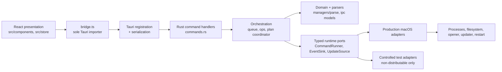
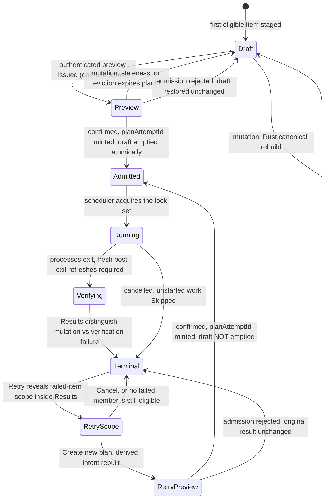

# Architecture Spine — Pack-Manager

> **Revision 8, 2026-07-25.** Closes the three CRITICAL Open rows revision 7
> recorded but declined to fix, each a pair of stories that obey every existing
> `AD` and still build incompatibly. Six new invariants: **AD-21** (only
> plan-determining inputs advance the revision admission checks), **AD-22** (a
> confirming action is one critical section and a safety-reducing rider never
> outlives a failed action), **AD-23** (`PlanIntent` carries per-member
> provenance; the `kind` scalar is gone), **AD-24** (the draft has one author;
> Retry derives its own intent), **AD-25** (a Manager failure never destroys a
> Last-good Snapshot — the referent AD-16 had been citing without defining), and
> **AD-26** (a native automation surface never reaches release bits). AD-11's
> accessibility rule is corrected: reduced motion **is** automated and runs in
> CI, so the standing obligation is contrast alone. Change record:
> `DRIFT-NOTE.md`.
>
> **Revision 7, 2026-07-25.** The `epics.md` retired register is **reconciled**, so
> the last Open row from revision 6 is closed — `epics.md` now carries the retired
> gate only as retirement records and cites this spine as the sole AD authority.
> Also corrects four claims this spine made that the tree or the bound stories
> contradicted: the application version (release-please owns it and it was already
> 1.0.1), and three Deferred rows whose "no live consumer" premise was false —
> opener/reveal is now an Open item owned by Story 6.5. A reviewer gate of four
> lenses ran against revision 6; its unresolved architecture findings are listed as
> Open items below. Change record: `DRIFT-NOTE.md`.
>
> **Revision 6, 2026-07-25.** AD-17's draft durability is settled: fail-to-empty,
> session-scoped, never persisted. Revision 5 assumed the durable branch; the
> owner chose the other one. Everything below is otherwise revision 5.
>
> **Revision 5, 2026-07-25.** Removes the last of the readiness-gate apparatus
> `docs/DECISIONS.md` D33 retired — chiefly AD-3's versioned boundary catalog,
> which bound builders to a `contracts/` directory that has never existed. Adds
> AD-17 through AD-20 for the places the live build queue could diverge, and
> states D27's headline invariant — no entry point executes — which earlier
> revisions claimed in a `Prevents` but never wrote as a `Rule`. AD-6..AD-10 and
> AD-13..AD-15 remain retired and their ids are never reused. Change record:
> `DRIFT-NOTE.md` in this folder.

## Design Paradigm

Pack-Manager is one layered Tauri application. Hexagonal boundaries exist only
where the application must control or observe nondeterminism — processes, the
clock, the filesystem, the updater. Rust owns trusted orchestration and every
canonical domain value; React owns presentation. They meet at exactly one typed
local command/event boundary.

Dependencies point inward. The arrow direction below is a rule, not a sketch.


```mermaid
flowchart LR
    UI["React presentation<br/>src/components, src/store"] --> BRIDGE["bridge.ts<br/>sole Tauri importer"]
    BRIDGE --> IPC["Tauri registration<br/>+ serialization"]
    IPC --> HANDLERS["Rust command handlers<br/>commands.rs"]
    HANDLERS --> APP["Orchestration<br/>queue, ops, plan coordinator"]
    APP --> DOMAIN["Domain + parsers<br/>managers/parse, ipc models"]
    APP --> PORTS["Typed runtime ports<br/>CommandRunner, EventSink, UpdateSource"]
    PORTS --> PROD["Production macOS adapters"]
    PORTS --> CTRL["Controlled test adapters<br/>non-distributable only"]
    PROD --> OS["Processes, filesystem, opener, updater, restart"]
```

Nothing in `src/` or `src-tauri/src/` may point outward from this graph — not at
test infrastructure, not at CI, not at release tooling.

## Verified Brownfield Baseline

Verified against the tree on 2026-07-25. Starting conditions, not a claim of
completeness.

- Production registers 20 Tauri commands (`src-tauri/src/lib.rs`,
  `invoke_handler`) and six typed events (`src-tauri/src/events.rs`), with
  matching frontend wrappers and subscriptions. `src/lib/ipc/bridge.ts` is the
  sole frontend Tauri importer; startup subscribes before hydration.
- `dev/fixtures/ipc/` holds 15 committed contract fixtures. `src-tauri/src/ipc.rs`
  byte-compares each serialized model against its fixture and round-trips the
  committed bytes back through `Deserialize`.
- The process runner already provides structured argv, cleared environment, null
  stdin, isolated process groups, bounded output, timeout, and
  SIGTERM-to-SIGKILL escalation. Opener, reveal, restart, current-executable,
  bundle-parent writability, and some path/time behavior are still direct OS
  calls.
- Rust tests construct handlers below Tauri; browser tests replace the Tauri
  bridge with an in-browser double. Neither crosses the complete production
  JavaScript-to-Tauri-to-Rust transport. No native harness exists.
- The Upgrade Plan is currently transient dialog state (`ui.dialog`
  `{ kind: "upgradePlan" }`, discarded by `closeDialog`), a single-package row
  action executes immediately, the durable token is a monotonic `revision` in
  `PlanCoordinator`, and no `planAttemptId`, `Verifying`, or
  `InteractionRequired` symbol exists in `src/` or `src-tauri/src/`.
  `autoOpenDrawer` is still an active setting.
- Persistence lives in Application Support: `settings.json` (atomic replace) and
  `operations.jsonl` (append-only, compacted to the newest 1,000 records via
  temp file + fsync + rename). Diagnostics export ships `report.json`, the
  newest three app logs, the newest 25 transcripts, and `operations.jsonl`.
- `release.yml` builds universal signed artifacts and blocks publication on two
  checks: `minisign` verification of the detached updater signature against the
  embedded pubkey, and a reachability/coherence assertion on the published
  `latest.json`.
- Minimum supported macOS is 15.0 at `bundle.macOS.minimumSystemVersion`. The
  application version is release-please-owned across five files and is read from
  `.release-please-manifest.json`, never restated here — it was 1.0.1 as of
  2026-07-25 and will move without this document changing.

## Invariants & Rules

### AD-1 — [ADOPTED] Dependencies point inward; test and release tooling are never product dependencies

- **Binds:** all
- **Prevents:** a test harness, CI lane, or release tool becoming load-bearing
  product behavior — and work being scheduled for a "test gap" the shipping code
  already covers
- **Rule:** Product code never imports, branches on, or requires test
  infrastructure, CI, or release tooling. Test infrastructure may replace
  adapters at the composition boundary; it may not add product behavior.
- **Rule:** Missing or incorrect behavior is product work, not test work. Before
  scheduling anything described as a test gap, verify whether the behavior is
  already present in the shipping code (`docs/DECISIONS.md` D33).

### AD-2 — [ADOPTED] One composition root; controlled adapters never reach release bits

- **Binds:** all
- **Prevents:** a test-only application path that bypasses production handlers,
  the state graph, serialization, or safety defaults
- **Rule:** The Tauri composition root constructs the application from typed
  runtime ports. Production composition supplies fail-closed macOS adapters. Any
  controlled adapter is a construction-time dependency of a non-distributable
  target.
- **Rule:** Release builds contain no feature flag, environment variable, CLI
  option, hidden command, or runtime selector that can activate a controlled
  adapter, and production registration contains no test-only command or event.

### AD-3 — [ADOPTED] The IPC surface changes atomically, proven by the committed contract fixtures

- **Binds:** all IPC work; Epic UX-PB; Story 6.5
- **Prevents:** React and Rust drifting apart on the shape of what crosses the
  boundary — payload fields, wire casing, registration set, and which module may
  touch Tauri at all
- **Rule:** `src/lib/ipc/bridge.ts` is the only frontend module that imports
  Tauri APIs, re-exporting exactly `invoke`, `listen`, and `UnlistenFn`.
  Components use typed wrappers from `client.ts`; `events.ts` owns native event
  subscriptions. Argument-taking commands wrap payloads as `{ args: ... }`;
  no-argument commands omit the payload entirely.
- **Rule:** One deliberate surface change moves as one change: Rust models and
  registration, TypeScript types, guards and wrappers, `dev/fixtures/ipc/*.json`,
  and event subscriptions. The enforcing mechanism is the shipping contract test
  — `src-tauri/src/ipc.rs` byte-compares each serialized model against its
  committed fixture, and the TypeScript half asserts its fixture set exactly
  equals its guard map. Regenerate only with
  `PM_UPDATE_CONTRACT=1 cargo test ipc_contract`; never set that variable in a
  verification run.
- **Rule:** Every IPC enum declares its wire casing explicitly with
  `#[serde(rename_all = ...)]`, and each existing spelling is preserved. Stable
  `ErrorCode` values and `IpcError` context fields do not change meaning.
- **Rule:** The verified 20 commands and six events are a baseline, not a fixed
  count. There is no separate versioned boundary-catalog file and none is to be
  created.
- **Rule:** Startup subscribes to native events before `get_state` hydration, and
  a real detection report is never clobbered by the pre-detection placeholder.
- **Rule:** The fixtures prove payload shape on both sides. They do not dispatch
  anything through Tauri, so real event *delivery* is unproven by construction —
  no current suite crosses the complete JavaScript-to-Tauri-to-Rust transport.
  Any story adding a field to an event payload (AD-18's `planAttemptId` on
  `op:status`, `op:output`, and the attention path) owns fixture coverage of the
  shape; proving delivery itself waits on the native harness, whose only live
  consumer is Story 6.5 and whose admissibility AD-26 governs. No story may claim
  delivery coverage from a fixture or from the browser double.

### AD-4 — [ADOPTED] Material process and macOS effects go through typed ports

- **Binds:** all Rust orchestration; Epic UX-PB; Stories 2.2, 3.4, 6.5
- **Prevents:** unsafe real mutations under test, and untestable branches hidden
  behind direct operating-system calls
- **Rule:** Five ports exist today and are extended rather than bypassed:
  `CommandRunner`, `EventSink`, `UpdateSource`, `PendingRelease`, and
  `ManagerAdapter`. Effects already behind one of them stay behind it, and a
  direct call for a covered effect is a defect.
- **Rule:** Effects the live build queue newly introduces go through a port from
  the start — specifically the filesystem access AD-18's attempt journal requires,
  and the clock any verification or staleness deadline reads. AD-17's draft needs
  neither, because it never leaves memory. Opener, reveal, restart,
  current-executable, bundle-parent writability,
  and the remaining path/time call sites are direct calls today; that is recorded
  brownfield state, not a violation. Opener and reveal are the exception: Story 6.5
  requires their success and failure to be controlled, so that seam is an Open item
  owned by Story 6.5, not a consumer-less deferral.
- **Rule:** Ports may not weaken the settled safety floor. Process requests stay
  structured argv against resolved absolute executables, with `env_clear`, an
  explicit environment, null stdin, and `process_group(0)`. No shell command
  string is ever run, no display text is ever split back into arguments, and no
  `sudo`, password, or administrator route exists.
- **Rule:** Observe the coordinator-first lock order. Any code reading
  plan-relevant state — `detection`, `registry`, `queue.records()`, `settings`,
  `tool_env` — must already hold `state.plan_coordinator`. Taking those locks
  without it yields a mixed-time collection instead of one canonical epoch.
- **Rule:** The manager's own `outdated` verdict is the only authority on whether
  a package is outdated. Pack-Manager never computes a version comparison to
  decide it; frontend version-delta logic is display-only.
- **Rule:** Ownership and self-update routing are derived from paths at detection
  time, never hardcoded. Classification inspects the RAW resolved path against
  mise's shims and installs directories BEFORE canonicalizing it — mise shims are
  symlinks to the mise binary, so canonicalize-first misroutes npm and uv to
  brew. Route precedence is fixed: in-band override, then delegated-if-detected,
  then native, then unavailable.
- **Rule:** The output side has a fidelity floor. Transcripts are byte-faithful
  to what the child printed, with exactly one exception: the runner's
  unterminated-notice list, a closed set of verbatim strings — never patterns —
  which is the only place Pack-Manager inserts a line break the child never
  printed. Extending `CommandRunner` may not add a second output-rewriting rule.
- **Rule:** Scheduling keeps the complete lock-set rule: the single scheduler
  atomically checks and acquires each operation's full lock set before start.
  The set is the executor lock union the subject lock, plus the Mise lock when a
  mise-managed npm or uv is the executor. The global concurrency cap of 4, the
  120s aging guard, and duplicate-refresh coalescing are preserved.

### AD-5 — [ADOPTED] Anything exercising application data owns a disposable root

- **Binds:** persistence and lifecycle work; Stories 3.4, 6.5; UX-PB.1b, UX-PB.2c
- **Prevents:** a test corrupting the operator's real data, or a relaunch
  signaling a reused historical process identifier
- **Rule:** One injected root set owns Application Support, settings, journals,
  logs, transcripts, diagnostics destination, and temporary files for each
  scenario. No scenario resolves a production user directory by fallback.
- **Rule:** Historical PGIDs recorded in the journal are data only and are never
  signaled after a restart, because PID reuse makes it unsafe. An unfinished
  start is reconstructed as Interrupted instead.
- **Rule:** Diagnostics must reject symlinks both when selecting and when
  streaming files.

### AD-11 — [ADOPTED] Release acceptance is the checklist plus two automated checks

- **Binds:** release
- **Prevents:** a release shipping without the checks whose failure is silent and
  simultaneous across every installed client
- **Rule:** Release readiness is `docs/RELEASE-CHECKLIST.md` — a manual
  checklist, not a computed verdict, coverage percentage, or gate decision. A
  GitHub Release's existence is distribution state, not proof.
- **Rule:** Two checks in `release.yml` block publication: the detached updater
  signature is base64-decoded and verified with `minisign` against the public key
  the shipping app embeds, and the published `latest.json` is asserted reachable
  and coherent after upload.
- **Rule:** The build stays universal and `latest.json` publishes both
  `darwin-aarch64` and `darwin-x86_64`, both pointing at the single universal
  archive. The x86_64 key is never dropped — `tauri-plugin-updater` resolves its
  target from `cfg!(target_arch)`, so removing it strands every installed Intel
  user with no signal. Verification is Apple silicon only; Intel is best-effort
  and unverified (`docs/DECISIONS.md` D32).
- **Rule:** Minimum supported macOS is 15.0 at
  `bundle.macOS.minimumSystemVersion` (`docs/DECISIONS.md` D31). A deployment
  target above the build SDK is a floor annotation, not an SDK requirement, which
  is why CI has been able to build on `macos-14`. Whether `notarytool` accepts
  `minos 15.0` against that SDK is still open and is settled by a manual Release
  run, never by assertion. **`macos-14` is now on a retirement clock** — GitHub's
  runner-images deprecation began 2026-07-06 and the images are "fully
  unsupported by November 2nd, 2026", after which workflows using the label "will
  be terminated with an error". `ci.yml` and `release.yml` both pin it, so the
  runner move is release-blocking work with a deadline, and it changes the build
  SDK underneath the open `notarytool` question rather than leaving it untouched.
- **Rule:** Accessibility is product quality carried by the existing lanes, not a
  separate evidence lane. Both automated checks belong in the Playwright/Vitest
  lane, and they are at different stages — state which before scheduling work
  against either. **Reduced motion is covered today**: the product honors it at
  `src/styles/theme.css` (`@media (prefers-reduced-motion: reduce)`), and
  `tests/e2e/browser-style-contract.spec.ts` emulates
  `{ reducedMotion: "reduce" }` and asserts transitions and animations resolve to
  `0s`, running in CI on every push and pull request to `main` via
  `.github/workflows/test.yml`. **Automated 4.5:1 text contrast does not exist**;
  that same spec disclaims it — "It does not claim measured contrast compliance
  or validate the native Tauri package." Contrast is therefore an obligation on
  whichever story adds it; reduced motion is a regression surface to preserve,
  not a gap to schedule (AD-1). One manual VoiceOver pass and a by-eye contrast
  check sit on the release checklist. Broader WCAG or legal compliance is not
  implied (`docs/DECISIONS.md` D33, restating the former DR-2).

### AD-12 — [ADOPTED] release-please owns versions; `main` is the release trigger

- **Binds:** release, all commits
- **Prevents:** a hand-edited version drifting between the five files that must
  agree, and unfinished work shipping because `main` has no later gate
- **Rule:** release-please and GitHub Actions are the release framework and
  transport. A conventional commit reaching `main` enters release automation with
  no later human gate, so work stays off `main` until it is ready to ship.
- **Rule:** Seven files are release-please-owned and never hand-edited:
  `package.json`, `package-lock.json`, `src-tauri/tauri.conf.json`,
  `src-tauri/Cargo.toml`, `src-tauri/Cargo.lock`, `CHANGELOG.md`, and
  `.release-please-manifest.json`.
- **Rule:** Apple Developer ID signing and notarization are required for a
  published release; updater signing is required by the build. The manual
  workflow-dispatch path publishes nothing only when `attach_to_tag` is empty —
  that is the safe way to test pipeline changes.

### AD-16 — [ADOPTED] Upgrade Plan intent and confirmed Plan Attempts are distinct durable domains

- **Binds:** D27–D30; Epic UX-PB (all 28 stories); Stories 3.1, 3.2, 3.5, 6.5
- **Prevents:** executing from a row or Manager header, treating a short-lived
  preview capability as History identity, fabricating plan groups from legacy
  Operations, or reporting success before verification
- **Rule:** No entry point executes. A Package row action, a Manager-header
  action, a Manager-wide action, and `Update Everything` all mutate the draft and
  return. `execute_plan` is reachable only from the confirmed-attempt path below.
  The shipping `ManagerPane.upgradeRow` → `executePlan` call site is retired by
  this rule, not preserved by it (`docs/DECISIONS.md` D27).
- **Rule:** The draft holds canonical `PlanIntent`, never trusted executable
  strings, with individually removable Package and Manager members plus explicit
  option values. Every draft mutation asks Rust to rebuild the preview. The
  existing `planId` stays a bounded one-use capability for one reviewed preview
  and expires on mutation, staleness, execution attempt, or eviction — an evicted
  `planId` fails closed exactly like an unknown or replayed one.
- **Rule:** A canonical rebuild may remove or invalidate membership; it may never
  add a member the user has not seen. A bulk mutation freezes its expansion into
  concrete members at the moment it is made — the scope predicate never runs a
  second time, and newly eligible work discovered later surfaces as an explicit
  offer to re-seed, never as silent membership. If
  a rebuild would enlarge membership, the preview `planId` expires and re-review
  is required. This holds identically on the confirmation-off path, which
  otherwise has no moment at which the user could see the addition.
- **Rule:** `execute_plan` returns a newly generated durable `planAttemptId` plus
  the admitted Operation identities. A preview `planId` and a `planAttemptId` are
  different types, fields, schemas, namespaces, and test assertions. Neither is
  ever silently converted into the other.
- **Rule:** Admission is atomic and all-or-none. The complete derived operation
  set enters the scheduler together or nothing does, so a confirmed attempt's
  membership can never silently differ from the reviewed intent. Execution must
  match the issued preview and a fresh coherent rebuild, and is rejected on
  in-progress state change, revision drift, an active refresh, or a lock-set
  overlap with any pending or running mutating operation. AD-21 fixes what can
  advance that revision, and AD-22 fixes the sequencing when the confirming
  action itself carries a side effect.
- **Rule:** Exactly one confirmed attempt may be active. A second confirmation
  fails closed with a typed already-active result. The active attempt may run
  independent Managers concurrently under AD-4's lock-set rules.
- **Rule:** Primary cancellation targets `planAttemptId`: unstarted work becomes
  `Skipped`, running process groups use the existing escalation, and every
  terminal state stays durable. `Cancel operation` is reserved for an explicitly
  Operation-scoped diagnostic action.
- **Rule:** A mutating attempt is not successful until the required affected
  Manager refreshes complete. The attempt explicitly enters `Verifying`, and
  Results distinguish mutation failure from verification failure while preserving
  the Last-good Snapshot rules (AD-25). "Affected" is the executor and the subject of each
  mutating operation in the attempt — the same set the scheduler locked.
- **Rule:** A verification refresh must be a fresh acquisition whose data
  collection begins strictly after the mutating process exited. Verification
  refreshes are exempt from AD-4's duplicate-refresh coalescing against any
  refresh already in flight at that instant; a coalesced refresh satisfies
  verification only if it started after it. A snapshot taken before the mutation
  can neither confirm nor refute it.
- **Rule:** `Verifying` and `Skipped` are durable wire-level operation states, not
  presentation states derived in React. They are journaled, exported in
  diagnostics, and replayed from History, so a derived state could not survive a
  crash or a replay. Adding them is one atomic contract change under AD-3.
  `Skipped` marks only work that never started; crash-reconstructed unfinished
  work stays `Interrupted`.
- **Rule:** The same answer governs every new operation state the UX-PB stories
  introduce, not only those two. `Cancelling` and `Interaction required` are
  durable wire-level states on `OpStatus` as well — replay must reconstruct what
  the user saw, and a transient flag following the `op:stalled` event precedent
  cannot survive a crash or a replay. `OpStatus` ships seven variants today, so
  every addition moves as one atomic AD-3 change across the Rust enum,
  `src/lib/ipc/types.ts`, the guards, and `dev/fixtures/ipc/*.json`. Emitting an
  event alongside a state is fine; emitting one *instead of* a state is the defect.
- **Rule:** Retry always creates a new `planAttemptId`, links to the preceding
  failed attempt, and preserves the original failure. The backend rebuilds
  current intent rather than replaying historical executable text. That rebuild
  produces a derived intent of its own and never writes the persistent draft
  (AD-24).
- **Rule:** Settings replace active `autoOpenDrawer` behavior with
  `skipUpgradePlanConfirmation`, default `false`. A confirmation opt-out skips
  only the final modal — never draft review, the Rust rebuild, stale detection,
  or the explicit confirmation action.
- **Rule:** `Interaction required` is entered only from a closed Manager-specific
  classifier or an explicit typed native signal — "entered", because the rule above
  makes it a durable state; any event announcing it accompanies that state rather
  than standing in for it. Any unmatched null-stdin silence
  uses the ordinary stall contract.
- **Rule:** The application's own update is not a Package plan. It never enters a
  `PlanIntent`, draft, confirmed attempt, Results, or plan-attempt History, and it
  holds no manager lock. Its surfaces are its own StatusBar badge, the Settings
  Updates card, and the macOS app menu's `Check for Updates…` item. The menu
  handler and the IPC command share one code path behind the
  `UpdateSource`/`PendingRelease` seam — a second entry point never grows its own
  state transitions (`docs/DECISIONS.md` D25, D25a).

#### Normative domain minimum (under AD-16)

Names may be refined during story implementation; the semantic separation is
fixed.

```text
PlanIntent
  # no intent-level `kind` field — provenance is per member (AD-23)
  packageUpdates: ordered unique PlanMember<PackageRef>[]
  managerUpdates: ordered unique PlanMember<ManagerId>[]   # independent removable members
  removed: unique Ref[]             # tombstones; no bulk expansion re-adds one
  includeGreedyCasks: boolean
  # no global includeSelfUpdates control exists

PlanMember<Ref>
  ref: Ref
  origin: Explicit | Bulk { scope: Manager(ManagerId) | FilteredView | Everything }
  # scope is descriptive, recorded at the creating mutation, never re-evaluated

RetryIntent                         # derived; never the persistent draft (AD-24)
  sourcePlanAttemptId: PlanAttemptId
  intent: PlanIntent                # the source's reviewed intent restricted to its failed members

UpgradePlanPreview
  planId: one-use PlanCapabilityId
  intent: PlanIntent
  groups: reviewed commands and display items
  exclusions / warnings

PlanAttempt
  planAttemptId: durable PlanAttemptId
  retryOfPlanAttemptId?: PlanAttemptId
  reviewedIntent + reviewedCommandSnapshot
  operationIds[]
  state: admitted | running | verifying | terminal
  verificationResults + resultSummary
```

The active-attempt lookup, cancel command, History query, Activity replay, and
diagnostic export address `planAttemptId`. Operation detail continues to address
`opId` within that attempt.


```mermaid
stateDiagram-v2
    [*] --> Draft: first eligible item staged
    Draft --> Draft: mutation, Rust canonical rebuild
    Draft --> Preview: authenticated preview issued (one-use planId)
    Preview --> Draft: mutation, staleness, or eviction expires planId
    Preview --> Admitted: confirmed, planAttemptId minted, draft emptied atomically
    Preview --> Draft: admission rejected, draft restored unchanged
    Admitted --> Running: scheduler acquires the lock set
    Running --> Verifying: processes exit, fresh post-exit refreshes required
    Verifying --> Terminal: Results distinguish mutation vs verification failure
    Running --> Terminal: cancelled, unstarted work Skipped
    Terminal --> RetryScope: Retry reveals failed-item scope inside Results
    RetryScope --> Terminal: Cancel, or no failed member is still eligible
    RetryScope --> RetryPreview: Create new plan, derived intent rebuilt
    RetryPreview --> Admitted: confirmed, planAttemptId minted, draft NOT emptied
    RetryPreview --> Terminal: admission rejected, original result unchanged
```

#### Domain rules required by the UX-PB acceptance criteria (under AD-16)

- **Member provenance.** `PlanIntent` distinguishes explicitly chosen membership
  from bulk membership durably, and it does so per member rather than per intent
  — a bulk-added item the user removes stays removed, and an explicit item is
  never silently absorbed into a later bulk action. Each bulk member carries the
  scope of the action that created it, because the bulk entry points differ in
  scope and a provenance without a scope cannot be re-derived or explained. No
  member's scope ever silently widens. AD-23 fixes the shape this requires.
- **Draft-mutation convergence.** Every draft mutation resolves against a Rust
  canonical rebuild. If the rebuild errors or rejects, the prior coherent draft
  and its last authenticated preview are preserved unchanged and nothing is
  admitted. Frontend display text is never authority. Concurrent mutations
  converge to one deduplicated membership set with a single authenticated
  rebuild.
- **Ineligible-item inertness.** An item that is pinned, already current, a
  non-opted-in greedy cask, or removed between staging and rebuild is inert: its
  control is non-interactive to pointer and keyboard, it carries a stated reason
  for assistive technology, and it can never enter a `PlanIntent`.
- **Item ineligibility is not plan-composition exclusion.** The two resolve at
  different times and must not be collapsed. Item-level ineligibility is a
  property of the item alone and bars it from `PlanIntent` entirely. A
  plan-composition exclusion depends on what else is in the plan — `rustDedup`
  when rustup toolchains join a plan also containing mise's `tool:rust`, and
  `alreadyRunning` — so the item stays in `PlanIntent` and is surfaced with its
  reason in the preview's exclusions. A cross-item exclusion is never
  retroactively converted into item ineligibility, and removing the other side of
  the conflict restores the item without the user re-staging it.
- **Legacy honesty.** Journal and History records without a recorded
  `planAttemptId` stay individually labeled legacy Operations. Migration may
  preserve and index them but must never infer a plan grouping.

### AD-17 — [ADOPTED] Rust owns the canonical draft; the sidecar is a layout region

- **Binds:** UX-PB.1a–1e, UX-PB.3a, UX-PB.4d; Stories 3.1, 3.2, 3.5
- **Prevents:** UX-PB.1a and UX-PB.1b disagreeing on whether the draft survives a
  relaunch — one persisting it, the other assuming it is gone — and separate
  stories disagreeing on whether the sidecar is a dialog, a drawer, or a layout
  region
- **Rule:** Rust owns the canonical `PlanIntent`. The Zustand draft store is a
  projection of the last authenticated rebuild — never the authority, never the
  author of executable text. Every mutation round-trips through Rust before the
  projection updates.
- **Rule:** The draft is session-scoped and is never written to disk. Every
  relaunch — after a clean quit, a crash, or a force-quit — starts with an empty
  draft and a hidden sidecar. This takes the second branch of UX-PB.1b's recovery
  criterion unconditionally: membership is never reconstructed, never partially
  restored, and never fabricated, and nothing executes on relaunch. A draft is
  never surfaced as Activity or History.
- **Rule:** The door stays closed. No draft file exists in Application Support, no
  draft schema is versioned, and AD-19 has nothing to migrate for it. A story that
  wants staging to survive a crash is proposing a new decision, not implementing
  this one — the cost of that choice is a lost draft after a crash, and it was
  accepted deliberately.
- **Rule:** Admission transfers custody **of what it admitted**. Admitting the
  draft's own preview empties the draft atomically with the mint of
  `planAttemptId`; a failed or rejected admission restores it unchanged. Admitting
  a derived intent — a retry scope (AD-24) — consumes that intent and leaves the
  draft and its tombstones untouched, because the draft was never its source.
  Minting a `planAttemptId` is not by itself the trigger; being the admitted
  intent's source is.
  While an attempt is non-terminal the region is owned by attempt status, and new
  membership staged during that attempt accumulates in the canonical draft
  without displacing it — surfacing in the region only once the attempt's Results
  are dismissed.
- **Rule:** The sidecar is a single layout region — not a `ui.dialog` kind and not
  a `DialogHost` child. Exactly one instance exists and it persists across
  `ActiveView` changes without losing membership or scroll identity. Its
  visibility is a four-way union: a non-terminal attempt, a **derived intent under
  review** (AD-24), undismissed Results, or a non-empty draft — in that content
  precedence, highest first. A confirmed attempt replaces its content in place
  rather than opening a second surface. Results remain until dismissed by `Done`,
  with one exception: choosing `Create new plan` on a retry deliberately replaces
  Results with the derived intent under review, and the immutable result stays
  reachable by `View previous result`. Higher precedence hides lower content, never
  destroys it. When all four are false the region is hidden and the workspace
  reclaims its width with no reserved empty column.
- **Rule:** The retry **scope** and the derived intent **under review** are
  different things and only the second is in that union. The scope is a content
  state *inside* the surface Retry was invoked from — Results, or a read-only
  History replay — so the failure detail the user is deciding against stays on
  screen and `Cancel` has a Retry action to return focus to. The scope never
  supersedes Results, never hides a live attempt, and never becomes a second
  region. Only `Create new plan` promotes the derived intent into the region.
  Because the scope lives inside Results, `Done` may not discard it out from under
  the user: while a retry scope is open, dismissal is withheld until the user
  resolves it with `Cancel` or `Create new plan`. Staging a new item while a retry scope is open still writes the draft
  (AD-24), and the draft surfacing behind Results is unchanged by the retry scope
  being open.
- **Rule:** Below 720 usable CSS pixels the region stops being a fixed sidecar and
  the same single instance is presented as a full-workspace or stacked surface.
  Viewport is a placement driver, never a second mount point.
- **Rule:** Activity is a first-class destination in the existing discriminated
  `ActiveView` state — for the active attempt and for replaying a completed
  History entry — not a drawer and not a sidecar mode. The existing
  `ActivityDrawer` surface retires with the `autoOpenDrawer` setting; no story
  keeps it alive as a second home for attempt status. A queued draft stays in the
  sidecar and never appears in Activity (`docs/DECISIONS.md` D30).
- **Rule:** `DialogHost` remains the single mount point for modal surfaces and
  shows one dialog at a time. The final confirmation dialog is one of those
  modals; the sidecar is not.
- **Rule:** There is exactly one status-announcement channel for plan and attempt
  progress, owned alongside the sidecar region. It announces at **polite** priority
  by default and **assertive** only for an immediate safety action — the stall
  handoff and `Interaction required` both qualify, because a polite region is
  announced only when the user is otherwise idle and a VoiceOver user working
  elsewhere would miss the prompt. Stories announce through it; none adds a second
  live region for the same information, and Brief Notifications suppress speech the
  channel already emitted. Two live regions narrating one attempt is a defect, not
  additive coverage.

### AD-18 — [ADOPTED] Confirmed plan attempts have their own durable store

- **Binds:** UX-PB.2c, UX-PB.2d, UX-PB.2f, UX-PB.3d, UX-PB.4a, UX-PB.4b, UX-PB.4e; Story 6.5
- **Prevents:** the writer, the History reader, and the diagnostics exporter each
  choosing a different home for attempt records — an extended `operations.jsonl`,
  a private sidecar file, or memory only
- **Rule:** Confirmed attempts persist to their own append-only NDJSON journal in
  the same Application Support directory as `operations.jsonl`, under the same
  discipline: an append failure is nonfatal to package operations, and compaction
  is temp file + fsync + rename, never truncate-in-place.
- **Rule:** `operations.jsonl` keeps its record shape and carries `planAttemptId`
  only where one exists. A record without one stays an individually labeled
  legacy Operation.
- **Rule:** Diagnostics export carries both journals as distinct entries
  alongside `report.json`, the newest three app logs, and the newest 25
  transcripts. Existing retention bounds are unchanged.
- **Rule:** Widening the export does not widen disclosure. Plan-attempt records
  enter the archive under the same allowlist the export already applies —
  inherited environment values are excluded, and a record carries the reviewed
  intent and the exact argv Pack-Manager constructed, never ambient environment
  or user paths beyond what the existing entries already disclose. A story that
  adds a field to the attempt record owns its disclosure review.
- **Rule:** The two journals share a retention policy. Compacting the Operation
  journal may not orphan an attempt whose Operations it drops, and compacting the
  attempt journal may not leave Operations pointing at an attempt that no longer
  resolves. A record that loses its counterpart reads as legacy, never as
  corrupt.
- **Rule:** Operation status, output and stall events, transcript metadata, and
  journal start/finish records carry `planAttemptId` when one exists, so
  correlation never depends on reconstructing it from timing or membership.

### AD-19 — [ADOPTED] Persisted schemas tolerate their own history

- **Binds:** UX-PB.5b; Story 3.4; all persistence
- **Prevents:** one story dropping unknown persisted keys while another fails
  closed on them, and a retired setting silently coming back to life
- **Rule:** Reading a persisted file tolerates unknown and retired fields and
  never fails the application.
- **Rule:** Degrade-to-defaults is scoped to configuration, not to records. A
  corrupt `settings.json` falls back to defaults with a visible notice — the
  shipping behavior. A journal must never be defaulted away: an unparseable line
  is skipped and counted, the surrounding records stay readable, and a
  plan-attempt or Operation record is never silently replaced by a synthesized
  one. Losing history quietly is worse than surfacing that some of it is
  unreadable.
- **Rule:** A retired field is never re-serialized as active and is never
  observed by product code. An old persisted `autoOpenDrawer` value is tolerated
  on read and inert once `skipUpgradePlanConfirmation` exists.
- **Rule:** A settings patch is persisted before it becomes active in memory or
  advances the canonical revision; a failed save changes neither — the shipping
  order at `src-tauri/src/commands.rs` `set_settings_core`. Every control saves
  immediately and atomically with visible `Saving` / `Saved` / failure state.
  Whether a given patch advances the revision at all is AD-21's question, not
  this rule's: the same call site currently bumps it for every key.

### AD-20 — [ADOPTED] The webview trust boundary widens only on purpose

- **Binds:** all frontend work; any new plugin, permission, window, or remote asset
- **Prevents:** a feature story quietly widening the webview's authority, and
  remote content reaching a webview that has no content-security policy
- **Rule:** The application loads only its own bundled assets. `csp` is `null`
  today, which means Tauri injects none — tolerable only while nothing remote is
  loaded. Any change that introduces remote content, a remote font, script,
  style, or navigation target must set a real CSP in the same change, not later.
- **Rule:** One capability file grants the `main` window exactly `core:default`,
  `opener:default`, and `core:window:allow-start-dragging`. Adding a permission,
  a plugin, a window, or a second capability is a security-sensitive change
  reviewed on its own terms and never folded into a feature story as a
  side effect.

### AD-21 — Only plan-determining inputs can invalidate a reviewed plan

- **Binds:** UX-PB.2b, UX-PB.5b, UX-PB.5c; Story 3.4; all settings work
- **Prevents:** a settings write anywhere in the application silently
  invalidating a reviewed plan — and specifically the confirmation opt-out
  deterministically failing the admission it rides on
- **Rule:** The canonical revision AD-16 tests for drift advances only on a
  change to a **plan-determining input**: the closed set of state whose change
  can alter a preview's membership, its exclusions, the argv of the operations
  this plan would run — its verification refreshes included, so a key that shapes
  refresh argv is plan-determining — or any execution parameter the reviewed
  snapshot records, timeouts and stall thresholds among them, because the user
  reviewed a plan that runs under them. That set is `detection`, `registry`, `queue.records()`, `tool_env`, and
  the plan-determining subset of `settings`. A change outside it is not drift and
  does not expire a preview.
- **Rule:** Classification is fail-closed and declared at the definition site. A
  persisted key is plan-determining unless it is explicitly marked plan-inert
  with a stated reason. Adding a key and forgetting to classify it costs one
  unnecessary re-review; the opposite default would execute a plan the user never
  reviewed. `skipUpgradePlanConfirmation` is plan-inert — it selects whether a
  modal renders and cannot reach membership, exclusions, or argv.
- **Rule:** Splitting the revision does not split the lock. `settings` stays
  plan-relevant state read under `state.plan_coordinator` (AD-4); one coordinator
  epoch still orders every read. Only the *bump* is conditional, never the
  acquisition.
- **Rule:** The shipping call site bumps unconditionally for every key
  (`src-tauri/src/commands.rs` `set_settings_core`). Narrowing it is product work
  owned by whichever of UX-PB.5b or Story 3.4 lands first, not a test concern
  (AD-1).

### AD-22 — A confirming action is one critical section; a safety-reducing rider never outlives a failed action

- **Binds:** UX-PB.5b, UX-PB.2b, UX-PB.5c
- **Prevents:** the two halves of one confirming click landing independently —
  the safety gate disarmed while the run it authorized was refused, or an attempt
  admitted under a preference that never reached disk
- **Rule:** The confirming action is atomic against the **canonical revision**,
  not against one mutex hold. Validation reads under `state.plan_coordinator`; the
  guard is released before admission; the scheduler re-checks the same
  `expected_revision` under its own acquisition and enqueues all-or-none or
  nothing. That revision-checked round trip *is* the critical section, and it
  already ships — `execute_issued_plan` states the constraint outright ("No
  synchronous guard crosses an await"), and `handle_plan_batch` performs the
  re-check.
- **Rule:** No confirming action holds the coordinator across admission. It cannot:
  `plan_coordinator` is a `std::sync::Mutex`, so it is not reentrant and its guard
  is not `Send` across the admission `await`, and the scheduler takes the same lock
  to admit. A rule demanding one unbroken hold would not compile, and would
  deadlock if it did. **No confirming action** may persist under a held coordinator
  guard either — the settings path acquires that lock itself and `save_to` fsyncs.
  This scopes the ban to the confirming action and leaves AD-19's reference to
  `set_settings_core`, which legitimately holds the guard across its own save,
  intact.
- **Rule:** Ordering is fixed — validate, admit through the scheduler's
  revision-checked transaction, then persist the rider once the admission has
  returned. A rider never precedes the admission it rides on. **This deliberately
  overrides UX-PB.5b's stated clause order** (persist, activate, then admit); see
  the rider rule below for why, and the `epics.md` batch row for the criterion that
  must be restated.
- **Rule:** A rider that **reduces** a safety default commits only if the action
  it rode on succeeded. On rejected admission nothing is persisted and nothing
  becomes active, and the dialog retains the user's selection so the choice is
  not silently lost. On successful admission with a failed rider save the attempt
  stands, the prior preference is retained as both active and persisted state,
  and the failure is surfaced inline. The asymmetry is the point: an unsaved
  opt-out costs one extra confirmation, while a saved opt-out on a refused run
  removes the gate from a run the user never got.

### AD-23 — `PlanIntent` membership carries per-member provenance

- **Binds:** UX-PB.1a, UX-PB.1c, UX-PB.1d, UX-PB.2a; Story 3.2
- **Prevents:** one story emitting a whole-intent `kind` scalar while another
  needs per-member and per-scope provenance — two stories that cannot produce the
  same wire shape for a single fixture-backed model
- **Rule:** Provenance is a property of the member, never of the intent. Every
  member of `packageUpdates` and `managerUpdates` carries its own `origin`:
  `Explicit` when the user staged that exact item, or `Bulk { scope }` when it
  arrived in a bulk expansion.
- **Rule:** `Explicit` dominates. A bulk expansion covering an already-`Explicit`
  member leaves it `Explicit` — that is the only enforceable reading of "never
  silently absorbed into a later bulk action". Explicitly staging a `Bulk` member
  promotes it to `Explicit`; the reverse never happens.
- **Rule:** `scope` is descriptive. It records which action created the member —
  one Manager, the current filtered view, or everything — and is never
  re-evaluated, because AD-16 already freezes expansion into concrete members at
  the creating mutation.
- **Rule:** Removal writes a tombstone on the intent. A later bulk expansion of
  any scope does not re-add a tombstoned ref — a member list can record presence
  but not a deliberate absence, so the "stays removed" guarantee needs this home.
  Explicitly re-staging a tombstoned ref clears its tombstone: a user reversing
  themselves deliberately is not a silent re-add.
- **Rule:** Tombstones share the draft's lifetime exactly — they live on the
  `PlanIntent`, so they are session-scoped and never persisted (AD-17), and
  an admission that empties the draft carries them off with it, while a retry
  admission leaves both untouched (AD-24). A new draft starts with none. Growth is therefore bounded by one session's draft activity, and no
  tombstone outlives the intent that recorded it.
- **Rule:** No durable intent-level `kind` field exists. Where a kind is displayed
  or explained it is derived — an intent is explicit when no member carries `Bulk`
  origin, otherwise mixed. Nothing converts one kind into another, because there
  is no whole-intent value left to convert.
- **Rule:** This shape is one atomic surface change under AD-3 — Rust models,
  TypeScript types and guards, `dev/fixtures/ipc/*.json`, and wrappers move
  together. UX-PB.1a and UX-PB.1c may not land it independently; whichever runs
  first lands the complete shape and the other builds against it.

### AD-24 — The draft has exactly one author; a derived intent never routes through it

- **Binds:** UX-PB.4d, UX-PB.1a, UX-PB.1c, UX-PB.4b
- **Prevents:** Retry and the accumulating draft both writing the draft's next
  state — one discarding membership staged during the attempt, the other
  inflating the reviewed retry scope and falsifying its lineage
- **Rule:** The one persistent draft has exactly one author: a user staging or
  removal action resolved through the Rust canonical rebuild. Admission of the
  draft's own preview empties it as custody transfer (AD-17) and a canonical
  rebuild may narrow it (AD-16); no other path adds, replaces, or clears
  membership. **A confirmed retry does not empty the draft** — it admits a derived
  intent, not the draft, so staged membership and its tombstones survive it.
- **Rule:** Retry does not write the draft. A retry scope is a **derived intent**
  — composed in Rust from the failed attempt's reviewed intent restricted to its
  failed members, canonically rebuilt against current eligibility and argv, and
  taken directly to preview and confirmation. It is a separate reviewable object
  and never merges with the persistent draft in either direction.
- **Rule:** The retry scope is revealed inline in the surface Retry was invoked
  from — Results, or a read-only History replay — not in a surface of its own and
  not by displacing the sidecar's content (AD-17). Confirming it admits the
  derived intent through the ordinary preview and confirmation path.
- **Rule:** Membership staged while the attempt was running is untouched by
  Retry. It stays in the persistent draft and surfaces once higher-precedence
  content is dismissed, exactly as AD-17 promises. Staging while a retry scope is
  open behaves identically — the item joins the persistent draft, never the
  derived intent, so a retry's reviewed scope cannot grow under the user after
  they have seen it.
- **Rule:** A confirmed retry mints a new `planAttemptId` linked by
  `retryOfPlanAttemptId`, and its reviewed membership is exactly what the retry
  review showed. Because no draft membership can reach it, the lineage claim
  stays true by construction rather than by each story remembering to filter.
- **Rule:** If the derived intent cannot be rebuilt — every failed member now
  pinned, current, removed, or unavailable — the retry scope explains the
  failure, nothing is admitted, the original result stays immutable, and the
  persistent draft is unchanged.

### AD-25 — [ADOPTED] A Manager failure is contained and never destroys a Last-good Snapshot

- **Binds:** Story 2.2; UX-PB.1e, UX-PB.2b, UX-PB.3d; the verification path
- **Prevents:** one Manager's failure blanking its peers, and two stories
  re-deriving merge-versus-replace differently on the recovery path
- **Rule:** A failure in one Manager's detection, refresh, parse, network,
  update, cancellation, timeout, or persistence path is contained to that
  Manager. Peers keep running and keep rendering
  (`docs/SPEC.md` load-bearing invariant 5).
- **Rule:** A Manager that has ever produced a successful snapshot retains it on
  failure, labeled with its own timestamp and the exact failure, with a Retry
  affordance. A failure never replaces a good snapshot with an empty one, and
  never with a partial overlay: recovered-parse output **merges** into the
  inventory already parsed from the successful outputs. Replacing a snapshot with
  an outdated-only overlay makes every up-to-date package vanish, and merging
  never un-pins a row. The seam already exists — `ManagerAdapter::parse_recovery`
  takes `refresh_outputs` alongside the failed command's output precisely so the
  merge is possible; discarding that argument is the defect this rule names.
- **Rule:** A verification refresh (AD-16) is bound by this rule too. A
  verification refresh that fails or times out marks the attempt's verification
  failed and leaves the Manager's Last-good Snapshot in place — a failed
  verification must not destroy the inventory that would show what actually
  happened.
- **Rule:** Health and staleness presentation derive from the snapshot's real
  timestamp. A Manager relying on a Last-good Snapshot reads as degraded with
  that timestamp and the specific failure; no invented or interpolated value is
  ever substituted.

### AD-26 — A native automation surface never reaches release bits

- **Binds:** Story 6.5; any native E2E harness adoption
- **Prevents:** the only story that requires native-transport coverage being
  satisfied by shipping an automation plugin or an embedded driver inside the
  distributed application
- **Rule:** Which route is chosen decides this, so name it. Driving
  `tauri-driver` directly is not available here — "Driven directly, only Windows
  and Linux are supported on desktop, as macOS has no WKWebView driver tool
  available (use the service's embedded WebDriver server for macOS)"
  (`tauri.app/llms-full.txt`, verified 2026-07-25). The route that does cover
  macOS is `@wdio/tauri-service`, which "works on **Windows, Linux, and macOS**"
  because "By default the service runs an **embedded WebDriver server** inside
  your app". That server is `tauri-plugin-wdio-webdriver`. So the macOS route
  puts an automation surface *inside the application*, which makes adopting it a
  trust-boundary decision under AD-20 and a release-bits decision under AD-2 —
  not a test-tooling detail.
- **Rule:** The automation surface is excluded at **compile time**, never by a
  runtime selector. The reference shape is the plugin registered under
  `#[cfg(debug_assertions)]`, so release builds do not contain it at all. A
  feature flag, environment variable, capability toggle, or any other runtime
  route that could activate it is forbidden by AD-2 and is not an acceptable
  substitute.
- **Rule:** Compile-time exclusion is only as strong as the profile behind it.
  `src-tauri/Cargo.toml` declares no `[profile.release]`, so `debug-assertions`
  is off in release builds today and the gate holds. Enabling `debug-assertions`
  in a release profile, or moving the gate to a default-on feature, silently
  re-admits the automation surface — either is a security-sensitive change under
  AD-20, never a build-tuning detail.
- **Rule:** A native harness proves delivery only if it drives the **production
  composition**: the same registered commands and events, the same handlers, the
  same serialization (AD-2, AD-3). The one permitted difference from release bits
  is the debug-gated automation plugin and the debug profile, declared as such. A
  harness that introduces a test-only command, a second composition root, or a
  different registration set proves nothing about the shipping application, and
  no story may claim delivery coverage from it.
- **Rule:** Widening the shipping trust boundary to satisfy a test level is never
  the remedy. If no compliant composition can be made to work, the remedy is a
  renegotiated test level for the story, decided at this altitude.

## Consistency Conventions

| Concern | Convention |
| --- | --- |
| IPC surface | Production registration is authoritative; 20 commands / six events is the current baseline, not an invariant. Rust models, TypeScript types/guards/wrappers, `dev/fixtures/ipc/*.json`, and subscriptions move in one change (AD-3). |
| Wire casing | Every IPC enum declares `#[serde(rename_all = ...)]` explicitly. Structs and multiword-variant enums are `camelCase`; single-word-variant enums are `lowercase`; `ErrorCode` is `snake_case`. |
| Identity | Package ids are `kind:name`, split on the first colon only. `mas` is the exception: its id segment is the numeric App Store id. Manager-supplied version strings are preserved verbatim; unknown versions are `null`. |
| Plan identity | `planId` is a one-use preview capability; `planAttemptId` is durable. Different types, fields, schemas, and namespaces — never interconverted (AD-16). |
| Plan membership | Provenance is per member (`Explicit` / `Bulk { scope }`), never a whole-intent scalar; removal writes a tombstone no bulk expansion re-adds (AD-23). The persistent draft has one author; Retry derives its own intent (AD-24). |
| Plan invalidation | Only a plan-determining input advances the revision admission tests for drift; a persisted key is plan-determining unless declared inert at its definition site (AD-21). |
| Runtime effects | Application and domain code depends on typed ports. Direct OS calls live only in production adapters; controlled adapters exist only in a non-distributable composition (AD-2, AD-4). |
| Persistence | Application Support holds `settings.json` (atomic replace) plus append-only NDJSON journals compacted by temp file + fsync + rename. Unknown and retired fields are tolerated on read (AD-18, AD-19). |
| Frontend state | Narrow Zustand selectors in components; the store's static accessor outside React. Objects and Sets are replaced immutably; cross-store derived state lives in `src/store/index.ts`. Per-manager phase is derived, never stored. |
| Styling | Design tokens live in `src/styles/theme.css`; the product is dark-only and adds no hardcoded hex elsewhere. Color states always carry a text or icon equivalent. |
| Determinism | Default suites are offline and deterministic: `CommandRunner`/`FakeRunner`, `EventSink`/`VecSink`, `bridge.ts`/`fakeIpc`, paused Tokio or fake timers. No real processes, network, sleeps, or host state. |

## Stack

Verified against `package-lock.json` and `src-tauri/Cargo.lock` on 2026-07-25.
A brownfield seed, not a version policy — the lockfiles own this.

| Name | Version |
| --- | --- |
| Application version | release-please-owned; see `.release-please-manifest.json` (1.0.1 on 2026-07-25) |
| Rust edition | 2021 |
| Tauri Rust crate | 2.11.5 |
| Tauri JavaScript API | 2.11.1 |
| Tauri CLI | 2.11.4 |
| Tauri updater plugin | 2.10.1 |
| Tauri opener plugin | 2.5.4 |
| Tokio | 1.53.1 |
| React / React DOM | 19.2.8 |
| TypeScript | 7.0.2 |
| Vite | 8.1.5 |
| Tailwind CSS | 4.3.3 |
| Zustand | 5.0.14 |
| TanStack React Virtual | 3.14.8 |
| Vitest | 4.1.10 |
| Playwright | 1.61.1 |
| Node in CI | 24 |
| CI runner images | macos-14 (ci.yml build/test, release.yml); ubuntu-latest (all other jobs) |
| Minimum supported macOS | 15.0 |
| Release automation | release-please action v5 + GitHub Actions |

## Structural Seed

Where durable state lives. The code owns the detail; this fixes the shape the
UX-PB stories must agree on.

```text
~/Library/Application Support/<bundle-id>/
  settings.json          # atomic replace; unknown/retired fields tolerated (AD-19)
  operations.jsonl       # existing Operation journal; carries planAttemptId when one exists (AD-18)
  <plan-attempts>.jsonl  # confirmed attempts; own append-only journal (AD-18)
  transcripts/           # newest 25 exported
  # no draft file — the draft is session-scoped and never persisted (AD-17)
~/Library/Logs/<bundle-id>/
                         # newest 3 exported
```

## Capability → Architecture Map

| Capability / area | Lives in | Governed by |
| --- | --- | --- |
| Draft Upgrade Plan and sidecar — persists across navigation, not across relaunch (UX-PB.1a–1e) | Rust plan services + Zustand projection + layout region | AD-16, AD-17, AD-23, AD-24 |
| Plan attempts, admission, cancellation (UX-PB.2a–2f) | Rust queue/ops + plan-attempt store | AD-3, AD-4, AD-16, AD-18, AD-21, AD-22 |
| Activity, live progress, Results, interaction classification (UX-PB.3a–3g) | Rust event dispatch + React attempt views | AD-4, AD-16, AD-25 |
| History, replay, Retry, legacy labeling (UX-PB.4a–4e) | Plan-attempt journal + History views | AD-16, AD-18, AD-24 |
| Confirmation gate and its setting (UX-PB.5a–5e) | `DialogHost` modal + settings persistence | AD-16, AD-17, AD-19, AD-21, AD-22 |
| Detection, refresh phases, timeouts (Story 2.2) | Manager adapters behind runtime ports | AD-4, AD-25 |
| Package state, eligibility, keyboard selection (Stories 3.1, 3.2, 3.5) | React package views + Rust plan builder | AD-4, AD-16, AD-17, AD-23 |
| Settings and Environment Report (Story 3.4) | Settings persistence + detection state | AD-19, AD-21 |
| Diagnostics export (Story 6.5) | `diagnostics.rs` through the production native command | AD-5, AD-18, AD-26 |
| Packaged release, signing, updater | `release.yml` + `docs/RELEASE-CHECKLIST.md` | AD-11, AD-12 |

## Decision Status and Deferred Items

| Item | Status | Note |
| --- | --- | --- |
| Canonical design-token set | **OPEN — needs an owner decision, blocks UX-PB.1e and UX-PB.5d** | Surfaced by `reviews/review-rubric-v8.md` H2; a real divergence pair this spine does not resolve, because choosing is a product call. The Styling convention fixes *where* tokens live and never says *which*. Verified conflict: `src/styles/theme.css` ships `--color-bg-base: #0B0E14` and `--color-accent: #4F8CFF` with **no** `focusRing` token, and `tests/e2e/browser-style-contract.spec.ts` asserts `rgb(11, 14, 20)` on every push and PR to `main`. `DESIGN.md` specifies `background #090C13`, `accent #65A7FF`, and a dedicated `focusRing #F4F7FB`, and `EXPERIENCE.md` makes the focus ring normative — "Every interactive element uses a separate `{colors.focusRing}` indicator", which `docs/SPEC.md`'s accent-coloured "2px `--color-accent` ring" contradicts. Both stories are bound to build from `DESIGN.md`/`EXPERIENCE.md`. Whichever lands first either rewrites the tokens and breaks the CI style contract on `main` — the same lane AD-11 now relies on for reduced motion — or keeps the shipping values and ships focus rings `EXPERIENCE.md` forbids. Decide the token set and the focus mechanism together, then the CI assertion moves with them in one change. |
| `macos-14` runner retirement | **OPEN — dated, release-blocking** | Surfaced by `reviews/review-currency-v8.md`, not by this run's own scope. GitHub deprecated the `macos-14` image family on 2026-07-06 — nineteen days before this revision — and the images are "fully unsupported by November 2nd, 2026", after which workflows using the label "will be terminated with an error" (`actions/runner-images` #13518). `ci.yml` pins it twice and `release.yml` pins it for the signed, notarized build, so after that date Pack-Manager cannot cut a release at all. Not fixed here: this run was scoped to invariants, and the runner move is workflow work. It also perturbs the open `notarytool minos 15.0` residual below, because a newer image ships a newer SDK. |
| Minimum supported macOS | **RESOLVED (one residual)** | 15.0 declared at `bundle.macOS.minimumSystemVersion` (`docs/DECISIONS.md` D31). Whether `notarytool` accepts `minos 15.0` against the CI SDK is OPEN and is settled by a manual Release run — D31 declines to assert it, and neither does this spine. |
| Supported architectures | **RESOLVED** | Universal build retained; verification is Apple silicon only. `docs/DECISIONS.md` D32. |
| Readiness gate policy | **RETIRED** | The 72-criterion gate, coverage percentages, scenario contracts, evidence manifests, and candidate-freeze machinery are dissolved. `docs/DECISIONS.md` D33. AD-6..AD-10 and AD-13..AD-15 are retired ids and are never reused. |
| Boundary catalog file | **RETIRED** | `contracts/tauri-boundary/v1.json` is not created. The atomic-change obligation moved to AD-3's committed contract fixtures. |
| ASR-01 / ASR-02 / ASR-03 enabler framing | **RETIRED** | The enabler register belonged to the retired gate. The surviving obligations are AD-2, AD-3, AD-4, and AD-5. |
| Upgrade Plan redesign (D27–D30) | **IN BUILD** | Epic UX-PB is the primary build queue; AD-16 through AD-19 and AD-21 through AD-25 are its contract. |
| Epics 1–6 | **RESCOPED** | Six stories survive — 2.2, 3.1, 3.2, 3.4, 3.5, 6.5 — carrying no inter-epic dependencies. Epics 1, 4, and 5 were removed; 31 stories archived. `docs/DECISIONS.md` D33. |
| Native Tauri E2E harness and runner | **OPEN — owner Story 6.5; shape named, not yet adopted** | No longer a premise-free deferral. `tauri-driver` driven directly does not cover macOS, but `@wdio/tauri-service` does, by running an embedded WebDriver server (`tauri-plugin-wdio-webdriver`) **inside the app** — so the harness question is a trust-boundary question, which **AD-26** now governs. A compliant composition does exist: the plugin registered under `#[cfg(debug_assertions)]` is excluded from release bits at compile time, and this repo declares no `[profile.release]`, so the gate holds today. Story 6.5 is therefore buildable, contrary to what revision 7 recorded. What is still open is the adoption itself — a new plugin is an AD-20 security-reviewed change, and the CrabNebula fork alternative "requires a paid API key for macOS", which is a procurement decision this spine does not make. Was `reviews/review-rubric-v6.md` H1; premise corrected by `reviews/review-currency-v8.md`. |
| Controlled child-helper language | **Deferred** | Any choice must satisfy AD-4 and cannot add a production shell-command surface. |
| Crash/relaunch lifecycle controller | **Deferred (live consumers)** | UX-PB.1b, UX-PB.2f, UX-PB.4e, and Story 6.5 each assert crash, force-quit, or relaunch behavior, so the earlier "no live story requires one" premise was false. AD-5 binds whoever builds it; until it exists those stories own their own disposable-root setup and may not resolve a production directory by fallback. |
| Plan-attempt file name and serde shape | **Deferred** | AD-18 fixes ownership, location, durability, and failure mode; the exact filename and field list belong to UX-PB.2c. |
| Porting opener, reveal, restart, current-executable, writability, and remaining path/time call sites | **OPEN — owner Story 6.5** | Direct calls today. The earlier "no live story needs them controllable" premise was false: `epics.md` Story 6.5 requires "native command/opener success and failure are controlled", and both reveal paths are un-ported direct calls (`src-tauri/src/commands.rs` `reveal_item_in_dir`, `open_path`). Story 6.5 must introduce an opener/reveal seam as a sixth port under AD-4 rather than weaken its own criterion; it may not claim the coverage from the browser double. The remaining call sites stay Deferred. |
| Draft durability | **RESOLVED** | Fail-to-empty. The draft is session-scoped and never persisted; every relaunch starts empty. `epics.md` UX-PB.1b's recovery criterion permits this branch explicitly. Decided 2026-07-25; closes the assumption revision 5 carried. |
| Signing-secret storage mechanics | **Deferred** | fnox locally, GitHub Secrets in CI; secrets never enter build artifacts. |
| Settings write vs. revision drift | **RESOLVED** | Closed by **AD-21** (only a plan-determining input advances the revision; `skipUpgradePlanConfirmation` is declared plan-inert) and **AD-22** (the confirming action is atomic against the canonical revision, enforced by the scheduler's `expected_revision` re-check rather than by any mutex hold; the rider persists only after a successful admission). Verified as a shipping defect, not just a paper one: `set_settings_core` bumps for every key and the execute path rejects on `issued.revision != coordinator.revision()`. Was `reviews/review-divergence-v6.md` C-1. |
| `PlanIntent` member provenance | **RESOLVED** | Closed by **AD-23**: provenance moves onto the member as `Explicit \| Bulk { scope }`, removal writes a tombstone no bulk expansion re-adds, and the intent-level `kind` scalar is removed rather than reworded. Was `reviews/review-divergence-v6.md` C-2. |
| Retry vs. the accumulating draft | **RESOLVED** | Closed by **AD-24**: the persistent draft has exactly one author, and Retry composes a derived `RetryIntent` that never routes through it. AD-17's visibility union gained the derived intent under review as a fourth member with explicit precedence, while the retry *scope* stays a content state inside Results. Was `reviews/review-divergence-v6.md` C-3. |
| Per-Manager failure isolation and Last-good Snapshot retention | **RESOLVED** | Closed by **AD-25**, which is now the referent AD-16's verification rule cites. Carries the merge-not-replace rule for recovered-parse output, and extends containment to a failed verification refresh. Was `reviews/review-rubric-v6.md` H2. |
| App-update safety guard enforcement point | **OPEN** | The rule that an update is refused while Package work is queued or running has no stated enforcement point, and the shipping guard is frontend convention only — `install_app_update` has no Rust guard. `reviews/review-rubric-v6.md` H4. |
| Reviewer-gate tail (revision 6) | **Open** | The four `*-v6` lenses returned 44 findings: 5 CRITICAL, 14 HIGH, 18 MEDIUM, 7 LOW. Revision 7 resolved 12 and promoted 5 to their own rows; revision 8 closed all three promoted CRITICALs (AD-21..AD-24), rubric H2 (AD-25), and rubric H1 from the tail (AD-26). The remaining tail is **6 HIGH, 15 MEDIUM, 5 LOW** across `reviews/review-divergence-v6.md`, `review-rubric-v6.md`, `review-reconcile-epics-v6.md`, and `review-currency-v6.md`. Each finding names its own affected stories. |
| `epics.md` divergence batch for `bmad-correct-course` | **OPEN — owner runs this once, after revision 8** | Recorded here rather than edited, by owner instruction. (a) **UX-PB.1b** — the crash/relaunch recovery criterion still permits the draft-reconstruction branch AD-17 forbids (carried from revision 7). (b) **UX-PB.1c** — one criterion reads "**Given** a draft seeded by `Update Everything` as an `AllEligible` intent **When** I remove any item **Then** the draft converts to an `Explicit` intent of the surviving PackageRefs …". Both halves need work, not just the conversion: the *seed* clause treats `AllEligible` as a live-predicate intent, which AD-16's frozen-expansion rule already forbade, and the *conversion* clause is the whole-intent kind AD-23 removes. Only the conversion half's observable outcome survives; restate the seed as a frozen bulk expansion and the conversion as member removal plus a tombstone. (c) **UX-PB.4d** — "`Create new plan` rebuilds current canonical intent into a new reviewable draft" must be read as AD-24's derived `RetryIntent`, never the one persistent draft; the indefinite article currently carries that whole distinction. (d) **Story 6.5 / native harness** — **four** locations still frame the harness as simply Deferred and cite only AD-2 and AD-3, all of which should cite AD-26: the `DEFERRED` register row; the narrative line attributing the deferral to *this spine* ("The native Tauri harness is Deferred **there**, with Story 6.5 as its only live consumer"); Story 6.5's own contract lines; and the Governance and Risks row "Suites green while the real command/event boundary is broken … delivery coverage explicitly unproven and **awaiting the deferred native harness**". The `Real native Tauri E2E plus artifact inspection` test level needs no renegotiation after all — AD-26 names a compliant shape, so it is satisfiable as written. (e) **UX-PB.5b** — not merely a missing case: its criterion states the *reverse* of AD-22's fixed ordering ("written atomically, the new value takes effect only after persistence succeeds, and the plan is admitted" — persist, activate, admit). AD-22 deliberately overrides it to admit-then-persist, because a preference saved against a refused run disarms the gate for a run the user never got. The criterion must be restated, and the rejected-admission case added. (f) **`epics.md` accessibility claim, in two places** — it carries the same factual error AD-11 just fixed. The D33 restatement: "Neither automated check exists yet, so this is an obligation on whichever story adds them, not a description of current coverage." And the Implementation-Entry Register's DR-2 row: "An obligation on whichever story adds the two automated checks, **which do not exist yet**." Reduced motion exists and runs in CI; only contrast is outstanding. (g) **UX-PB.4b ↔ UX-PB.4d contradict each other on Retry from History.** UX-PB.4d offers Retry from "a terminal Results **or History entry**", while UX-PB.4b's replay criterion says "**no control in the replay can mutate, re-run, or execute anything**". This spine takes UX-PB.4d's side — revealing a retry scope executes nothing, and any execution still goes through the ordinary preview and confirmation path — so UX-PB.4b needs an explicit carve-out for the non-executing Retry affordance, or UX-PB.4d's History origin has to go. Taking a side is this spine's job; recording it is too. |
| `epics.md` retired register | **RESOLVED** | Reconciled 2026-07-25 under `sprint-change-proposal-2026-07-25.md`. TIR-1..TIR-8, RE-1..RE-11, ASR-01..ASR-05, the register's own AD-1..AD-15, the 72-criterion controls, the Candidate Identity Manifest, the Evidence Registrar, `contracts/readiness/v1/contract-lock.json`, and the `contracts/tauri-boundary/v1.json` set-equality requirement appear only as retirement records. No `AD-n` id in `epics.md` asserts a rule differing from this spine's under that id, and all twelve live AD ids are now cited there. The `R-001`..`R-008` register was retired with them — its ids were defined only in archived gate artifacts and its `Required mitigation` column *was* the retired machinery, so asserting it survived re-imported ASR-01 set-equality and D32's dropped physical-Intel obligation by reference. Residual: UX-PB.1b `epics.md` UX-PB.1b's recovery criterion still offers the draft-reconstruction branch AD-17 forbids. |
