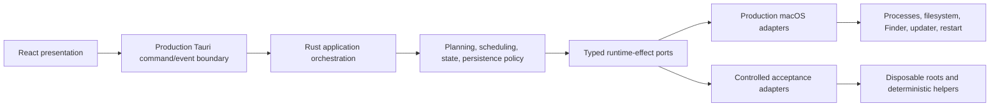

# Architecture Spine — Pack-Manager

> **Revision 3, 2026-07-24.** The readiness-gate apparatus this document once
> carried was retired by `docs/DECISIONS.md` D33. AD-6 through AD-10 and AD-13
> through AD-15, the Normative Evidence Contract, and the Structural Seed have
> been removed; the original is preserved verbatim at
> `_bmad-output/archive/2026-07-24-scope-recalibration/architecture/ARCHITECTURE-SPINE-original.md`.
> What remains is the product architecture: the IPC boundary, the ports and
> adapters seam, the process and lifecycle rules, and AD-16's Upgrade Plan
> domain model.
>
> Some rule prose in AD-1 through AD-5 still uses evidence-lane vocabulary
> inherited from the retired gate. The rules themselves are sound; the wording
> is due a cleanup pass.


## Design Paradigm

Pack-Manager remains one layered Tauri application. Hexagonal boundaries are
introduced only where acceptance work must control or observe nondeterminism.
Production and acceptance compositions share the same application core,
registered commands, events, handlers, wire types, and frontend bridge.


```mermaid
flowchart LR
    UI["React presentation"] --> IPC["Production Tauri command/event boundary"]
    IPC --> APP["Rust application orchestration"]
    APP --> DOMAIN["Planning, scheduling, state, persistence policy"]
    DOMAIN --> PORTS["Typed runtime-effect ports"]
    PORTS --> PROD["Production macOS adapters"]
    PORTS --> CONTROLLED["Controlled acceptance adapters"]
    PROD --> OS["Processes, filesystem, Finder, updater, restart"]
    CONTROLLED --> FIXTURES["Disposable roots and deterministic helpers"]
```

Dependencies point inward. Product behavior must not depend on test
infrastructure, evidence storage, CI, or candidate state. Test infrastructure
may replace only adapters at the composition boundary. Candidate-specific
release evidence must exercise the unchanged packaged candidate through
production adapters.

## Verified Brownfield Baseline

- Production currently registers 20 Rust commands and six typed events, with
  matching frontend wrappers/subscriptions. `bridge.ts` is the sole frontend
  Tauri API import, and startup subscribes before hydration.
- Current Rust tests construct handlers below Tauri, while browser tests
  replace `__TAURI_INTERNALS__`; neither crosses the complete production
  JavaScript-to-Tauri-to-Rust transport.
- The process runner already provides structured argv, a cleared environment,
  null stdin, isolated process groups, bounded output, timeout, and
  SIGTERM-to-SIGKILL escalation. Application initialization and several
  commands still bind real paths, opener, updater, focus, restart, clocks, and
  other macOS effects directly.
- Settings use atomic replacement, and the append journal reconstructs an
  unfinished start as Interrupted without signaling its recorded PGID.
  Disposable native relaunch coverage and user-facing window-close host wiring
  do not yet exist.
- The current implementation has a one-use preview `planId`, immediate
  single-Package and direct Manager-update execution paths, Operation-only
  journal/history records, and no durable plan-attempt correlation. These are
  verified brownfield mechanics, not the approved target. Decisions D27-D30
  require the Product Behavior Prerequisite before affected evidence work.
- The release workflow checks out the release tag, verifies aligned versions,
  and builds universal artifacts. It can also finish without Apple Developer
  ID signing/notarization secrets (updater signing remains required), uploads
  assets with `--clobber`, and emits no Candidate Manifest or Evidence Index.
  Current CI does not enforce host-wide outbound denial, and no
  provisioned-target-Mac or installed-candidate lane exists.
- Minimum supported macOS is declared at `bundle.macOS.minimumSystemVersion`
  = `15.0` (`docs/DECISIONS.md` D31). Before that it was undeclared and
  inherited Tauri's `10.13` default.

These are verified starting conditions and gaps, not acceptance evidence or a
readiness claim.

## Invariants & Rules

### AD-1 — [ADOPTED] Product, infrastructure, and evidence remain separate

- **Binds:** all ASRs, TIR-1, TIR-8, RE-1..RE-11
- **Prevents:** a test harness becoming product behavior, or a green reusable
  test lane being reported as proof of a release candidate
- **Rule:** Every work item and result declares exactly one primary concern:
  Product Behavior, Reusable Test Infrastructure, or Candidate-Specific
  Release Evidence. A missing or incorrect behavior returns to Product
  Behavior through TIR-1. Infrastructure produces capabilities and results,
  never readiness status. Candidate evidence consumes an immutable candidate;
  it does not alter product behavior or the infrastructure oracle.

### AD-2 — [ADOPTED] One composition root, two adapter sets

- **Binds:** ASR-01, ASR-02, ASR-03
- **Prevents:** a test-only application path that bypasses the production
  handlers, state graph, serialization, or safety defaults
- **Rule:** The Tauri composition root constructs the application from typed
  runtime ports. Production composition supplies fail-closed macOS adapters;
  native acceptance composition supplies controlled adapters and disposable
  roots. Both compositions use the same Rust application services and command
  handlers. No test-only command, event, or alternate business workflow may
  count as native acceptance.
- **Rule:** Controlled adapters are construction-time dependencies of a
  non-distributable native harness target. Release builds contain no feature,
  environment variable, CLI option, hidden command, or runtime selector that
  can activate them. Packaged acceptance uses production adapters and obtains
  isolation only from the external test environment.

### AD-3 — [ADOPTED] The shared production command/event boundary is the acceptance boundary

- **Binds:** ASR-01, TIR-3, F1-AC1..F1-AC4, F2-AC1, F6, F7, D26
- **Prevents:** React and Rust suites agreeing internally while production
  registration, invocation shape, serialization, event delivery, or startup
  ordering is broken
- **Rule:** Native acceptance crosses the production frontend `invoke`/`listen`
  bridge, Tauri registration and serialization, Rust handler, application
  service, and production event dispatcher. It inventories every registered
  command and event and exercises representative success and failure paths for
  each command family plus every event channel. Startup subscription precedes
  hydration; detection, Re-detect, and all-six-Manager refresh cross this
  boundary with isolated dependencies.
- **Rule:** One production builder and registration source supplies both the
  shipped application and native acceptance composition. The inventory must
  prove set equality between registered Rust commands/events and the
  TypeScript wrappers/subscriptions. Direct handler calls, fake browser IPC,
  duplicated test registries, and test-only commands/events do not cross this
  boundary.
- **Rule:** `contracts/tauri-boundary/v1.json` is the one versioned boundary
  catalog. It is one strict JCS object with only
  `schema: "pack-manager.tauri-boundary/v1"`, `commands[]`, and `events[]`.
  Commands sort by unique `name` and contain only `name`, `family`,
  `requestSchemaId`, `requestSchemaSha256`, `responseSchemaId`,
  `responseSchemaSha256`, and `nativeVectors[]`. Events sort by unique `name`
  and contain only `name`, `payloadSchemaId`, `payloadSchemaSha256`, and
  `nativeVectors[]`. Each native vector sorts by unique `vectorId` and contains
  only `vectorId`, `scenarioContractSha256`, and expected `outcome`.
  Production registration is generated from or compile-validated against this
  catalog; TypeScript wrappers/subscriptions and Rust/TypeScript wire-schema
  fixtures must have exact set equality with it. Native acceptance performs at
  least one real frontend-to-handler round trip per command and one real
  dispatcher-to-frontend delivery per event, plus every named vector. Vector
  `outcome` is exactly one of `success`, `application-error`,
  `transport-error`, or `event-delivered`; the scenario digest fixes all input
  and expected wire bytes.
- **Rule:** The currently verified 20 commands and six events are a baseline,
  not permanent counts. A deliberate surface change is one atomic contract
  change: the boundary catalog, production registration, Rust models,
  TypeScript wrappers/types and guards, shared fixtures, subscriptions,
  boundary inventory, and native acceptance coverage change together.

### AD-4 — [ADOPTED] All material process and macOS effects have typed control points

- **Binds:** ASR-02, TIR-2, TIR-4, TIR-5, TIR-7
- **Prevents:** unsafe real mutations in tests and untestable branches hidden
  behind direct operating-system calls
- **Rule:** The runtime-port set covers process spawn/output/exit/stdin/signals,
  monotonic and wall time, executable discovery and ToolEnv, application and
  log roots, filesystem and permissions, symlink metadata, opener/reveal,
  current bundle and writability, focus/restart, and updater check/download/
  install. Existing `CommandRunner`, `EventSink`, `UpdateSource`, and
  `PendingRelease` remain valid ports and are extended rather than bypassed.
  Direct calls for a covered effect are confined to production adapters.
- **Rule:** Controlled child helpers must deterministically emit stdout,
  stderr, silence, expected and unexpected exits, external-lock signatures,
  inherited-descriptor behavior, SIGTERM exit or refusal, descendant
  processes, timeout, and null-stdin observation. They run only against
  disposable data and never invoke a real Package mutation.
- **Rule:** Ports cannot weaken settled safety behavior: process requests remain
  structured argv with allowlisted absolute executables, sanitized environment,
  null stdin, no shell reconstruction, and no `sudo`, password, or admin
  route. Scheduling retains the complete lock-set rule, operation IDs correlate
  commands/events/journal/transcripts, updater installation remains explicit,
  and a non-writable installation remains manual-install-required.
- **Rule:** Controlled adapters prove orchestration; candidate acceptance uses
  production macOS adapters. Neither result substitutes for the other.

### AD-5 — [ADOPTED] Lifecycle acceptance owns a disposable environment

- **Binds:** ASR-03, TIR-5, FR-15, FR-17, FR-18
- **Prevents:** crash and relaunch scenarios corrupting the operator's real
  data or signaling a reused historical process identifier
- **Rule:** One injected root set owns Application Support, settings, journal,
  logs, transcripts, diagnostics destination, temporary files, and controlled
  executables for each native lifecycle scenario. No scenario may resolve a
  production user directory by fallback.
- **Rule:** The lifecycle controller launches, force-terminates, and relaunches
  the same native acceptance application composition; preserves the disposable
  roots between launches; retains pre-crash output; and verifies journal,
  transcript, settings, retention, and Interrupted reconstruction.
- **Rule:** User-facing quit acceptance must cross the real Tauri close/run
  event wiring, operation guard, cancellation, bounded shutdown, and relaunch
  focus path. A dialog component test or `RunEvent::Exit` shutdown alone
  cannot prove the packaged quit contract.
- **Rule:** Historical PGIDs are data only. A relaunch test must place a live,
  controlled sentinel at a recorded historical identifier and prove it is not
  signaled. The controller owns cleanup of only the process groups it created.
- **Rule:** Candidate packaged lifecycle checks use the exact candidate in an
  OS-isolated disposable user/home or equivalent external sandbox; they do not
  enable a hidden test path in release bits.

### AD-11 — [ADOPTED] Packaged acceptance ends at the installed application

- **Binds:** FR-19..FR-22, RP-1, RP-2
- **Prevents:** source, browser, or workflow results being mistaken for the
  experience users install and update
- **Rule:** Release acceptance inspects the exact app, DMG, ZIP, updater
  archive and signature, resources, icon set, entitlements, architectures,
  Developer ID signature, notarization, stapling, Gatekeeper assessment,
  `latest.json`, HTTPS URLs, embedded updater key, and cross-asset versions.
  The mechanics are enumerated in `docs/RELEASE-CHECKLIST.md`.
- **Rule:** UI interaction and visual acceptance runs inside the packaged
  application's WKWebView. Dev-server browser, DOM-only, and source-style
  results can support diagnosis but cannot satisfy the packaged boundary.
- **Rule:** The downloaded DMG journey installs and launches the exact build
  from Finder and the Dock. An installed prior public version must discover,
  verify, download, explicitly install, and relaunch into the same build.
  Active Package Operation refusal and non-writable manual-install-required
  behavior are part of that journey.
- **Rule:** Accessibility acceptance is packaged keyboard and focus paths,
  automated 4.5:1 text contrast, reduced motion, and one manual VoiceOver
  focus-order and completion-announcement pass. The automated half runs in the
  Playwright/Vitest lane. Broader WCAG or legal compliance is not implied.
  (Restates the former DR-2; see `docs/DECISIONS.md` D33.)
- **Rule:** The build is universal (arm64 + x86_64) and both updater platform
  keys are published, but verification is Apple silicon only. Intel is
  best-effort and unverified. (`docs/DECISIONS.md` D32.)
- **Rule:** Minimum supported macOS is 15.0, declared at
  `bundle.macOS.minimumSystemVersion`. (`docs/DECISIONS.md` D31.)

### AD-12 — [ADOPTED] Release automation is release-please plus GitHub Actions

- **Binds:** ASR-02, release preparation
- **Prevents:** a release shipping without the checks that catch silent,
  client-wide failure
- **Rule:** release-please and GitHub Actions remain the release framework and
  transport. A conventional commit reaching `main` enters release automation
  with no later human gate, so work stays off `main` until it is ready to
  ship.
- **Rule:** Apple Developer ID signing and notarization are required for a
  published release; updater signing is required by the build. The manual
  workflow-dispatch path uploads to the workflow run only and never touches a
  GitHub Release — it is the safe way to test pipeline changes.
- **Rule:** Two automated checks gate publication because their failure modes
  are silent and simultaneous across every installed client: the detached
  updater signature must verify against the public key the shipping app
  embeds, and the published `latest.json` must be reachable, name the version
  just released, and point at an asset URL that resolves.
- **Rule:** A GitHub Release's existence is distribution state. Release
  readiness is the checklist in `docs/RELEASE-CHECKLIST.md`, not a computed
  verdict.

### AD-16 — [ADOPTED] Upgrade Plan intent and confirmed Plan Attempts are distinct durable domains

- **Binds:** D27-D30, FR-6..FR-17, FR-19, F3-F8, F10-AC1, F11-AC2,
  Product Behavior Prerequisite UX-PB.1..UX-PB.5
- **Prevents:** executing from a row or Manager header, treating a short-lived
  preview capability as History identity, fabricating plan groups from legacy
  Operations, or reporting success before verification
- **Rule:** Frontend draft state stores canonical `PlanIntent`, never trusted
  executable strings. It contains individually removable Package and Manager
  update members plus explicit option values. Every draft mutation asks Rust to
  rebuild the preview. The existing `planId` remains a bounded one-use
  capability for one reviewed preview and expires on mutation, staleness,
  execution attempt, or eviction.
- **Rule:** `execute_plan` returns a newly generated durable
  `planAttemptId` plus the admitted Operation identities. A preview `planId`
  and a `planAttemptId` are different types, fields, schemas, namespaces, and
  test assertions. Neither may be silently converted into the other.
- **Rule:** Plan attempt persistence records reviewed canonical intent, exact
  command snapshot, warnings/exclusions, timestamps, nested Operations,
  verification refreshes, terminal Results, and optional
  `retryOfPlanAttemptId`. Operation status/output/stall events, transcript
  metadata, journal start/finish records, and diagnostic export carry
  `planAttemptId` when one exists.
- **Rule:** Exactly one confirmed attempt may be active. A second confirmation
  fails closed with a typed already-active result. The active attempt may run
  independent Managers concurrently through AD-4's existing lock-set and
  resource rules.
- **Rule:** Primary cancellation targets `planAttemptId`: unstarted work becomes
  `Skipped`, running process groups use the existing escalation, and all
  terminal states remain durable. `Cancel operation` is reserved for an
  explicitly Operation-scoped diagnostic action.
- **Rule:** A mutating attempt is not successful until required affected
  Manager refreshes complete. The attempt explicitly enters `Verifying`.
  Results distinguish mutation failure from verification failure and preserve
  the Last-good Snapshot rules.
- **Rule:** Retry always creates a new `planAttemptId`, links to the preceding
  failed attempt, and preserves the original failure. The backend rebuilds
  current intent rather than replaying historical executable text.
- **Rule:** Legacy journal/history records without a recorded
  `planAttemptId` remain individually labeled legacy Operations. Migration may
  preserve and index them but must not infer a plan grouping.
- **Rule:** Settings replace active `autoOpenDrawer` behavior with
  `skipUpgradePlanConfirmation`, default `false`. Older files may deserialize
  `autoOpenDrawer` as ignored legacy input. A confirmation opt-out skips only
  the final modal, never draft review, Rust rebuild, stale detection, or the
  explicit confirmation action.
- **Rule:** `Interaction required` is emitted only from a closed
  Manager-specific classifier or explicit typed native signal. Any unmatched
  null-stdin silence uses the ordinary stall contract.
- **Rule:** The command/event boundary change is atomic under AD-3: Rust and
  TypeScript wire models, registration, wrappers, fixtures, guards, catalog,
  journal schemas, diagnostics, and native acceptance change together.

#### AD-16 normative domain minimum

Names may be refined during story implementation, but the semantic separation
is fixed:

```text
PlanIntent
  packageUpdates: ordered unique PackageRef[]
  managerUpdates: ordered unique ManagerId[]
  includeGreedyCasks: boolean

UpgradePlanPreview
  planId: one-use PlanCapabilityId
  intent: PlanIntent
  groups: reviewed commands and display items
  exclusions/warnings

PlanAttempt
  planAttemptId: durable PlanAttemptId
  retryOfPlanAttemptId?: PlanAttemptId
  reviewedIntent + reviewedCommandSnapshot
  operationIds[]
  state: admitted | running | verifying | terminal
  verificationResults + resultSummary
```

The active-attempt lookup, cancel command, History query, Activity replay, and
diagnostic export address `planAttemptId`. Operation detail continues to
address `opId` within that attempt.


#### AD-16 domain rules required by the UX-PB acceptance criteria

These five rules were implied by the shipped story criteria but absent from
the model. They are recorded here so the primary build queue has a complete
domain contract before its first story starts.

- **Intent kind.** `PlanIntent` distinguishes explicitly chosen membership from
  bulk `AllEligible` membership. The distinction is durable: a bulk-added item
  the user then removes stays removed across a rebuild, and an explicit item is
  never silently absorbed into a later bulk action.
- **Draft-mutation convergence.** Every draft mutation resolves against a Rust
  canonical rebuild. If the rebuild errors or rejects, the prior coherent draft
  and its last authenticated preview are preserved unchanged, and nothing is
  admitted for execution. Frontend display text is never authority.
- **Ineligible-item inertness.** An item that is pinned, already current, a
  non-opted-in greedy cask, or removed between staging and rebuild is inert:
  its control is non-interactive to pointer and keyboard, it carries a stated
  reason for assistive technology, and it can never enter a `PlanIntent`.
- **Sidecar lifecycle.** The draft plan sidecar is a property of the draft, not
  of a view. It persists across navigation, survives view changes without
  losing membership or scroll identity, and has exactly one instance. A
  confirmed attempt replaces its content with live attempt status rather than
  opening a second surface.
- **Application-update separation.** The application's own update is not a
  Package plan. It never enters `PlanIntent`, a draft, a confirmed attempt,
  Results, or plan-attempt History, and its readiness surfaces only through its
  own badge and Settings card. (`docs/DECISIONS.md` D25.)

## ASR Accountability

Pack-Manager is maintained by one person, so accountability here means "this is
the boundary the enabler has to satisfy", not a hand-off between roles.

| Enabler                                        | Acceptance boundary                                                                                                                                                                                                        |
| ---------------------------------------------- | -------------------------------------------------------------------------------------------------------------------------------------------------------------------------------------------------------------------------- |
| ASR-01 — Real native command/event boundary    | The versioned catalog, production bridge and registration, wire schemas, wrappers and subscriptions, and inventory have set equality; every command round-trips and every event dispatches through one real Tauri boundary. |
| ASR-02 — Deterministic process and OS controls | Deterministic helpers and adapters produce every required output, exit, signal, timeout, lock, stdin, path, permission, opener, restart, and updater condition while production adapters retain fail-closed behavior.       |
| ASR-03 — Disposable lifecycle environment      | Crash, forced quit, relaunch, persistence, retention, hostile filesystem, and historical-PGID non-signal scenarios run from disposable roots and never contact operator data or processes.                                  |

## Consistency Conventions

| Concern            | Convention                                                                                                                                                |
| ------------------ | --------------------------------------------------------------------------------------------------------------------------------------------------------- |
| Boundary inventory | The versioned catalog is authoritative and must have set equality with production registration/wrappers/subscriptions; 20/6 is only the current baseline. |
| Wire changes       | Catalog, Rust registration/models, TypeScript wrappers/types/guards, fixtures, subscriptions, and native vectors move atomically.                         |
| Runtime effects    | Application/core code depends on typed ports; controlled adapters exist only in a non-distributable harness composition.                                  |

## Stack

This is a verified brownfield seed, not a permanent version policy.

| Name                         | Version                                   |
| ---------------------------- | ----------------------------------------- |
| Rust edition                 | 2021                                      |
| Tauri Rust crate             | 2.11.5                                    |
| Tauri JavaScript API         | 2.11.1                                    |
| Tauri CLI                    | 2.11.4                                    |
| Tauri updater plugin         | 2.10.1                                    |
| Tokio                        | 1.53.1                                    |
| React / React DOM            | 19.2.8                                    |
| TypeScript                   | 5.8.3                                     |
| Vite                         | 7.3.6                                     |
| Playwright                   | 1.61.1                                    |
| Node in CI                   | 24                                        |
| Release automation           | release-please action v5 + GitHub Actions |

## Capability → Architecture Map

| Capability / area                                                                                      | Lives in                                                                                 | Governed by            |
| ------------------------------------------------------------------------------------------------------ | ---------------------------------------------------------------------------------------- | ---------------------- |
| ASR-01                                                                                                 | Versioned boundary catalog, production Tauri boundary, and native acceptance composition | AD-2, AD-3             |
| ASR-02                                                                                                 | Runtime-effect ports, production adapters, controlled helpers                            | AD-2, AD-4             |
| ASR-03                                                                                                 | Disposable roots and lifecycle controller                                                | AD-5                   |
| Packaged launch, accessibility, signing, notarization, updater journey                                 | The exact packaged application                                                           | AD-11, AD-12           |
| Persistent Upgrade Plan, Plan Attempts, Activity, Results, History, Retry, and confirmation preference | Frontend draft state plus Rust plan-attempt application/persistence services             | AD-3, AD-4, AD-5, AD-16 |

## Decision Status and Deferred Items

| Item                                      | Status       | Note                                                                                                                                     |
| ----------------------------------------- | ------------ | ---------------------------------------------------------------------------------------------------------------------------------------- |
| Minimum supported macOS                   | **RESOLVED** | 15.0, declared at `bundle.macOS.minimumSystemVersion`. `docs/DECISIONS.md` D31. Closes the former DR-1.                                  |
| Supported architectures                   | **RESOLVED** | Universal build retained; verification is Apple silicon only. `docs/DECISIONS.md` D32. Narrows the former DR-3.                          |
| Readiness gate policy                     | **RETIRED**  | The 72-criterion gate, coverage percentages, scenario contracts, and candidate-freeze machinery are dissolved. `docs/DECISIONS.md` D33.  |
| Packaged accessibility method             | **ADOPTED**  | Restated as AD-11 rules against the existing test lane plus one manual VoiceOver pass. Was DR-2.                                          |
| Upgrade Plan redesign (D27–D30, AD-16)    | **IN BUILD** | Epic UX-PB in `epics.md` is the primary build queue. AD-16 including its five added domain rules is the contract.                        |
| Epics 1–6                                 | **HELD**     | Retained but unscheduled pending rescope into normal development stories. Triage complete: 6 keep, 19 merge, 12 retire.                  |
| Native harness/test runner                | **Deferred** | Any choice must satisfy AD-2/AD-3, the versioned boundary catalog, and the non-distributable harness rule.                               |
| Controlled-helper implementation language | **Deferred** | Any choice must satisfy AD-4 and cannot add a production shell-command surface.                                                          |
| Signing-secret storage mechanics          | **Deferred** | Existing fnox/GitHub Secrets boundaries remain; secrets never enter build artifacts.                                                      |
| AD-1..AD-5 wording cleanup                | **Open**     | Rule prose still carries evidence-lane vocabulary from the retired gate. The rules are sound; the wording is due a pass.                 |
