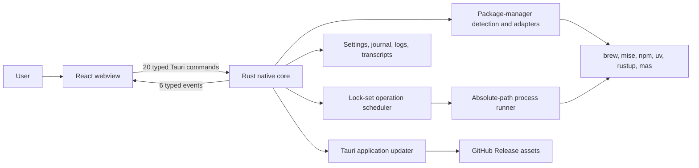
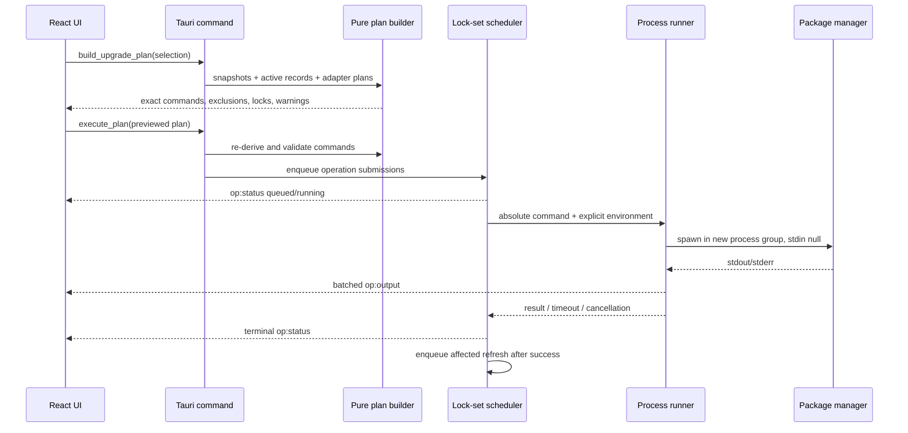

# Pack-Manager Architecture

- **Date:** 2026-07-22
- **Project type:** Single-part macOS desktop application
- **Primary pattern:** React component/store interface over a command- and event-driven Rust/Tauri core

## Executive Summary

Pack-Manager detects six macOS package managers, presents their inventories and outdated results, previews exact upgrade commands, and runs selected work with live output, cancellation, durable history, and diagnostics.

The application is one Tauri bundle with two internal layers:

- A React/TypeScript webview renders the interface and holds session presentation state.
- A Rust native core owns detection, command planning, scheduling, process execution, persistence, diagnostics, and application updates.

The only interface between those layers is typed local Tauri IPC: 20 commands for requests and six events for asynchronous state/output. There is no HTTP API, remote service, or database.

## Approved target course correction — not yet implemented

The current-mechanics inventory below remains accurate for the brownfield
checkout. It must not be mistaken for the approved update-experience target.
Decisions D27-D30 and Architecture Spine AD-16 require:

- one persistent Upgrade Plan for every Package and Manager update;
- one-use preview `planId` distinct from durable `planAttemptId`;
- one active confirmed attempt, with Manager concurrency inside it;
- plan-level Activity, verification, Results, cancellation, History, replay,
  and linked Retry;
- a separate final confirmation and
  `skipUpgradePlanConfirmation: false` safe default; and
- trusted closed prompt classification, with unknown silence remaining stalled.

The Product Behavior Prerequisite UX-PB.1..UX-PB.5 must implement that target
before this document's current Activity drawer, direct self-update,
Operation-History, or settings mechanics are rewritten as implemented truth.

## Architectural Invariants

These constraints shape the architecture and should be treated as correctness requirements:

1. **Manager verdicts are authoritative.** Package-manager output determines outdatedness; the frontend's version delta is display-only.
2. **Ownership and update routing are detected.** Raw resolved paths are classified before canonicalizing mise shims.
3. **Every update is staged and previewed exactly.** Canonical Package and Manager intent enters the persistent plan; Rust owns commands, exclusions, locks, notes, and warnings.
4. **Locks model interference.** Homebrew work serializes, routed updates lock executor and subject, and mise-managed npm/uv work protects the shared tree.
5. **No password interaction.** Native processes receive null stdin and a cleared/explicit environment; no sudo workflow exists.
6. **Failures remain isolated.** One manager failure does not blank other managers or erase the previous successful snapshot.
7. **Confirmed attempts are reconstructible.** Durable plan-attempt identity correlates nested Operations, events, transcripts, logs, journal records, verification, Results, and Retry lineage.
8. **IPC changes are coordinated.** Rust models, TypeScript mirrors/guards, and shared JSON fixtures move together.

## Technology Stack

| Category             | Technology                      | Locked/resolved version                      | Architectural role                                                                 |
| -------------------- | ------------------------------- | -------------------------------------------- | ---------------------------------------------------------------------------------- |
| Desktop runtime      | Tauri                           | Rust crate 2.11.5; JS API 2.11.1; CLI 2.11.4 | Window, local IPC/events, plugins, and application bundle.                         |
| Native language      | Rust 2021                       | Stable toolchain in CI                       | Trusted command planning/execution, state, persistence, diagnostics.               |
| Async runtime        | Tokio                           | 1.53.1                                       | Scheduler task, process I/O, timers, cancellation, background startup/update work. |
| Serialization        | Serde / serde_json              | 1.0.229 / 1.0.151                            | camelCase IPC and JSON persistence/contracts.                                      |
| Native observability | tracing                         | 0.1.44                                       | Structured logs and correlated operation diagnostics.                              |
| Interface            | React / React DOM               | 19.2.8                                       | Store-driven component interface.                                                  |
| Interface language   | TypeScript                      | 5.8.3                                        | Strict static types and runtime IPC guards.                                        |
| Frontend build       | Vite                            | 7.3.6                                        | Development server and production webview bundle.                                  |
| Styling              | Tailwind CSS                    | 4.3.3                                        | Dark-only tokenized visual system.                                                 |
| Frontend state       | Zustand                         | 5.0.14                                       | Domain-specific session stores.                                                    |
| Large-list rendering | TanStack React Virtual          | 3.14.7                                       | Package and live-output virtualization.                                            |
| Frontend tests       | Vitest + Testing Library        | Vitest 4.1.10                                | jsdom component, store, and contract behavior.                                     |
| Browser tests        | Playwright                      | Playwright 1.61.1                            | Chromium/WebKit journeys over the React interface and fake Tauri boundary.         |
| Native tests         | Cargo test                      | Rust toolchain                               | Unit, fixture, paused-time, lifecycle, persistence, and ignored live smoke tests.  |
| Release automation   | release-please + GitHub Actions | Workflow-defined                             | Version PR, universal build, signing, notarization, and assets.                    |

## System Context



Package managers are external local tools, not services. Pack-Manager constructs a Finder-safe tool environment, resolves absolute binaries, and interprets each manager through an adapter.

## Startup and Composition

### Native startup

`src-tauri/src/main.rs` delegates to `pack_manager_lib::run()` in `src-tauri/src/lib.rs`.

The composition root:

1. Loads persisted settings before logging initialization.
2. Initializes structured logging and prunes retained logs/transcripts.
3. Builds `AppState`, including the registry, queue, runner, event sink, journal history, and updater state.
4. Registers opener/updater plugins and the macOS application menu.
5. Registers the 20 Tauri commands.
6. Shows the window and probes PATH/detects managers asynchronously.
7. Starts release-build application-update checks when enabled.
8. Cancels/reaps running process groups on app exit.

### Frontend startup

`index.html` loads `src/main.tsx`, which renders `App`.

`App` subscribes to native events before calling `get_state`. This ordering prevents a fast asynchronous native detection result from being lost between initial render and hydration. State and app-update status hydrate the Zustand stores; launch refresh waits for detection readiness.

## Frontend Architecture

### Shell and navigation

`src/components/shell/AppLayout.tsx` is the interface composition root. Navigation is a discriminated `ActiveView` in `ui.ts`; there is no React Router.

The shell always mounts:

- Sidebar navigation and manager status.
- The selected dashboard/manager/history/settings view.
- Activity drawer and operation list/live output.
- Global status, dialogs, and toasts.

### State domains

| Store           | Responsibility                                                            |
| --------------- | ------------------------------------------------------------------------- |
| `managers.ts`   | Detection report, detection progress, and isolated manager errors.        |
| `packages.ts`   | Snapshots, stale flags, search, filters, selection, and range anchors.    |
| `operations.ts` | Normalized operation records and per-operation 5,000-line output buffers. |
| `ui.ts`         | Active view, drawer, dialog, toasts, settings working copy, highlighting. |
| `appUpdate.ts`  | Native application-update state snapshot.                                 |

Derived phase/outdated selectors live in `store/index.ts`; state that can be calculated from operations and errors is not duplicated.

### Component structure

- `dashboard/` owns manager cards and ownership/routing explanation.
- `manager/` owns tables, filters, selection, health, self-update, and upgrade actions.
- `activity/` and `history/` own live and past operation experiences.
- `dialogs/` contains upgrade preview, stall handoff, and quit/update guards.
- `settings/` exposes preferences, environment information, diagnostics, and updater controls.
- `primitives/` contains reusable visual controls/states.

See [component-inventory.md](./component-inventory.md) for the full catalog.

## Native Core Architecture

| Module              | Responsibility                                                                     |
| ------------------- | ---------------------------------------------------------------------------------- |
| `lib.rs`            | Tauri composition, plugins, menu, startup, command registration, shutdown.         |
| `state.rs`          | Shared dependency/state graph and startup orchestration.                           |
| `commands.rs`       | Thin IPC request handlers and input/output adaptation.                             |
| `ipc.rs`            | Canonical wire enums/structs with camelCase Serde representation.                  |
| `paths.rs`          | Static plus login-shell PATH discovery and clean child environment.                |
| `detect.rs`         | Binary resolution/version probing, ownership classification, self-update routes.   |
| `managers/`         | Six manager adapters and their pure command/parse plans.                           |
| `queue.rs`          | Upgrade-plan construction, lock scheduling, execution lifecycle, recovery refresh. |
| `process/runner.rs` | Sole real child-process launcher and termination controller.                       |
| `ops.rs`            | Operation identity and transcript formatting/writing.                              |
| `registry.rs`       | In-memory manager snapshots and cross-manager joins.                               |
| `events.rs`         | Typed event abstraction, Tauri/test sinks, output batching.                        |
| `journal.rs`        | Crash-safe start/finish journal and prior-session history.                         |
| `settings.rs`       | Defaults, patch merge, atomic settings persistence.                                |
| `logging.rs`        | Structured logs, live filtering, startup retention.                                |
| `diagnostics.rs`    | Safe diagnostics ZIP assembly.                                                     |
| `app_update.rs`     | Pack-Manager update discovery/download/install state machine.                      |
| `error.rs`          | Internal error taxonomy and stable IPC errors.                                     |

### Manager adapters

`ManagerAdapter` separates manager-specific facts from shared orchestration. Each adapter can define:

- Inventory and outdated command plans.
- Pure parsing and merge behavior.
- Recovery command/parser when a preferred format fails.
- Package and self-update commands.
- Self-update route derivation and exit classification.

Adapters exist for brew, mise, npm, uv, rustup, and mas. Pure parsers are isolated under `managers/parse/` and grounded in committed captures.

## IPC Design

### Command surface

The 20 registered commands are grouped below.

| Area                     | Commands                                                                                                              |
| ------------------------ | --------------------------------------------------------------------------------------------------------------------- |
| Detection/state          | `detect_managers`, `get_state`                                                                                        |
| Refresh and upgrades     | `refresh_manager`, `refresh_all`, `build_upgrade_plan`, `execute_plan`, `self_update_manager`, `run_health_fix`       |
| Operations               | `cancel_operation`, `get_operation`, `list_operations`                                                                |
| Settings and diagnostics | `get_settings`, `set_settings`, `reveal_operation_log`, `reveal_logs_dir`, `export_diagnostics`, `log_frontend_event` |
| Application updater      | `get_app_update_state`, `check_for_app_update`, `install_app_update`                                                  |

The frontend exposes matching wrappers in `src/lib/ipc/client.ts`. Only `bridge.ts` imports Tauri's `invoke`/`listen`, giving tests a single replacement seam.

### Event surface

| Event               | Payload/use                                                            |
| ------------------- | ---------------------------------------------------------------------- |
| `detection:updated` | Complete detection report after the native probe.                      |
| `snapshot:updated`  | Full snapshot for one manager.                                         |
| `op:status`         | Queue/start/phase/terminal state, command, times, error, and log path. |
| `op:output`         | Batches of correlated stdout/stderr lines.                             |
| `op:stalled`        | Silence duration prompting cancel/terminal handoff.                    |
| `appUpdate:status`  | Application update discovery/download/install state.                   |

Operation output flushes on the first of 64 lines, 8 KiB, or 50 ms; terminal transitions force a flush.

### Contract safety

`src-tauri/src/ipc.rs` is serialized into shared representative JSON files in `dev/fixtures/ipc/`. Rust byte-equality tests and TypeScript runtime guards validate the same files. A wire change is incomplete until both languages and fixtures agree.

## Upgrade Planning and Operation Flow



Nothing in a bulk plan executes until the user sees the derived command groups. Execution re-derives adapter commands rather than trusting arbitrary command text returned by the frontend.

## Scheduler and Process Safety

The scheduler is one Tokio task that owns pending work, held locks, and running operations.

- Global concurrency limit: four operations.
- Locks are acquired as one set, eliminating lock-order deadlocks.
- Non-conflicting work may skip ahead, but a 120-second aging guard prevents starvation.
- Duplicate refreshes for a manager coalesce.
- Commands inside one operation run serially.
- Successful mutating work enqueues refreshes for affected managers.
- Queued cancellation removes work without spawning or journaling it.

The process runner:

- Uses resolved absolute executable paths; it does not run shell strings.
- Clears the inherited environment and supplies a controlled environment.
- Uses null stdin to prohibit password prompts.
- Creates a process group for cancellation and descendant cleanup.
- Streams ANSI-stripped, carriage-return-aware output while retaining complete transcripts.
- Enforces absolute command timeouts and settings-driven stall/hard-cap behavior.
- Escalates `SIGTERM` to `SIGKILL` after five seconds.

## Data and Persistence Architecture

Pack-Manager has no relational/document database. Durable data is file-backed:

| Data                        | Path                                                          | Behavior                                                                                    |
| --------------------------- | ------------------------------------------------------------- | ------------------------------------------------------------------------------------------- |
| Settings                    | `~/Library/Application Support/Pack-Manager/settings.json`    | Partial defaults; atomic temp-file/fsync/rename writes.                                     |
| Operation journal/history   | `~/Library/Application Support/Pack-Manager/operations.jsonl` | Flushed start/finish records; interrupted recovery; newest 1,000 retained after compaction. |
| Structured application logs | `~/Library/Logs/Pack-Manager/pack-manager.log.YYYY-MM-DD`     | Daily JSON log; 14-day retention.                                                           |
| Operation transcripts       | `~/Library/Logs/Pack-Manager/operations/`                     | Full incremental stream with headers/markers/footer; 90 days and newest 200 cap.            |
| Diagnostics export          | `~/Desktop/Pack-Manager-diagnostics-<timestamp>.zip`          | Report, recent logs/transcripts, journal; regular files only.                               |

Detection, snapshots, queue state, frontend view state, and downloaded updater bytes are session-memory state. The journal rehydrates operation history but never signals a recorded process ID after restart.

## Error Handling and Failure Isolation

The Rust core maps internal failures into stable `IpcError` payloads with a code, message, and optional details such as manager, operation, and log path. Codes distinguish missing tools, spawn failures, timeouts, nonzero exits, Homebrew lock contention, parse failures, cancellation, unavailable self-update, environment capture, I/O, and internal faults.

Manager refreshes are independent. A failed refresh records an isolated error and leaves the previous snapshot visible/stale. Parser recovery is adapter-specific; it is not a generic silent retry. Homebrew lock contention is named and not automatically retried.

The frontend centralizes copy in `src/lib/errors.ts` and turns operation transitions into contextual drawers, dialogs, and toasts.

## Security and Trust Boundaries

- Package-manager processes receive an explicit minimal environment rather than inherited secrets.
- Commands use absolute binaries and adapter-derived arguments, not arbitrary shell input.
- Null stdin prevents sudo/password entry.
- Bulk preview and execution are independently derived.
- Diagnostics reject symlinks so unrelated files cannot be pulled into an export.
- Settings and journal rewrites use atomic replacement.
- Application updates are signature-verified by the configured Tauri updater key.
- Update installation checks bundle-parent writability and falls back to manual installation rather than an administrator-password path.
- Main-window permissions are scoped in `src-tauri/capabilities/default.json` to Tauri core and opener defaults.
- `tauri.conf.json` currently sets CSP to `null`; this is an existing security constraint for changes involving external/web content.
- Signing secrets remain encrypted through fnox locally and GitHub Secrets in CI.

## Testing Strategy

### Native

The Rust tree contains fixture-grounded parser/adapter tests, paused-time scheduler/event tests, fake and real process-lifecycle tests, IPC serialization tests, atomic persistence tests, diagnostics/log-retention tests, and updater state-machine tests.

Machine-dependent detection and Homebrew smoke tests are explicitly ignored and developer-run. The default suite is designed to be offline.

### Frontend

Vitest, jsdom, React Testing Library, fake timers, fake IPC, and typed fixtures cover bootstrap ordering, stores, dashboard/navigation/settings, package selection and upgrade preview, operation logs/cancellation, dialogs, keyboard behavior, history, error copy, contract guards, and application updates.

Playwright adds Chromium and WebKit browser journeys over the real React interface with a deterministic in-browser Tauri transport.

### CI gates

- Rust/macOS: `cargo fmt --check`, Clippy with warnings denied, `cargo test --locked`.
- Web/Ubuntu: clean npm install, TypeScript check, Vitest, Vite production build.
- Browser/Ubuntu: Playwright validation, two shards collectively covering the configured Chromium and WebKit projects, pull-request and weekly burn-in, and merged HTML/JUnit reporting.
- Main branch: unsigned debug Tauri bundle smoke on macOS.

## Deployment Architecture

Both layers build into one universal macOS application. Release-please owns versioning and creates a reviewed release PR. Merging it creates the version tag/GitHub Release and invokes the reusable macOS build.

The release workflow builds arm64 and x86_64 targets, combines them, optionally signs/notarizes/staples with Apple credentials, signs updater artifacts, verifies output, and publishes DMG, ZIP, updater archive/signature, and `latest.json`.

See [deployment-guide.md](./deployment-guide.md) for the operational sequence and credential boundaries.

## Source Tree

The highest-value paths are:

```text
src/                       React components, Zustand stores, IPC client/events/types
src-tauri/src/             Native orchestration, adapters, scheduler, processes, persistence
src-tauri/tests/           Ignored live-machine integration tests
dev/fixtures/              Parser evidence and cross-language contract payloads
.github/workflows/         Verification and release automation
docs/                      Specification, decisions, guides, and scan state
```

See [source-tree-analysis.md](./source-tree-analysis.md) for the annotated tree and configuration map.

## Current Constraints and Documentation Drift

- Node 24 is pinned through `.nvmrc`; stable Rust is used in CI without a repository `rust-toolchain.toml` pin.
- There is no configured frontend lint/format command. Playwright provides deterministic browser journeys across Chromium and WebKit.
- The application is English-only and has no localization framework.
- Current production registration has 20 commands and six events; some older comments/tests still say 17 commands or five events.
- Fixture/spec history contains conflicting older statements about mas availability/verification. Treat current code and current captured fixtures as implementation evidence and reconcile authoritative prose before relying on a machine-specific mas status.
- CSP is explicitly `null`; external-content features need a deliberate security design.
